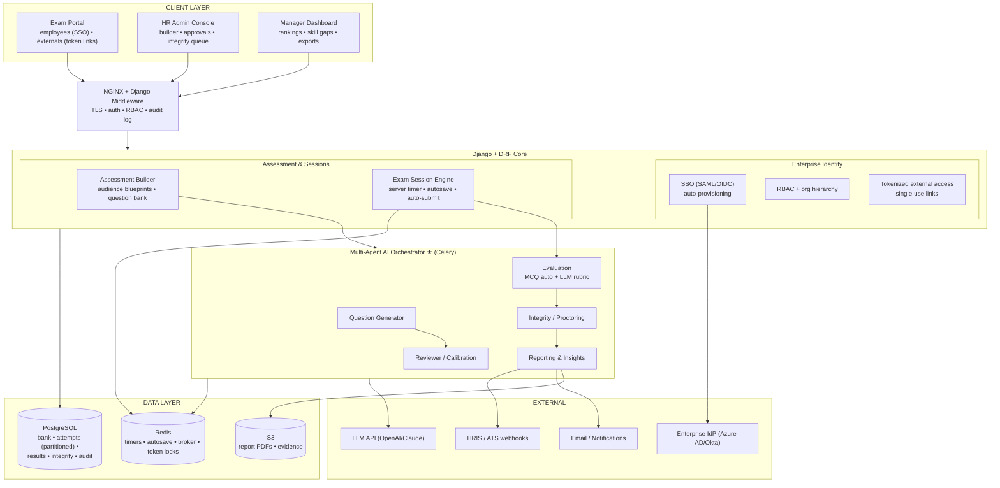
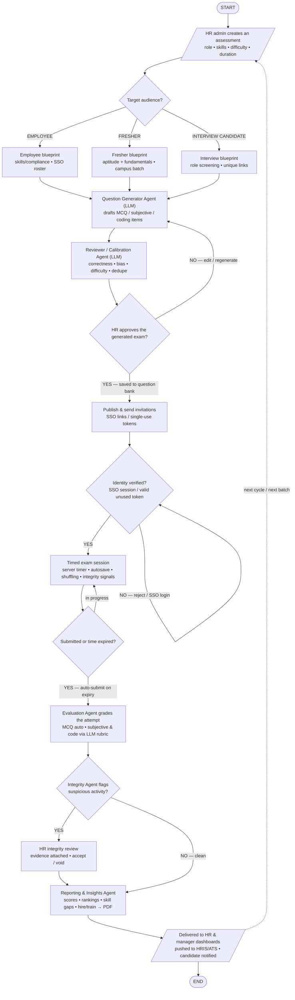

# AI HR Exam Application — Detailed Technical Reference

**A multi-agent AI system on Django for automated HR testing and reporting**
Employees • Freshers • Interview Candidates • Version 1.0 • July 2026

---

## Contents

1. [System Architecture — Deep Dive](#1-system-architecture--deep-dive)
2. [Architecture Diagram (Mermaid)](#2-architecture-diagram-mermaid)
3. [Application Flow — Step-by-Step](#3-application-flow--step-by-step)
4. [Flow Chart (Mermaid)](#4-flow-chart-mermaid)
5. [The Multi-Agent Design](#5-the-multi-agent-design)
6. [Data Model (PostgreSQL)](#6-data-model-postgresql)
7. [Exam Integrity — Fairness by Construction](#7-exam-integrity--fairness-by-construction)
8. [API Surface](#8-api-surface)
9. [Security, Scaling & Reliability Notes](#9-security-scaling--reliability-notes)

---

## 1. System Architecture — Deep Dive

### 1.1 Client Layer

**Exam Portal** (all three audiences)
- Employees arrive via **SSO**; freshers and interview candidates via **single-use tokenized links** from their invitations.
- Timed exam UI: question navigation, answer **autosave** on every change, server-synced countdown, warning banners, and hard **auto-submit** on expiry.
- Question types rendered: MCQ (single/multi), subjective (rich text), and coding (editor with language selection).

**HR Admin Console**
- Assessment builder: role, target skills, difficulty distribution, duration, question mix, audience selection.
- **AI-question approval workspace:** generated items arrive with the Reviewer agent's annotations; HR edits, regenerates, or approves into the question bank.
- Scheduling and invitation management; **integrity review queue** with evidence.

**Manager / Recruiter Dashboard**
- Per-assessment results: score distributions, candidate **rankings**, per-skill breakdowns and **gap analysis**, hire/train recommendations, PDF/CSV exports.

### 1.2 Application Layer — Django + DRF

**NGINX gateway:** TLS, session/JWT auth, rate limiting; Django middleware adds RBAC enforcement and audit logging on every request.

**Enterprise Identity & User Management**

| Module | Responsibility |
|---|---|
| **SSO (SAML / OIDC)** | Azure AD / Okta integration; employee auto-provisioning on first login; IdP group claims mapped to application roles. |
| **RBAC & Org Hierarchy** | Roles: HR admin, manager/recruiter, employee, external candidate; managers see only their org subtree; every privileged action lands in the audit trail. |
| **External Candidate Access** | Per-candidate exam tokens: single-use (Redis lock on first consumption), time-boxed validity, bound to one assessment; no account creation required for freshers/interviewees. |

**Assessment & Exam Session Engine**

| Module | Responsibility |
|---|---|
| **Assessment Builder** | Audience **blueprints** (employee / fresher / interview) defining skill areas, difficulty mix, and question-type ratios; question bank with tagging and reuse. |
| **Exam Session Engine** | Server-authoritative timer (client clock never trusted), per-question shuffle and option shuffle per attempt, autosave to Redis with periodic PostgreSQL flush, resume-on-reconnect, auto-submit at expiry. |

**Multi-Agent AI Orchestrator ★** — see §5. Agents run as **Celery pipelines** (Redis broker), keeping LLM latency out of web requests; each agent's inputs/outputs are persisted for auditability.

### 1.3 Data Layer

| Store | Role |
|---|---|
| **PostgreSQL** | `users`, `org_units`, `question_bank`, `assessments`, `invitations/tokens`, `exam_attempts` (partitioned by month), `answers`, `results`, `integrity_events`, `reports`, `audit_log`. |
| **Redis** | Live timers and session state, autosave buffer, Celery broker, token single-use locks, rate limits. |
| **S3** | Report PDFs, code-answer artifacts, integrity evidence bundles. |

### 1.4 External Services

| Service | Purpose |
|---|---|
| **LLM API (OpenAI / Claude)** | Powers all five agents. |
| **Enterprise IdP** | SAML/OIDC SSO; group claims → roles. |
| **Email / Notifications** | Invitations, reminders, result notices. |
| **HRIS / ATS** | Results and recommendations pushed via webhooks (Workday, Greenhouse, etc.). |

---

## 2. Architecture Diagram (Mermaid)

---

## 3. Application Flow — Step-by-Step

### Phase A — Assessment Creation (HR + agents)

| # | Step | Detail |
|---|---|---|
| 1 | **HR creates assessment** | Role, skills, difficulty distribution, duration, question mix. |
| 2 | **Audience decision** | **Employee** blueprint (skills/compliance; roster pulled from SSO org units), **Fresher** blueprint (aptitude + fundamentals; campus batch list), or **Interview** blueprint (role-specific screening; per-candidate unique links). |
| 3 | **Question Generator Agent** | Drafts MCQ/subjective/coding items per the blueprint, with answer keys and rubrics. |
| 4 | **Reviewer / Calibration Agent** | Validates correctness, screens bias/ambiguity, calibrates difficulty, de-duplicates against the bank; annotates each item. |
| 5 | **HR approval gate** | HR edits/regenerates (loop back to step 3) or approves; approved items enter the versioned question bank. |

### Phase B — Publication & Access

| # | Step | Detail |
|---|---|---|
| 6 | **Publish & invite** | Employees receive SSO exam links; externals receive single-use tokenized links with validity windows; reminders scheduled. |
| 7 | **Identity gate** | SSO session or valid unused token required; consumed/expired tokens are rejected (Redis single-use lock), employees without session are redirected to SSO. |

### Phase C — The Exam Session

| # | Step | Detail |
|---|---|---|
| 8 | **Timed session** | Server-side countdown; answers autosaved on change; questions and options shuffled per attempt; tab-switch/paste events logged as integrity signals; disconnects resume where left off. |
| 9 | **Submission** | Explicit submit, or **auto-submit** the saved state at expiry — no attempt is ever lost or extended. |

### Phase D — Grading, Integrity & Reporting (agents)

| # | Step | Detail |
|---|---|---|
| 10 | **Evaluation Agent** | MCQs scored deterministically; subjective and coding answers graded against per-question **LLM rubrics** with criterion-level feedback; borderline confidence marks items for optional human moderation. |
| 11 | **Integrity gate** | Integrity Agent scores the attempt (behaviour signals + answer-similarity + AI-answer indicators). Flagged → **HR integrity review** with evidence: accept or void. Clean → continue. |
| 12 | **Reporting & Insights Agent** | Compiles scores, percentile rankings, per-skill gap analysis, and a hire/train recommendation into a PDF; per-candidate and cohort views. |
| 13 | **Delivery** | Dashboards updated; notifications sent; results pushed to HRIS/ATS. Loop returns for the next cycle or candidate batch. |

---

## 4. Flow Chart (Mermaid)

---

## 5. The Multi-Agent Design

Each agent is a Celery task chain with persisted inputs/outputs (auditable, replayable), a scoped system prompt, and a defined hand-off contract:

| Agent | Input | Output | Notes |
|---|---|---|---|
| **Question Generator** | blueprint (role, skills, difficulty mix, type ratios) | draft items: stem, options/expected answer, rubric, skill tag, difficulty estimate | Generates in batches per skill; coding items include starter code + test expectations. |
| **Reviewer / Calibration** | draft items + existing bank | annotated items: correctness verdict, bias/ambiguity flags, calibrated difficulty, duplicate matches | A *different* prompt persona than the generator — the disagreement is the value; its annotations render in the HR approval UI. |
| **Evaluation** | submitted attempt + answer keys/rubrics | per-question scores + criterion feedback + confidence | MCQs never touch the LLM (deterministic); subjective/code graded per rubric; low confidence → human moderation queue. |
| **Integrity / Proctoring** | behaviour events + answers + cohort context | integrity score + flags + evidence bundle | Signals: tab-switch/paste patterns, improbable speed, cross-candidate similarity, AI-generated-answer indicators. Flags **route to humans** — the agent never voids an attempt itself. |
| **Reporting & Insights** | graded, integrity-cleared attempts | candidate report + cohort analytics + hire/train recommendation (PDF + structured JSON) | JSON payload is what HRIS/ATS webhooks consume. |

Design principles: **specialisation** (small scoped prompts beat one mega-prompt), **cross-checking** (reviewer ≠ generator), **human gates at consequences** (approval before publication; review before voiding), and **auditability** (every agent run stored with prompt version, model, tokens, and output).

---

## 6. Data Model (PostgreSQL)

### Identity
| Table | Key columns |
|---|---|
| `users` | id, email (unique), auth_source (`sso/token`), role, org_unit_id? |
| `org_units` | id, name, parent_id — hierarchy for RBAC scoping |
| `exam_tokens` | id, assessment_id, candidate_email, token_hash (unique), expires_at, consumed_at? |

### Assessment & Bank
| Table | Key columns |
|---|---|
| `assessments` | id, title, audience (`employee/fresher/interview`), blueprint JSONB, duration_min, status (`draft/generating/awaiting_approval/published/closed`) |
| `question_bank` | id, type (`mcq/subjective/coding`), stem, options JSONB?, answer_key/rubric JSONB, skill_tag, difficulty, version, approved_by, source (`ai_generated/manual`) |
| `assessment_questions` | assessment_id, question_id, position, points |

### Attempts (partitioned by month)
| Table | Key columns |
|---|---|
| `exam_attempts` | id, assessment_id, user_id, started_at, deadline_at, submitted_at?, status (`in_progress/submitted/auto_submitted/voided`) |
| `answers` | attempt_id, question_id, response JSONB, saved_at |
| `integrity_events` | attempt_id, kind (`tab_switch/paste/focus_loss/...`), at, meta JSONB |

### Outcomes
| Table | Key columns |
|---|---|
| `results` | attempt_id (unique), total_score, per_skill JSONB, per_question JSONB, grading_confidence, moderated_by? |
| `integrity_reviews` | attempt_id, flags JSONB, decision (`accepted/voided`), reviewer_id, decided_at |
| `reports` | id, assessment_id, scope (`candidate/cohort`), pdf_s3_key, insights JSONB, recommendation |
| `audit_log` | actor_id, action, target, at, meta JSONB — append-only |

---

## 7. Exam Integrity — Fairness by Construction

1. **Server-authoritative time:** `deadline_at` is set at start; the client renders a countdown but the server enforces it — expiry auto-submits whatever is saved.
2. **Per-attempt shuffling:** question order and MCQ option order are seeded per attempt, so screen-sharing between candidates yields misaligned papers.
3. **Single-use tokens:** external links consume atomically (`SET token:{hash} NX` in Redis backed by `consumed_at` in PostgreSQL) — a forwarded link is dead on arrival.
4. **Continuous autosave:** answers persist on every change; disconnections resume with zero loss and no time credit.
5. **Signals, not verdicts:** tab-switches, paste bursts, improbable answer speed, cross-candidate similarity, and AI-answer indicators feed the Integrity Agent's score — but only **HR review** can void an attempt, with the evidence bundle attached to the decision in the audit log.
6. **Question-bank hygiene:** versioned items, exposure tracking (how often an item has been seen), and reviewer-agent dedupe keep leaked or over-used questions rotating out.

---

## 8. API Surface

### HR / Admin
| Method & Path | Purpose |
|---|---|
| `POST /api/assessments` | create with blueprint + audience |
| `POST /api/assessments/{id}/generate` | kick off the generation pipeline (async) |
| `GET /api/assessments/{id}/review` | generated items + reviewer annotations |
| `POST /api/questions/{id}/approve|edit|regenerate` | approval workflow |
| `POST /api/assessments/{id}/publish` | invitations (SSO roster / token list) |
| `GET /api/integrity/queue` · `POST /api/integrity/{attempt_id}/decide` | integrity reviews |

### Candidate / Employee
| Method & Path | Purpose |
|---|---|
| `GET /exam/{token}` · `GET /exam/sso/{assessment_id}` | enter the exam (identity gate) |
| `POST /api/attempts/{id}/answers` | autosave a response |
| `POST /api/attempts/{id}/submit` | explicit submission |
| `POST /api/events` | integrity signal ingestion |

### Reporting
| Method & Path | Purpose |
|---|---|
| `GET /api/reports/assessment/{id}` | cohort analytics + rankings |
| `GET /api/reports/candidate/{attempt_id}` | individual report (PDF link) |
| `POST /api/webhooks/hris` | outbound result push configuration |

---

## 9. Security, Scaling & Reliability Notes

- **Security:** SSO for the workforce, single-use expiring tokens for externals; RBAC scoped by org hierarchy; append-only audit log on privileged actions; answer keys and rubrics never sent to the client; LLM calls strip candidate PII where not needed; report links signed and expiring.
- **Scalability:** exam-day bursts are absorbed by Redis (timers/autosave) with async PostgreSQL flushes; agent pipelines run on Celery workers scaled independently of web dynos; attempts partitioned monthly; grading parallelises per attempt.
- **Reliability:** auto-submit guarantees no lost attempts; idempotent autosave (latest-wins per question); agent runs are replayable from persisted inputs if an LLM call fails mid-pipeline; HRIS pushes retried with dead-letter visibility.
- **Observability:** agent cost/latency per run (tokens logged), generation-approval rates (how often HR edits the AI), grading-confidence distributions (moderation load), integrity flag rates per assessment, and funnel metrics from invitation → completion → report.
