# AI Celigo Auditing Tool — Consolidated Process Flowchart (v1.0)

> **One diagram, the whole project.** Setup → read-only enforcement → live extraction →
> offline derivation → scoring → DOCX render → verification gates → governance loop,
> plus the live-or-`NA` value rule and the components that exist on disk but are not in
> the flow.
>
> Traced from the source files on disk on **2026-08-03** — not from the README or the
> CHANGELOG. For per-phase diagrams, module input/output tables and file+line
> traceability, see the companion
> [AI_Celigo_Auditing_Tool_Process_Flowchart_v1.0.md](AI_Celigo_Auditing_Tool_Process_Flowchart_v1.0.md).

**Legend** — rectangle = a step that runs · rounded = a file/artifact · diamond = a
decision or enforcement gate · red = a refusal path · dashed grey = on disk but **not**
wired into the working flow.

```mermaid
flowchart TD

%% ============================ 0. SETUP ============================
    subgraph PH0["PHASE 0 — SETUP (once per machine)"]
        direction TB
        A1["Copy config/account.example.json to config/account.json<br/>fill apiToken, region/baseUrl, cli.mode=read, proxy host/port/allowedMethods"]
        A2["scripts/bootstrap.ps1 - imports CeligoAuth.psm1, calls Assert-CeligoReady"]
        A3{"Node 22+ on PATH?<br/>celigo CLI installed?<br/>CLI mode == read?<br/>apiToken real, not the placeholder?"}
        A4["Auto-remediate:<br/>npm install -g @celigo/celigo-cli<br/>celigo config set mode read"]
        A5["THROW - refuse to continue<br/>nothing touches Celigo"]
        A6["Read-only connectivity test - a single list call"]
        A1 --> A2 --> A3
        A3 -->|"missing / wrong"| A4 --> A3
        A3 -->|"cannot enforce"| A5
        A3 -->|"all OK"| A6
    end

%% ==================== 1. READ-ONLY ENFORCEMENT ====================
    subgraph PH1["PHASE 1 — READ-ONLY ENFORCEMENT (three layers, always on)"]
        direction TB
        B1["LAYER 3 - config invariant<br/>config/account.json pins cli.mode=read and proxy.allowedMethods=GET,HEAD"]
        B2["LAYER 2 - scripts/CeligoAuth.psm1<br/>Invoke-CeligoCli: read-verb whitelist, DEFAULT-DENY on anything unrecognised<br/>Invoke-CeligoApi: GET/HEAD only, enforced at the parameter"]
        B3["LAYER 1 - scripts/celigo-readonly-proxy.mjs<br/>the ONLY holder of the token at runtime; clients hold none<br/>refuses to start unless: token real, cli.mode=read, bind is loopback"]
        B4{"Which HTTP method<br/>reaches the proxy?"}
        B5["Strip any client Authorization, inject Bearer,<br/>forward to api.integrator.io<br/>log ALLOW to config/work/celigo-proxy-access.log, token redacted"]
        B6["405 read_only_proxy - logged BLOCKED<br/>the mutation is NEVER sent to Celigo"]
        B1 --> B2 --> B3 --> B4
        B4 -->|"GET / HEAD"| B5
        B4 -->|"POST / PUT / PATCH / DELETE / anything else"| B6
    end

%% ======================= 2. EXTRACT (LIVE) ========================
    subgraph PH2["PHASE 2 — EXTRACT · THE ONLY LIVE CONTACT WITH THE CLIENT ACCOUNT"]
        direction TB
        C1["scripts/extract-celigo.ps1<br/>starts the proxy if it is not already healthy, stops it again if it did"]
        C2["CORE 7 via proxy GET v1/RESOURCE<br/>integrations · flows · connections · exports · imports · scripts · stacks"]
        C3["SUPPLEMENTARY via guarded CLI, mode=read<br/>users list (ashares) · subscriptions licenses · notifications list<br/>account stats · account lint · jobs list --created-gte"]
        C4["fetch-review-scripts.mjs<br/>persists name/lines/rating/note - NEVER the script source"]
        C5["fetch-connection-usage.mjs<br/>GET /v1/connections/ID/dependencies for EVERY connection"]
        C6["fetch-flow-errors.mjs<br/>open + resolved per flow-step; persists timestamps/code/classification only<br/>NEVER the error message, exportDataURI, traceKey or retry keys"]
        C7["fetch-subscription-usage.mjs<br/>GET /v1/usage processing-time series"]
        C8{"2xx but empty body?<br/>e.g. /v1/stacks returns 204"}
        C9["Store a literal empty array - an empty collection, never fabricated"]
        C10["Store the RAW bytes verbatim, UTF-8 no BOM<br/>PS 5.1 ConvertFrom-Json would truncate large payloads"]
        C11{"Call threw or was token-blocked?"}
        C12["Warn RESOURCE -> NA and continue to the next<br/>degrade gracefully, never crash, never fabricate"]
        SNAP(["config/work/snapshot_DD_MM_YYYY/ - gitignored<br/>raw JSON: the core 7 + users, licenses, notifications, accountstats, lint, jobs<br/>+ scripts_review, connection_usage, errors_open, errors_resolved, subscription_usage"])
        C1 --> C2 --> C8
        C1 --> C3 --> C8
        C1 --> C4 --> C8
        C1 --> C5 --> C8
        C1 --> C6 --> C8
        C1 --> C7 --> C8
        C8 -->|"yes"| C9 --> SNAP
        C8 -->|"no"| C10 --> SNAP
        C2 --> C11
        C11 -->|"yes"| C12 --> SNAP
    end

%% ===================== 3. DERIVE (OFFLINE) ========================
    subgraph PH3["PHASE 3 — DERIVE · 100% OFFLINE, ZERO CELIGO CALLS FROM HERE ON"]
        direction TB
        D0["gen-live-report-full.mjs projectRoot [snapshotDir]<br/>resolves the LATEST snapshot by folder name · report date from that folder ·<br/>region read from config/account.json · nothing hardcoded, account-agnostic"]
        D1["derive-run-history.mjs<br/>observed job window from the data + success rate WITH denominator + purgeAt horizon<br/>never a hard '30-day' label; zero jobs -> NA"]
        D2["derive-error-mttr.mjs<br/>backlog + MTTR from occurredAt to resolvedAt<br/>NOT from job numResolved; no resolved errors -> NA"]
        D3["derive-connection-usage.mjs<br/>orphaned / referenced-no-flow / used-by-flow from the authoritative /dependencies<br/>cross-checked against account lint"]
        D4["derive-export-classification.mjs<br/>three independent facets: adaptor type · sync mode · role<br/>a blank sync mode is 'unspecified', never unknown"]
        D5["derive-user-security.mjs<br/>three independent SSO facts + account MFA-required + access governance<br/>'licensed' is never reported as 'enforced'; unset stays unset"]
        D6["derive-resource-classification.mjs<br/>ADDITIVE tags disabled/orphaned/test-dev/duplicate/production<br/>deletes and hides nothing; the name regex is emitted for operator review"]
        D7["derive-subscription-usage.mjs<br/>processing-time rollup; empty or non-200 -> NA, never a fabricated 0"]
        D8["derive-stale-flows.mjs<br/>enabled-but-idle and never-run flows from the persistent lastExecutedAt<br/>so it is not bound by the short /v1/jobs retention"]
        D9["Rollups computed in the generator<br/>IA vs DIY tiles · active vs disabled flows · offline connections ·<br/>cron-parsed schedule register + shared-connection contention · lint by rule"]
        D0 --> D1 --> D9
        D0 --> D2 --> D9
        D0 --> D3 --> D9
        D0 --> D4 --> D9
        D0 --> D5 --> D9
        D0 --> D6 --> D9
        D0 --> D7 --> D9
        D0 --> D8 --> D9
    end

%% =================== 3b. THE VALUE RULE (applies to every field) ==
    subgraph PHV["THE LIVE-OR-NA VALUE RULE — governs EVERY value in the report"]
        direction TB
        V1{"Can the read-only token read it directly?"}
        V2{"Can it be COMPUTED from live data?"}
        V3{"Blocked by the token's role?<br/>401/403 restricted to the token's own user"}
        V4{"Is it a business input that does not exist in the account?"}
        V5["LIVE value"]
        V6["DERIVED value - disclose the basis"]
        V7["Render 'UI Screenshot needed'<br/>admin supplies it into config/manual-inputs/"]
        V8["Leave BLANK for the client to complete"]
        V9["Render the literal NA"]
        V10{"Is the WHOLE COLUMN unresolvable for this account?"}
        V11["DROP the column entirely - never a full column of NA<br/>restore it when an owner/admin token or a manual input resolves it"]
        V1 -->|"yes"| V5
        V1 -->|"no"| V2
        V2 -->|"yes"| V6
        V2 -->|"no"| V3
        V3 -->|"yes"| V7
        V3 -->|"no"| V4
        V4 -->|"yes"| V8
        V4 -->|"no"| V9
        V9 --> V10
        V10 -->|"yes"| V11
        V10 -->|"no, single cell"| V9
    end

%% ============================ 4. SCORE ============================
    subgraph PH4["PHASE 4 — SCORE · scoring model v1, risk-weighted, finalised 2026-07-28"]
        direction TB
        E1["For each of the 9 domains, compute % from ONE disclosed live signal<br/>Security 18 · Error Mgmt 16 · Connections 13 · Flow Config 12 · Flow Lifecycle 10 ·<br/>Data Mapping 9 · Architecture 9 · Scheduling 8 · Documentation 5"]
        E2{"Does the domain have a live basis?"}
        E3["Score = NA - the domain drops out entirely"]
        E4["Score = 0-100"]
        E5["Overall = weight-normalised mean of the SCORED domains only<br/>sum of score x weight / sum of their weights - NA excluded AND re-normalised"]
        E6{"Band?"}
        E7["0-59 Weak"]
        E8["60-74 Needs Improvement"]
        E9["75-89 Satisfactory"]
        E10["90-100 Good"]
        E1 --> E2
        E2 -->|"no"| E3 --> E5
        E2 -->|"yes"| E4 --> E5
        E5 --> E6
        E6 --> E7
        E6 --> E8
        E6 --> E9
        E6 --> E10
    end

%% =========================== 5. RENDER ============================
    subgraph PH5["PHASE 5 — RENDER · Markdown to DOCX"]
        direction TB
        MD(["reports/Celigo_Audit_Report_LIVE_DD_MM_YYYY.md<br/>15 numbered sections + Reviewers preamble + appendices"])
        F1["build-live-docx-full.py content out.docx cover_date<br/>imports the shared converter and monkeypatches ONLY the cover<br/>neutral live cover, no fabricated client name"]
        F2["build_celigo_template.py - the shared converter<br/>office/unpack.py explodes the V03 template: styles, theme, fonts, header/footer, logo"]
        F3["Idempotent header fix - rewrite any stale 'NetSuite Account Audit Report'<br/>running header to 'Celigo iPaaS Integration Audit Report', right-align at 10080"]
        F4["build_body walks the Markdown:<br/>'##' -> Heading1 with pageBreakBefore after the first · '###' -> Heading2 ·<br/>'>' -> callout() single-cell cantSplit box, DEEAF6 fill, blue left bar, + spacer ·<br/>pipe rows -> table() · everything else -> paragraph"]
        F5["Automatic table rules:<br/>a Metric / Value / Metric / Value header row -> dual-panel separator ·<br/>single-cell leading row -> full-width spanning title row ·<br/>'Score' header column and the row carrying the current-band marker -> green 43A047 ·<br/>block-char cell -> progress bar coloured by the band dot ·<br/>leading tick/warning/cross -> bold coloured word, icon dropped; severity dots kept"]
        F6["office/pack.py rezips against the original - OOXML schema validation happens HERE"]
        MD --> F1 --> F2 --> F3 --> F4 --> F5 --> F6
    end

%% =========================== 6. VERIFY ============================
    subgraph PH6["PHASE 6 — VERIFY · the gates"]
        direction TB
        G1{"OOXML schema-valid at pack?"}
        G2{"0 unfilled placeholders?"}
        G3{"0 fabrication fingerprints?<br/>Acme · Demo Customer · TBD · Lorem · XXX"}
        G4{"0 stale NetSuite running headers?<br/>0 mojibake?"}
        G5{"Table count RE-DERIVED FROM DISK matches<br/>the single authoritative note in .agent/03?"}
        G6["Operator opens it in Word:<br/>pagination, no blank pages, no split callouts"]
        G7["REJECT - fix and rebuild<br/>the build aborts, nothing is written"]
        G1 -->|"no"| G7
        G1 -->|"yes"| G2
        G2 -->|"no"| G7
        G2 -->|"yes"| G3
        G3 -->|"no"| G7
        G3 -->|"yes"| G4
        G4 -->|"no"| G7
        G4 -->|"yes"| G5
        G5 -->|"no"| G7
        G5 -->|"yes"| G6
    end

    DOCX(["reports/Celigo_Audit_Report_LIVE_DD_MM_YYYY.docx<br/>THE DELIVERABLE - reports/ holds only this + logs/"])

%% ========================= 7. GOVERNANCE ==========================
    subgraph PH7["PHASE 7 — GOVERNANCE · how work enters and leaves the record"]
        direction TB
        H1["DAY START - 'Hey Claude, I am here please ready'<br/>config/WorkStartWithThis/EveryDayStartPromp.md, read-only:<br/>read CLAUDE.md + .agent/00-06 + CHANGELOG + session archives,<br/>list every file, RE-DERIVE every claim from DISK, reconcile, report, STOP"]
        H2["CHANGE - 'make this change'<br/>config/precautions/01_making_changes.md:<br/>A trace the real source first, never guess · B hard guardrails ·<br/>C additive and backward-compatible · C2 must work on EVERY future account ·<br/>D config/work for intermediates, reports/ for the deliverable only ·<br/>E run the full pipeline and all gates · F keep it reversible, back up first"]
        H3["SAVE - 'save the project'<br/>config/precautions/02_full_project_update.md B2:<br/>the save is NOT complete until ALL FOUR exist"]
        H4["1. CHANGELOG.md entry"]
        H5["2. memory update"]
        H6["3. session_NN_DD_MM_YYYY_summary.jsonl, redaction-verified"]
        H7["4. Files-table row + milestone in the session README"]
        H8["SessionStart hook scripts/check-session-archive.mjs<br/>nudges at the next day-start if source looks un-archived<br/>KNOWN GAP: it compares SOURCE mtimes, so a reports/-only<br/>regeneration does not trip it - the day-start ritual is the source of truth"]
        H1 --> H2 --> H3
        H3 --> H4 --> H8
        H3 --> H5 --> H8
        H3 --> H6 --> H8
        H3 --> H7 --> H8
    end

%% ==================== ON DISK BUT NOT IN THE FLOW =================
    subgraph PHX["ON DISK BUT NOT IN THE FLOW"]
        direction TB
        X1["STUBS - run-report.ps1 and generate-report.ps1 are 2-line TODOs;<br/>run-audit.ps1 runs the full read-only preflight but its orchestration is a TODO"]
        X2["DORMANT NetSuite-era - generate_fresh_values.py · build_audit_docx.py ·<br/>check_static_data.py · smoke_test.py · inject_placeholders.py ·<br/>build.ps1 + auto_build_hook.ps1 (a PostToolUse hook that is NOT wired)<br/>their PLACEHOLDERS template was deleted 2026-07-10, so they cannot run"]
        X3["SUPERSEDED but kept for history - gen-live-report.mjs and build_live_docx.py,<br/>the 2026-07-13 prototype the frozen data scope was first validated against"]
    end

%% ===================== STATIC PARALLEL DELIVERABLE ================
    subgraph PHS["PARALLEL DELIVERABLE — the static illustrative template (never touches Celigo)"]
        direction TB
        T1(["templates/celigo_audit_report_v01_source.md - illustrative, account-agnostic"])
        T2["python audit-docx-tool/scripts/build_celigo_template.py<br/>the SAME shared converter and the SAME scoring model v1"]
        T3(["templates/celigo_audit_report_template_v01.docx"])
        T1 --> T2 --> T3
    end

%% ========================= PHASE WIRING ===========================
    A6 --> B1
    B5 --> C1
    SNAP --> D0
    D9 --> V1
    V5 --> E1
    V6 --> E1
    V7 --> E1
    V8 --> E1
    V11 --> E1
    E7 --> MD
    E8 --> MD
    E9 --> MD
    E10 --> MD
    F6 --> G1
    G6 --> DOCX
    DOCX --> H1
    H8 -.->|"next audit cycle - re-extract for fresh data"| C1
    T2 -.->|"shares the converter and the scoring model"| F2

%% ============================= STYLING ============================
    classDef gate fill:#fff8e1,stroke:#e8a33d,color:#3b3b3b;
    classDef refuse fill:#fdecea,stroke:#c00000,color:#7a0000;
    classDef artifact fill:#eaf3fb,stroke:#1d57be,color:#12325c;
    classDef live fill:#fdeaea,stroke:#c0392b,color:#5c1a12;
    classDef offline fill:#eafaef,stroke:#2e7d32,color:#14421c;
    classDef dormant fill:#f2f2f2,stroke:#9e9e9e,color:#666666,stroke-dasharray: 5 5;

    class A3,B4,C8,C11,E2,E6,G1,G2,G3,G4,G5,V1,V2,V3,V4,V10 gate;
    class A5,B6,G7 refuse;
    class SNAP,MD,DOCX,T1,T3 artifact;
    class C1,C2,C3,C4,C5,C6,C7 live;
    class D0,D1,D2,D3,D4,D5,D6,D7,D8,D9 offline;
    class X1,X2,X3 dormant;
```

---

### The four properties this chart is drawn to make unmissable

1. **Live contact happens in Phase 2 only.** Everything after the snapshot reads from
   disk, so a report can be regenerated any number of times without touching the client
   account — which is exactly how every report since 2026-07-27 was produced.
2. **A mutation cannot physically leave.** It is rejected at the proxy with 405 before it
   reaches Celigo, and the clients that call the proxy hold no token at all.
3. **No value is ever invented.** Every field walks the live-or-`NA` tree; an unreadable
   value renders `NA`, a token-blocked one renders "UI Screenshot needed", and an
   unresolvable *column* is dropped rather than filled with `NA`.
4. **An unmeasurable domain cannot distort the score.** It is excluded *and* the
   denominator shrinks with it, so the overall is always a weight-normalised mean of what
   was actually measured.

*Document version 1.0 — authored 2026-08-03, traced from source on disk. Producing it
made no Celigo call and changed no code.*
