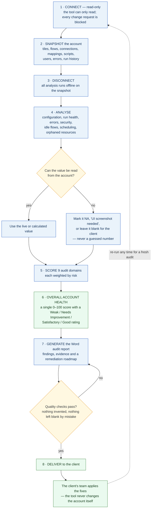

# AI Celigo Auditing Tool — High-Level Process Flow

**In one sentence:** the tool takes a single read-only snapshot of a Celigo account,
analyses it offline, scores its health out of 100, and produces a Word audit report with
a remediation roadmap — without ever changing anything in the client's account.

### The 9 scored domains

| Domain | Weight | Domain | Weight |
|---|---|---|---|
| Security & Governance | 18% | Data Mapping & Transformation | 9% |
| Error Management & Alerting | 16% | Architecture & Tile Design | 9% |
| Connections & Authentication | 13% | Scheduling & Performance | 8% |
| Flow Configuration | 12% | Documentation & Naming | 5% |
| Flow Lifecycle & Idle Flows | 10% | | |

### Three things that make this audit trustworthy

- **It cannot break anything.** The account is only ever read. Any attempt to create,
  change, delete or run something is blocked before it reaches Celigo.
- **Nothing is invented.** Every number in the report comes from the account or is
  calculated from it. Anything that can't be read is shown honestly as `NA`, as a value
  the client's admin must screenshot, or left blank — never filled with a guess.
- **It's repeatable and account-agnostic.** The same process runs against any Celigo
  account, and a report can be regenerated from a snapshot at any time without going
  back to the live account.

---

*High-level view — for a detailed technical breakdown see
[AI_Celigo_Auditing_Tool_Consolidated_Flowchart_v1.0.md](AI_Celigo_Auditing_Tool_Consolidated_Flowchart_v1.0.md)
(full single chart) or [AI_Celigo_Auditing_Tool_Process_Flowchart_v1.0.md](AI_Celigo_Auditing_Tool_Process_Flowchart_v1.0.md)
(phase-by-phase).*
