# AI Celigo Auditing Tool — Complete Process Flowchart (v1.0)

> **What this is.** The end-to-end process of this project, from an empty machine to a
> delivered DOCX audit report, drawn as flowcharts. It covers **every** stage: setup,
> the three-layer read-only enforcement, the live extraction, the offline derivation,
> the scoring model, the DOCX render, the verification gates, and the governance
> (save / archive) loop.
>
> **Accuracy basis.** Every node below was traced from the **source files on disk**
> (not from the README or the CHANGELOG) on **2026-08-03**. Each node maps to a real
> file and line range — see [§11 Traceability](#11-traceability--node--source). Where a
> component exists on disk but is **not part of the working flow** (stub or dormant
> NetSuite-era code), it is drawn dashed and listed in [§12](#12-on-disk-but-not-in-the-flow).
>
> **How to read.** Diagrams are Mermaid — they render in VS Code (Markdown Preview,
> Mermaid extension), GitHub, Obsidian, and most Markdown viewers. Colour/shape legend:
>
> | Shape | Meaning |
> |---|---|
> | Rectangle | A script / process step that runs |
> | Rounded | A file or data artifact produced or consumed |
> | Diamond | A decision or enforcement gate |
> | Dashed | Exists on disk but **not** wired into the working flow |

---

## Contents

1. [Master flow — the whole project in one view](#1-master-flow--the-whole-project-in-one-view)
2. [Phase 0 — One-time setup & preflight](#2-phase-0--one-time-setup--preflight)
3. [Phase 1 — Read-only enforcement (the three layers)](#3-phase-1--read-only-enforcement-the-three-layers)
4. [Phase 2 — Extract (the only live step)](#4-phase-2--extract-the-only-live-step)
5. [Phase 3 — Derive (offline analysis modules)](#5-phase-3--derive-offline-analysis-modules)
6. [Phase 4 — Score (scoring model v1)](#6-phase-4--score-scoring-model-v1)
7. [Phase 5 — Render (Markdown → DOCX)](#7-phase-5--render-markdown--docx)
8. [Phase 6 — Verify (the gates)](#8-phase-6--verify-the-gates)
9. [Cross-cutting — the live-or-NA decision tree](#9-cross-cutting--the-live-or-na-decision-tree)
10. [Phase 7 — Governance: change, save, archive](#10-phase-7--governance-change-save-archive)
11. [Traceability — node → source](#11-traceability--node--source)
12. [On disk but NOT in the flow](#12-on-disk-but-not-in-the-flow)
13. [The exact command sequence](#13-the-exact-command-sequence)

---

## 1. Master flow — the whole project in one view

```mermaid
flowchart TD
    subgraph P0["Phase 0 — Setup (once per machine)"]
        A1["Operator fills config/account.json<br/>apiToken + cli.mode=read + proxy block"]
        A2["scripts/bootstrap.ps1<br/>Node 22+ check, install/verify Celigo CLI,<br/>force mode=read, validate token, read-only connectivity test"]
        A1 --> A2
    end

    subgraph P1["Phase 1 — Read-only enforcement (always on)"]
        B1["Layer 3: config invariant<br/>cli.mode pinned to read"]
        B2["Layer 2: CeligoAuth.psm1<br/>Assert-CeligoReady + read-verb default-deny<br/>+ Invoke-CeligoApi GET/HEAD only"]
        B3["Layer 1: celigo-readonly-proxy.mjs<br/>holds the token, loopback only,<br/>GET/HEAD forwarded, everything else 405"]
    end

    subgraph P2["Phase 2 — Extract (the ONLY live contact)"]
        C1["scripts/extract-celigo.ps1<br/>7 core resources via the proxy"]
        C2["Supplementary CLI reads<br/>users, licenses, notifications, account stats/lint, jobs"]
        C3["4 fetch-*.mjs modules via the proxy<br/>scripts review, connection dependencies,<br/>flow errors, /v1/usage"]
        C4(["config/work/snapshot_DD_MM_YYYY/<br/>raw JSON, gitignored"])
        C1 --> C4
        C2 --> C4
        C3 --> C4
    end

    subgraph P3["Phase 3-4 — Derive + Score (100% OFFLINE)"]
        D1["gen-live-report-full.mjs<br/>resolves the latest snapshot"]
        D2["8 derive-*.mjs modules<br/>run-history, error-MTTR, connection-usage,<br/>export-classification, user-security,<br/>resource-classification, subscription-usage, stale-flows"]
        D3["Scoring model v1<br/>9 risk-weighted domains, NA excluded and re-normalised"]
        D4(["reports/Celigo_Audit_Report_LIVE_DD_MM_YYYY.md"])
        D1 --> D2 --> D3 --> D4
    end

    subgraph P5["Phase 5-6 — Render + Verify"]
        E1["build-live-docx-full.py<br/>neutral live cover, no fabricated client"]
        E2["build_celigo_template.py<br/>shared markdown to OOXML converter"]
        E3["office/pack.py<br/>OOXML schema validation at pack"]
        E4{"Gates: 0 unfilled placeholders,<br/>0 fabrication fingerprints,<br/>0 stale NetSuite header,<br/>table count re-derived from disk"}
        E5(["reports/Celigo_Audit_Report_LIVE_DD_MM_YYYY.docx<br/>THE DELIVERABLE"])
        E1 --> E2 --> E3 --> E4
        E4 -->|pass| E5
        E4 -->|fail| D1
    end

    subgraph P7["Phase 7 — Governance"]
        F1["Operator review"]
        F2["Save: CHANGELOG + memory + session archive + Files row"]
        F3["Next day-start ritual re-reconciles record vs disk"]
        F1 --> F2 --> F3
    end

    A2 --> B1 --> B2 --> B3 --> C1
    C4 --> D1
    D4 --> E1
    E5 --> F1
    F3 -.->|"next audit cycle"| C1
```

**The single most important property of this flow:** live Celigo contact happens **only
in Phase 2**. Phases 3–6 read the snapshot from disk and make **zero** network calls, so
a report can be regenerated any number of times without touching the client account.

---

## 2. Phase 0 — One-time setup & preflight

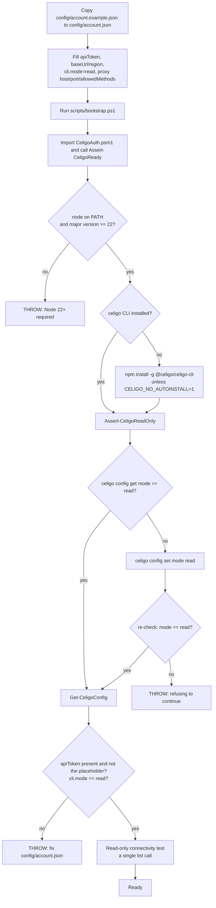

**Key guarantees established here:** the CLI can no longer mutate (`mode=read` rejects
mutations client-side), and the token is validated without ever being written to
`~/.celigo/config.json` — `config/account.json` stays the single source of truth and is
supplied to the CLI through an environment variable at call time only.

---

## 3. Phase 1 — Read-only enforcement (the three layers)

The account's API token is **full-permission** (no read-only token exists on this
account), so read-only is guaranteed by **architecture**, not by trust in the token.

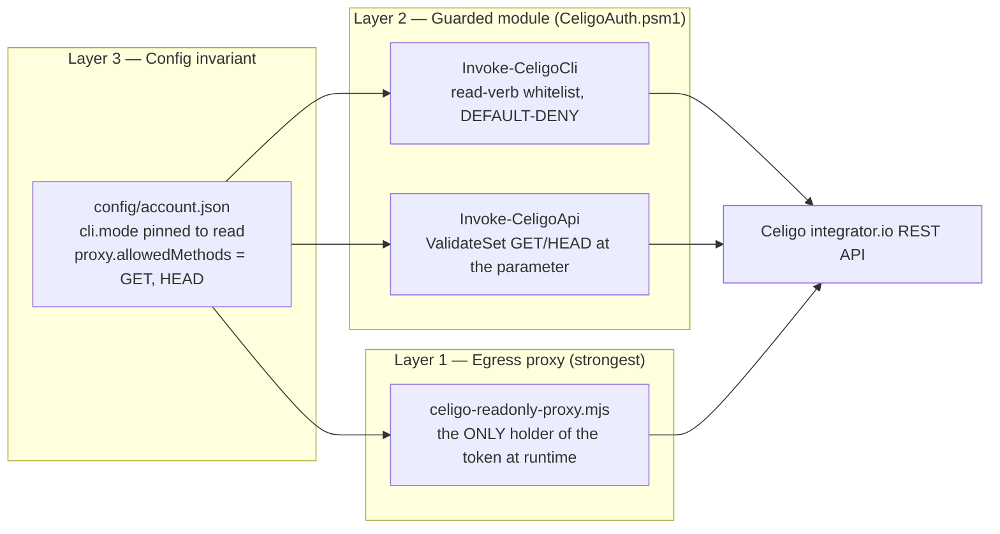

### 3.1 What a request actually does

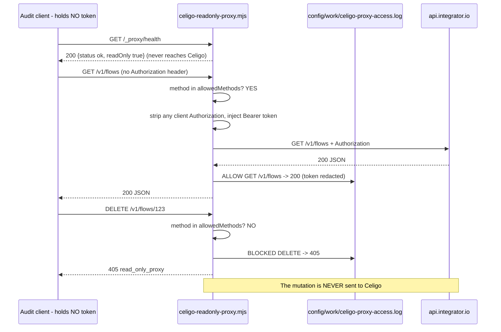

### 3.2 The proxy's own refusal conditions (fail-closed at startup)

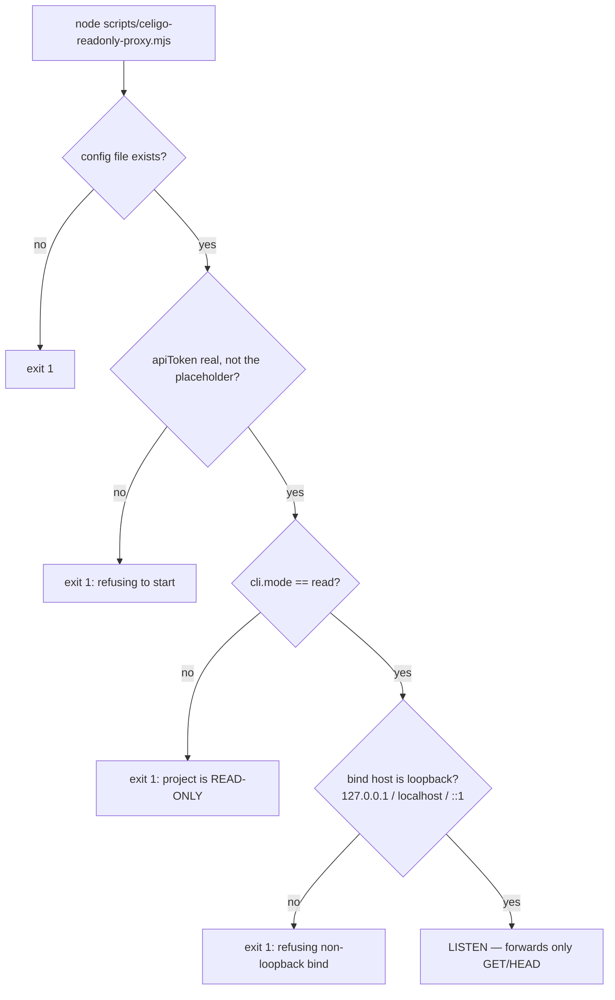

**Verb enforcement in Layer 2.** `Invoke-CeligoCli` scans the arguments for the first
non-flag token and treats it as the verb: on the read whitelist → allowed; on the
explicit mutating list → blocked; **unrecognised → blocked** (default-deny).

| Allowed (read) | Blocked (explicit mutating) |
|---|---|
| `list`, `get`, `show`, `whoami`, `audit`, `errors`, `resolved-errors`, `error`, `dependencies`, `used-by`, `download`, `info`, `tokeninfo`, `account` | `create`, `update`, `set`, `delete`, `run`, `clone`, `resolve-errors`, `add`, `remove`, `rename`, `enable`, `disable`, `install`, `deploy`, `import`, `revoke`, `rotate`, `retry`, `cancel`, `replay`, `pause`, `resume`, `activate`, `deactivate` |

---

## 4. Phase 2 — Extract (the only live step)

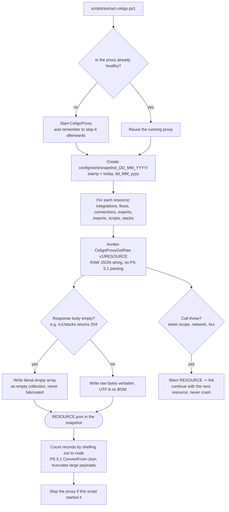

### 4.1 Everything that lands in a snapshot

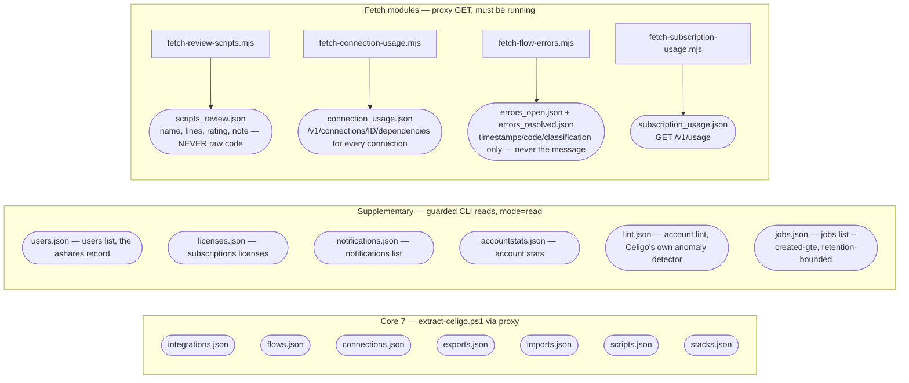

**Two privacy rules enforced inside the fetch modules:** `fetch-review-scripts.mjs`
persists only line count, heuristic rating and a note — **never the script source**;
`fetch-flow-errors.mjs` persists only `occurredAt` / `resolvedAt` / `code` / `source` /
`classification` — **never the error `message`, `exportDataURI`, `traceKey` or retry
keys**, because those carry the client's business data.

---

## 5. Phase 3 — Derive (offline analysis modules)

Every module below is **read-only, offline, account-agnostic and live-or-`NA`** — none
of them makes a Celigo call; each degrades to `NA` on missing/empty input rather than
fabricating a `0`, and none hardcodes an account id, date or path.

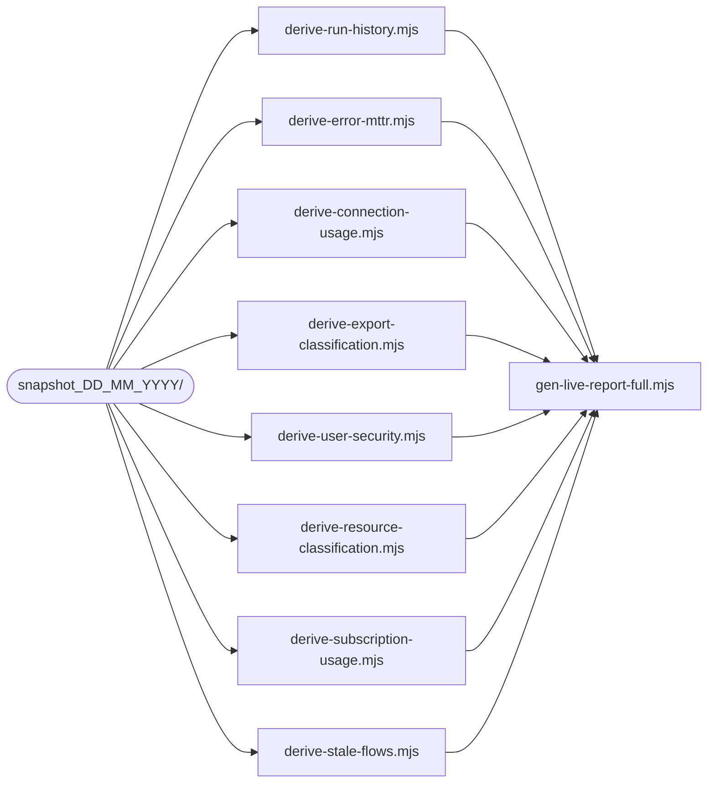

| # | Module | Reads | Produces | Accuracy rule it enforces |
|---|---|---|---|---|
| 1 | `derive-run-history.mjs` | `jobs.json` | Observed job window (min→max `createdAt`), success rate **with its denominator**, `purgeAt` record horizon, caveats | The window is read **from the data** — never labelled a hard "30-day"; zero jobs → `NA`, not 0% |
| 2 | `derive-error-mttr.mjs` | `errors_open.json`, `errors_resolved.json` | Backlog, resolved counts (auto vs manual), MTTR mean/median, error taxonomy by code | MTTR comes from `occurredAt`→`resolvedAt`, **not** from job `numResolved` (which is 0); no resolved errors → `NA` |
| 3 | `derive-connection-usage.mjs` | `connection_usage.json`, `flows.json`, `lint.json` | orphaned / referenced-but-in-no-flow / used-by-flow; offline-but-used-by-enabled-flow | Uses Celigo's authoritative `/dependencies`, not partial JSON traversal; cross-checked against `account lint` |
| 4 | `derive-export-classification.mjs` | `exports.json` | Three **independent** facets: adaptor type, sync mode, role (lookup vs standalone) | A blank sync mode is "unspecified", never "(none)"/unknown |
| 5 | `derive-user-security.mjs` | `users.json`, `licenses.json` | Three independent SSO facts (plan capability / account-required / per-user linked), account MFA-required, access governance | "SSO licensed" is never reported as "SSO enforced"; an unset flag is "unset", never coerced to false |
| 6 | `derive-resource-classification.mjs` | `flows.json`, `connections.json`, `integrations.json`, `lint.json`, `connection_usage.json` | Additive tags: disabled / orphaned / test-dev-candidate / duplicate / production, plus a production subset | Tags are **additive** — nothing is deleted or hidden; the name regex and flagged names are emitted for operator review |
| 7 | `derive-subscription-usage.mjs` | `subscription_usage.json`, `licenses.json` | Processing-time totals, per-year, earliest/latest period | Empty or non-200 → `NA`, never a fabricated 0; the entitlement **%** stays a UI-screenshot item |
| 8 | `derive-stale-flows.mjs` | `flows.json` | Enabled-but-idle and never-run flows, bucketed never / >1y / 6-12m / 3-6m / <3m | Uses the persistent `lastExecutedAt`, so it is **not** bound by the short `/v1/jobs` retention |

> **Naming note.** The project docs refer to this set as "the 10 read-only
> derivation/fetch modules". On disk that is **8 `derive-*` + 4 `fetch-*` files**; the
> shorthand counts the eight *concerns* above with their paired fetchers, and
> `fetch-review-scripts.mjs` predates the accuracy workstream. The generator imports the
> **8 `derive-*`** modules and prints an availability flag for each on every run.

---

## 6. Phase 4 — Score (scoring model v1)

Finalised 2026-07-28. Applied **identically** in the live generator and the static
template, so the two deliverables can never disagree on method.

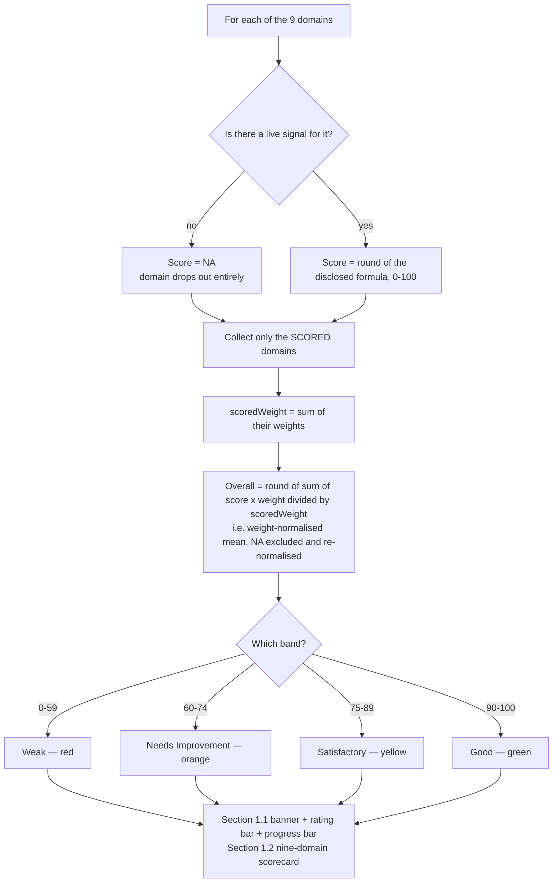

| # | Domain | Weight | Live signal the score is derived from |
|---|---|---|---|
| 1 | Security & Governance | 18% | mean of (SSO-linked users ÷ users) and (MFA-required users ÷ users); token rotation & audit log are UI-blocked |
| 2 | Error Management & Alerting | 16% | 50 points for having ≥1 notification subscription + 50 points for a zero open-error backlog |
| 3 | Connections & Authentication | 13% | online connections ÷ total connections |
| 4 | Flow Configuration | 12% | exports using delta or webhook sync ÷ total exports |
| 5 | Flow Lifecycle & Idle-Flow Hygiene | 10% | (active flows − idle/never-run active flows) ÷ active flows |
| 6 | Data Mapping & Transformation | 9% | imports with a field mapping ÷ total imports |
| 7 | Architecture & Tile Design | 9% | (all resources − orphaned exports/imports/connections) ÷ all resources |
| 8 | Scheduling & Performance | 8% | job success rate over the observed window |
| 9 | Documentation & Naming | 5% | not computed live this pass → **NA**, excluded |

**Worked example (the 2026-07-27 live run).** Eight domains scored, Documentation `NA`
→ `scoredWeight` = 95, weighted sum ÷ 95 = **43/100 🔴 Weak**. Because a `NA` domain is
removed *and* the denominator shrinks with it, an unmeasurable domain can never silently
drag the overall score up or down.

---

## 7. Phase 5 — Render (Markdown → DOCX)

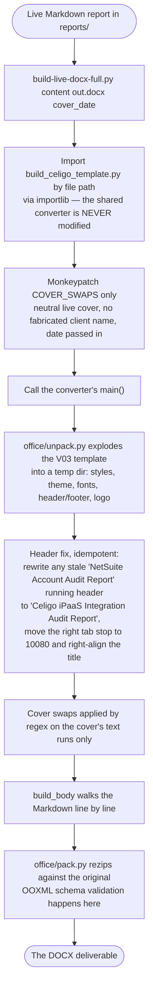

### 7.1 How each Markdown construct is rendered

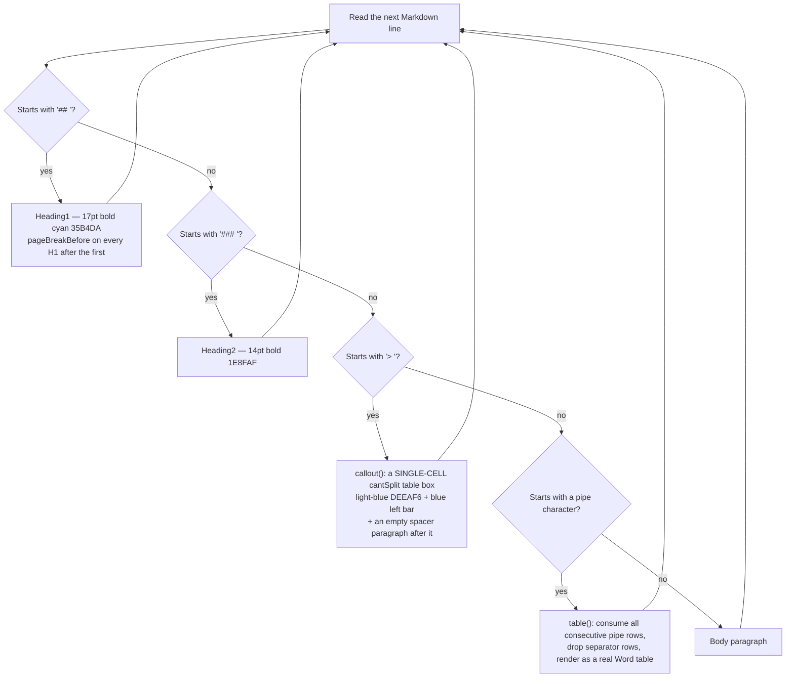

### 7.2 The table renderer's automatic formatting rules

| Trigger detected in the table | What the converter does |
|---|---|
| Header row is exactly `Metric \| Value \| Metric \| Value` | Draws a 1.5pt black **panel separator** down the middle boundary, so §1.3 reads as two panels |
| First row is a single cell above a wider header row | Renders it as a full-width **spanning title row** via `gridSpan` — this is how "Reviewers & Approvers" is titled |
| A column whose header is exactly `Score` | Boxes that column's **body** cells in bright green `43A047` |
| A body row containing `◀` | Boxes the whole **current-band row** green and renders `◀ current` bold + green |
| A cell containing a `█…░` bar | `_bar_runs()` renders bordered blocks, filled in the band colour keyed on the 🔴🟠🟡🟢 dot in the same cell, empty blocks grey `D9D9D9` |
| A cell starting with ✅ / ⚠️ / ❌ | Strips the icon and renders the remaining word **bold in that severity's colour** (green `2E7D32` / amber `E68A00` / red `C00000`) |
| A cell containing 🔴🟠🟡🟢 | **Left alone** — severity and rating dots stay as circular icons by design |

> **Why callouts are tables.** A `>` note used to be a shaded *paragraph*, which ghosted
> and duplicated itself when it landed on a page boundary. Rendering each as a
> single-cell `cantSplit` table makes it physically unsplittable. Consequence to
> remember: **callout boxes count toward the docx `<w:tbl>` total**, which is why the
> authoritative table counts live in one place only — `.agent/03_AUDIT_PLAYBOOK.md`.

---

## 8. Phase 6 — Verify (the gates)

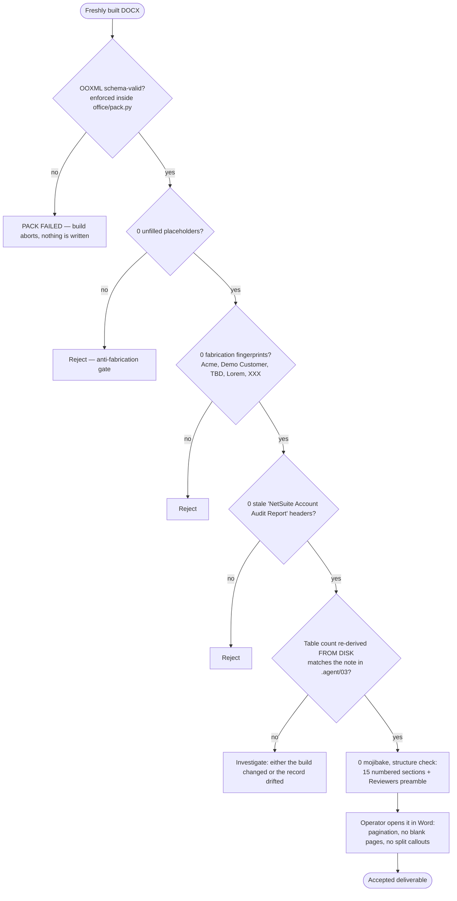

**Re-derive the counts, never quote them from memory:**

```bash
python -c "import zipfile,re;x=zipfile.ZipFile(P).read('word/document.xml').decode('utf8');t=re.findall(r'<w:tbl>.*?</w:tbl>',x,re.S);print(len(t),sum('DEEAF6' in i for i in t))"
```

---

## 9. Cross-cutting — the live-or-NA decision tree

This is the rule that governs **every single value** in the report. It is the project's
core anti-fabrication contract.

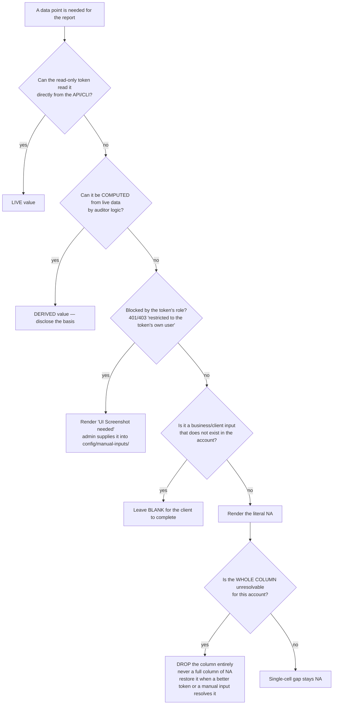

| Class | Examples | Where it comes from |
|---|---|---|
| **Live** | tiles, flows, connections, exports/imports, scripts, users, licences, lint, jobs | Direct `GET` via proxy / CLI `mode=read` |
| **Derived** | MTTR, connection→flow usage, idle flows, success rate, schedule contention, scores | The 8 `derive-*` modules |
| **Auditor-generated** | methodology, severity definitions, remediation roadmap, glossary | Standard content the tool produces |
| **UI Screenshot needed** | account name/ID, sandbox, on-premise agents, audit log/owner, API tokens, entitlement %, per-user MFA-enabled, per-flow auto-retry, credential rotation date | Token-role blocked — 401/403 |
| **Blank** | reviewers & sign-off, business SLAs, RACI, RTO/RPO | Client business input |

**The token-role boundary is the single biggest scope lever:** an owner/admin token would
convert several "UI Screenshot needed" rows into live values with no code change.

---

## 10. Phase 7 — Governance: change, save, archive

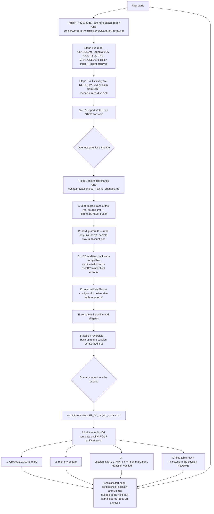

> **Known limitation of the hook (observed 2026-08-03).** `check-session-archive.mjs`
> compares the newest **source** mtime against the newest archive. A session that only
> regenerates the deliverable in `reports/` therefore does **not** trip it — exactly what
> happened on 2026-07-31, whose report regeneration is still un-archived. The day-start
> ritual, not the hook, remains the source of truth.

---

## 11. Traceability — node → source

Every diagram node above resolves to real code. Verified 2026-08-03.

| Flow node | File | Lines |
|---|---|---|
| Preflight (Node/CLI/mode/token) | [scripts/CeligoAuth.psm1](../scripts/CeligoAuth.psm1) `Assert-CeligoReady` | 101–106 |
| Read-verb whitelist / mutating list | [scripts/CeligoAuth.psm1](../scripts/CeligoAuth.psm1) | 25–35 |
| Default-deny verb test | [scripts/CeligoAuth.psm1](../scripts/CeligoAuth.psm1) `Test-ReadOnlyVerb` | 108–118 |
| Guarded CLI call, token via env | [scripts/CeligoAuth.psm1](../scripts/CeligoAuth.psm1) `Invoke-CeligoCli` | 120–142 |
| GET/HEAD-only REST wrapper | [scripts/CeligoAuth.psm1](../scripts/CeligoAuth.psm1) `Invoke-CeligoApi` | 144–155 |
| Proxy helpers (start/stop/health/get/raw) | [scripts/CeligoAuth.psm1](../scripts/CeligoAuth.psm1) | 165–239 |
| Proxy fail-closed startup checks | [scripts/celigo-readonly-proxy.mjs](../scripts/celigo-readonly-proxy.mjs) | 29–61 |
| Access log, token redacted | [scripts/celigo-readonly-proxy.mjs](../scripts/celigo-readonly-proxy.mjs) | 63–71 |
| Health endpoint | [scripts/celigo-readonly-proxy.mjs](../scripts/celigo-readonly-proxy.mjs) | 78–82 |
| **The 405 enforcement** | [scripts/celigo-readonly-proxy.mjs](../scripts/celigo-readonly-proxy.mjs) | 85–95 |
| Token injection + forward | [scripts/celigo-readonly-proxy.mjs](../scripts/celigo-readonly-proxy.mjs) | 97–119 |
| Snapshot loop, empty→`[]`, per-resource NA | [scripts/extract-celigo.ps1](../scripts/extract-celigo.ps1) | 37–55 |
| Latest-snapshot resolution | [audit-docx-tool/live-prototype/gen-live-report-full.mjs](../audit-docx-tool/live-prototype/gen-live-report-full.mjs) | 28–42 |
| Snapshot loads with graceful defaults | [gen-live-report-full.mjs](../audit-docx-tool/live-prototype/gen-live-report-full.mjs) | 44–58 |
| Region derived from config | [gen-live-report-full.mjs](../audit-docx-tool/live-prototype/gen-live-report-full.mjs) | 60–62 |
| The 8 derive modules invoked | [gen-live-report-full.mjs](../audit-docx-tool/live-prototype/gen-live-report-full.mjs) | 64–72 |
| **Scoring model v1** | [gen-live-report-full.mjs](../audit-docx-tool/live-prototype/gen-live-report-full.mjs) | 90–120 |
| Report body emission (§1–§15 + appendices) | [gen-live-report-full.mjs](../audit-docx-tool/live-prototype/gen-live-report-full.mjs) | 122–420 |
| Markdown written to `reports/` | [gen-live-report-full.mjs](../audit-docx-tool/live-prototype/gen-live-report-full.mjs) | 422–426 |
| Converter imported, cover monkeypatched | [build-live-docx-full.py](../audit-docx-tool/live-prototype/build-live-docx-full.py) | 22–37 |
| Stale running-header fix | [audit-docx-tool/scripts/build_celigo_template.py](../audit-docx-tool/scripts/build_celigo_template.py) | 349–365 |
| Cover text swaps | [build_celigo_template.py](../audit-docx-tool/scripts/build_celigo_template.py) | 372–374 |
| Markdown dispatch (`##`/`###`/`>`/`\|`) | [build_celigo_template.py](../audit-docx-tool/scripts/build_celigo_template.py) `build_body` | 297–325 |
| Table auto-rules (separator, span, Score, ◀) | [build_celigo_template.py](../audit-docx-tool/scripts/build_celigo_template.py) `table` | 205–256 |
| Cell rules (result marks, borders, span) | [build_celigo_template.py](../audit-docx-tool/scripts/build_celigo_template.py) `cell` | 152–203 |
| Progress bar renderer | [build_celigo_template.py](../audit-docx-tool/scripts/build_celigo_template.py) `_bar_runs` | 96–120 |
| `cantSplit` callout box | [build_celigo_template.py](../audit-docx-tool/scripts/build_celigo_template.py) `callout` | 272–295 |
| Pack + OOXML validation | [build_celigo_template.py](../audit-docx-tool/scripts/build_celigo_template.py) | 381–385 |
| Session-archive reminder hook | [scripts/check-session-archive.mjs](../scripts/check-session-archive.mjs) + `.claude/settings.json` | — |

---

## 12. On disk but NOT in the flow

Drawn here so the chart is **complete as well as correct** — these files exist but no
arrow in the working pipeline touches them.

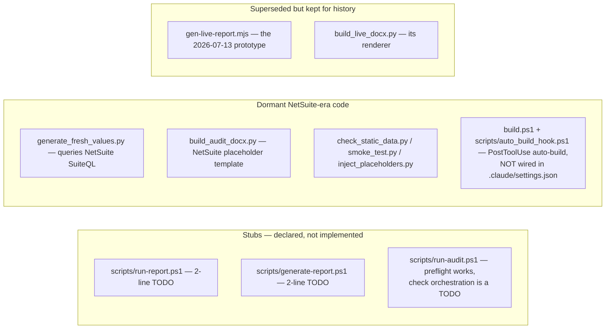

- The **stubs** are safe: `run-audit.ps1` still runs the full read-only preflight before
  reporting that orchestration is unimplemented.
- The **dormant NetSuite scripts** lost their target when the `PLACEHOLDERS` template was
  deleted on 2026-07-10. `check_static_data.py` and `smoke_test.py` are therefore **not
  runnable build gates today** — the gates actually in force are the ones in §8.
- The **superseded prototype** is retained deliberately as the artifact the frozen data
  scope was first validated against.

---

## 13. The exact command sequence

A complete audit, from a configured machine to a delivered report. Steps 1–3 are the only
ones that contact Celigo.

```powershell
# --- ONE TIME -------------------------------------------------------------
Copy-Item config\account.example.json config\account.json   # then fill in apiToken
.\scripts\bootstrap.ps1                                      # preflight + read-only connectivity test

# --- 1. Start the read-only egress proxy (its own terminal) ---------------
.\scripts\proxy.ps1                                          # GET/HEAD only; 405s every mutation

# --- 2. Extract the core snapshot ----------------------------------------
.\scripts\extract-celigo.ps1                                 # -> config/work/snapshot_<DD_MM_YYYY>/

# --- 3. Supplementary live reads (guarded CLI, mode=read) + fetch modules -
#     users list | subscriptions licenses | notifications list |
#     account stats | account lint | jobs list --created-gte <date>
node audit-docx-tool/live-prototype/fetch-review-scripts.mjs     <projectRoot>
node audit-docx-tool/live-prototype/fetch-connection-usage.mjs   <projectRoot>
node audit-docx-tool/live-prototype/fetch-flow-errors.mjs        <projectRoot>
node audit-docx-tool/live-prototype/fetch-subscription-usage.mjs <projectRoot>
# Stop the proxy here — nothing below touches Celigo.

# --- 4. Derive + score + emit Markdown (OFFLINE) --------------------------
node audit-docx-tool/live-prototype/gen-live-report-full.mjs <projectRoot> [snapshotDir]

# --- 5. Render the DOCX (OFFLINE) -----------------------------------------
python audit-docx-tool/live-prototype/build-live-docx-full.py `
       reports/Celigo_Audit_Report_LIVE_<DD_MM_YYYY>.md `
       reports/Celigo_Audit_Report_LIVE_<DD_MM_YYYY>.docx `
       "<DD Mon YYYY>"

# --- 6. Verify (§8), then keep reports/ to the deliverable + logs/ only ----
```

The **static illustrative template** is a separate, parallel deliverable built from its
own source with the same shared converter — it never touches Celigo:

```powershell
python audit-docx-tool/scripts/build_celigo_template.py
# defaults: templates/celigo_audit_report_v01_source.md -> templates/celigo_audit_report_template_v01.docx
```

---

*Document version 1.0 — authored 2026-08-03. Every node traced from source files on
disk; no value in this document was taken on trust from another document. Read-only:
producing this document made no Celigo call and changed no code.*
