# AI NetSuite Auditing Tool — Consolidated Process Flowchart (v1.0)

> **One diagram, the whole project.** Setup → read-only discipline → SDF deploy → in-account
> capture → local deep-dives → value generation → scoring → DOCX render → verification gates →
> governance loop, plus the live-or-`NA` value rule and the components that exist on disk but are
> not in the flow.
>
> Traced from the source files on disk on **2026-08-03** — not from the README or the CHANGELOG.
> For per-phase diagrams, module input/output tables and file-and-line traceability, see the
> companion
> [AI_NetSuite_Auditing_Tool_Process_Flowchart_v1.0.md](AI_NetSuite_Auditing_Tool_Process_Flowchart_v1.0.md).

**Legend** — rectangle = a step that runs · rounded = a file/artifact · diamond = a decision or
enforcement gate · red = a refusal path · dashed grey = on disk but **not** wired into the working
flow.

```mermaid
flowchart TD

%% ============================ 0. SETUP ============================
    subgraph PH0["PHASE 0 - SETUP (once per machine, once per account)"]
        direction TB
        A1["Copy config/account.example.json to config/account.json<br/>fill accountId, TBA consumer key/secret + token, sdf.passkey,<br/>sdf.certIdAdmin, java.javaHome, audit.adminEmailDomain"]
        A2["scripts/bootstrap.ps1 - safe to re-run, skips completed steps"]
        A3{"Java 21 found?<br/>SuiteCloud CLI installed?<br/>account.json filled?<br/>SDF auth ID registered?"}
        A4["Auto-remediate:<br/>npm install -g @oracle/suitecloud-cli<br/>suitecloud account:setup:ci with the RSA-4096 private key"]
        A5["WARN or EXIT - nothing is deployed<br/>SDF deploy cannot run without Java 21 and the cert"]
        A1 --> A2 --> A3
        A3 -->|"missing"| A4 --> A3
        A3 -->|"cannot satisfy"| A5
        A3 -->|"all OK"| A6["Ready - hand off to the initial deploy"]
    end

%% ==================== 1. READ-ONLY DISCIPLINE ====================
    subgraph PH1["PHASE 1 - READ-ONLY DISCIPLINE (four layers, always on)"]
        direction TB
        B1["LAYER 4 - the platform itself<br/>SuiteQL has no INSERT, UPDATE or DELETE statement<br/>every query the tool can express is a SELECT"]
        B2["LAYER 3 - least-privilege credentials<br/>tba.tokenId is a read-only audit role<br/>tba.adminTokenId is used ONLY for triggering, read-only COUNTs<br/>and creating AuditAI-owned reporting saved searches"]
        B3["LAYER 2 - what the deployed scripts do<br/>N/query + N/search + N/record.load to READ<br/>the only write is file.create of audit_result_*.json<br/>into the framework's own SuiteScripts/AuditAI folder"]
        B4["LAYER 1 - the standing guardrails<br/>CLAUDE.md + .agent/03 + config/precautions/01<br/>auto-loaded into the agent by the prompt hook"]
        B5{"Would an action modify a record<br/>the framework did not create?"}
        B6["REFUSE - report it as a finding instead<br/>with remediation steps for the client team to apply"]
        B7["Allowed: read anything, SDF-deploy AuditAI,<br/>write AuditAI result files, generate reports"]
        B1 --> B2 --> B3 --> B4 --> B5
        B5 -->|"yes"| B6
        B5 -->|"no"| B7
    end

%% ======================= 2. DEPLOY (SDF ONLY) ======================
    subgraph PH2["PHASE 2 - DEPLOY - THE ONLY WAY CODE ENTERS THE ACCOUNT"]
        direction TB
        C1["scripts/deploy.ps1<br/>reads java.javaHome + sdf.passkey from config, sets SUITECLOUD_CI"]
        C2["Stamps audit.adminEmailDomain into the three param XMLs<br/>for this deploy only, then restores the generic source"]
        C3["suitecloud project:deploy --accountspecificvalues WARNING<br/>run from SDF/AuditAI"]
        C4{"Deploy exit code 0?"}
        C5["ABORT - restore the source XMLs, surface the exit code"]
        SDFART(["Installed in NetSuite:<br/>24 .js files in SuiteScripts/AuditAI<br/>+ 28 Objects: 24 Script and Deployment records, 4 saved searches<br/>8 of the 24 scripts are Map/Reduce"])
        C6["scripts/secure_deploy.ps1 - client deliveries only<br/>obfuscate the JS body, keep the JSDoc header, deploy,<br/>restore readable source locally, restrict the folder"]
        C1 --> C2 --> C3 --> C4
        C4 -->|"no"| C5
        C4 -->|"yes"| SDFART
        C6 -.->|"alternative path, same single deploy command"| C3
    end

%% ==================== 3. CAPTURE - IN ACCOUNT =====================
    subgraph PH3["PHASE 3 - CAPTURE - THE AUDIT ENGINE RUNS INSIDE NETSUITE"]
        direction TB
        D1["scripts/run-audit.ps1 -Script all<br/>swaps in tba.adminTokenId, because a RESTlet runs as the caller's role<br/>and N/task.submit needs an admin-capable role"]
        D2["Deployer RESTlet action runScript, once per writer<br/>flips the deployment to NOTSCHEDULED, submits the task, restores status"]
        D3["16 result-writers run on demand<br/>= 16 of the 17 writers, everything except pageperf<br/>Map/Reduce writers give each item its own governance budget"]
        D4{"Was a check blocked<br/>by the executing role?"}
        D5["Write the result file WITH its own error field<br/>e.g. search_error - so the generator can tell<br/>a real zero from missing data"]
        D6["Write the live counts and findings"]
        RES(["17 audit_result_*.json in the account File Cabinet<br/>folder resolved AT RUNTIME from the deployer script's own folder,<br/>falling back to the SuiteScripts root - no hardcoded ID"])
        D7["Timer schedules also fire these daily or weekly<br/>so the account stays current without an operator"]
        D1 --> D2 --> D3 --> D4
        D4 -->|"yes"| D5 --> RES
        D4 -->|"no"| D6 --> RES
        D7 -.-> D3
    end

%% ============ 3b. WHAT NO SUITESCRIPT CAN REACH ===================
    subgraph PH3B["PHASE 3b - THE TWO READ-ONLY DEEP-DIVES + OPERATOR INPUTS"]
        direction TB
        E1["build.ps1 Step 0 - scripts/audit-workflow-actions.ps1<br/>per-action parameter VALUES exist only in the workflow XML"]
        E2["build.ps1 Step 0b - scripts/audit-customform-defs.ps1<br/>there is no customform table and no N/record form type"]
        E3["suitecloud object:import into a THROWAWAY temp project<br/>NEVER SDF/AuditAI, so imported client objects can never be deployed back<br/>deleted in a finally block either way"]
        E4["workflow_action_parser.py and parse_form_xml.py<br/>parse the XML into JSON"]
        WORK(["config/work/Workflow_Action_Audit_DD_MM_YYYY.json<br/>config/work/CustomForm_Defs_DD_MM_YYYY.json<br/>gitignored working files, never the deliverable"])
        E5["Operator-supplied facts NO API exposes<br/>account.accountTier from two billing screenshots<br/>+ config/manual-inputs CSV exports:<br/>Installed Bundles, Bundle Audit Trail, Integrations, UI Scripts"]
        E6["NON-FATAL by design<br/>a missing deep-dive or CSV degrades that block to NA<br/>the rest of the report is unaffected"]
        E1 --> E3
        E2 --> E3
        E3 --> E4 --> WORK
        E1 -.-> E6
        E2 -.-> E6
    end

%% ===================== 4. GENERATE THE VALUES =====================
    subgraph PH4["PHASE 4 - GENERATE - 12 phases, the last live contact with the account"]
        direction TB
        F0["generate_fresh_values.py --config --out<br/>report date, audit period and NetSuite release derived from today<br/>OAuth realm normalised to the underscore-uppercase Company ID form<br/>so a sandbox works with no code change"]
        F1["Phase 1 - read 17 result files<br/>Deployer RESTlet action readFileFull, newest file wins by name"]
        F2["Phase 2 - live SuiteQL inventory queries<br/>3 retries with backoff on network timeouts only<br/>an HTTP error is deterministic and is NOT retried"]
        F3["Phase 3 - compute the 34 sub-scores<br/>each guarded by an availability flag that checks the SOURCE's error field,<br/>not merely that the file exists"]
        F4["Phases 4 to 10 - observations, key findings, governance tables,<br/>finding-driven recommendations, remediation roadmap<br/>every sentence built from the live numbers, never asserted"]
        F5["Phase 11 - assemble the values dict<br/>Phase 12 - write it out"]
        VALS(["audit-docx-tool/input/values_DD_MM_YYYY.json<br/>401 keys - THE SNAPSHOT<br/>everything after this point is 100% offline"])
        F0 --> F1 --> F2 --> F3 --> F4 --> F5 --> VALS
    end

%% ============== 4b. THE VALUE RULE (every field) ==================
    subgraph PHV["THE LIVE-OR-NA VALUE RULE - governs EVERY value in the report"]
        direction TB
        V1{"Can the read-only token read it<br/>with a SuiteQL SELECT?"}
        V2{"Can a deployed script read it<br/>via N/search, N/record.load, N/dataset or N/config?"}
        V3{"Is the table full-access-gated<br/>e.g. savedreport, subsidiary, savedsearch?"}
        V4{"Is it sealed to every API<br/>e.g. customform definitions, the integration table?"}
        V5{"Is it a billing or Setup-page fact<br/>processors, storage, licensed users, concurrency?"}
        V6["LIVE value from SuiteQL"]
        V7["LIVE value from the audit result file"]
        V8["Read-only SELECT COUNT via the admin-token runQuery fallback"]
        V9["Read-only SDF object:import deep-dive, or the operator CSV"]
        V10["Operator-provided config.accountTier or manual-inputs"]
        V11["Render the literal NA<br/>plus a hint naming the permission or input that would fix it"]
        V12["count_or_none returns None on failure<br/>NEVER count, which fabricates a 0"]
        V1 -->|"yes"| V6
        V1 -->|"no"| V2
        V2 -->|"yes"| V7
        V2 -->|"no"| V3
        V3 -->|"yes"| V8
        V3 -->|"no"| V4
        V4 -->|"yes"| V9
        V4 -->|"no"| V5
        V5 -->|"yes"| V10
        V5 -->|"no"| V11
        V8 -.->|"still blocked"| V11
        V9 -.->|"input missing"| V11
        V10 -.->|"left blank"| V11
        V12 --> V11
    end

%% ============================ 5. SCORE ============================
    subgraph PH5["PHASE 5 - SCORE - 34 checks, 3 pillars, NA excluded and re-normalised"]
        direction TB
        G1["Each of the 34 checks maps a live number through a disclosed<br/>banding function to a 0-100 score<br/>Performance 12 - Optimization 13 - Security 9"]
        G2{"Does the check have a live basis?"}
        G3["Score = NA - the check drops out of its pillar entirely"]
        G4["Score = 0-100"]
        G5["Pillar = plain mean of ONLY its available checks<br/>a pillar with no available check is itself NA"]
        G6["Overall = weighted mean of the available pillars<br/>Performance 33, Optimization 33, Security 34<br/>weights re-normalised over what was actually measured"]
        G7{"Band?"}
        G8["below 65 - Needs Attention - red"]
        G9["65 to 79 - Fair - amber"]
        G10["80 to 100 - Good - green"]
        G1 --> G2
        G2 -->|"no"| G3 --> G5
        G2 -->|"yes"| G4 --> G5
        G5 --> G6 --> G7
        G7 --> G8
        G7 --> G9
        G7 --> G10
    end

%% =========================== 6. RENDER ============================
    subgraph PH6["PHASE 6 - RENDER - values JSON into DOCX, fully offline"]
        direction TB
        TPL(["templates/audit_report_template_v03_PLACEHOLDERS.docx<br/>the locked design source with 401 placeholders<br/>patched only by idempotent maintenance scripts, never by hand"])
        H1["build_audit_docx.py values.json<br/>compute_pillar_visuals derives the bars, colours and overall from the scores"]
        H2["office/unpack.py explodes the template into a temp dir"]
        H3["Expand the repeating rows FIRST, before token fill,<br/>because new rows carry their own placeholders:<br/>sub-category scores, governance risks, DEBUG scripts,<br/>deployment sprawl, bundles, workflows, actions,<br/>datasets, workbooks, custom forms - 16 repeating tables"]
        H4["Strip the editorial instruction paragraphs"]
        H5["Fill the simple placeholders and collect any left unfilled"]
        H6["Rewrite every saved-search hyperlink to the configured account's<br/>subdomain, so a drill-down link works on ANY account"]
        H7["office/pack.py rezips against the original<br/>OOXML schema validation happens HERE"]
        TPL --> H1
        H1 --> H2 --> H3 --> H4 --> H5 --> H6 --> H7
    end

%% =========================== 7. VERIFY ============================
    subgraph PH7["PHASE 7 - VERIFY - the gates, in the order they fire"]
        direction TB
        I1{"GATE 1 - static-data lint<br/>does any template data cell hold a literal<br/>instead of a placeholder?"}
        I2{"GATE 2 - render guard<br/>0 unfilled placeholders?"}
        I3{"GATE 3 - render guard<br/>0 demo-account fingerprints?<br/>0 demo-era recommendation prose?<br/>0 demo-era static assumptions?"}
        I4{"GATE 4 - OOXML schema-valid at pack?"}
        I5{"GATE 5 - smoke_test.py<br/>scores in range, overall equals the weighted mean,<br/>legend and appendix bands consistent,<br/>US spelling, all 9 sections present"}
        I6["Operator opens it in Word:<br/>page count, no blank pages"]
        I7["BUILD BLOCKED - exit 2, NO DOCX IS WRITTEN<br/>debug-only override AUDIT_ALLOW_UNVERIFIED=1, never for a deliverable"]
        I1 -->|"literal found"| I7
        I1 -->|"clean"| I2
        I2 -->|"unfilled"| I7
        I2 -->|"clean"| I3
        I3 -->|"fingerprint"| I7
        I3 -->|"clean"| I4
        I4 -->|"invalid"| I7
        I4 -->|"valid"| I5
        I5 -->|"fail"| I7
        I5 -->|"pass"| I6
    end

    DOCX(["reports/NetSuite_Audit_Report_DD_MM_YYYY.docx<br/>THE DELIVERABLE - reports/ holds only this plus logs/"])

%% ========================= 8. GOVERNANCE ==========================
    subgraph PH8["PHASE 8 - GOVERNANCE - how work enters and leaves the record"]
        direction TB
        J0["scripts/precautions_hook.ps1 fires on EVERY prompt<br/>and auto-loads the matching standing instructions"]
        J1["DAY START - good morning / hey claude code<br/>config/WorkStartWithThis/EveryDayStartPromp.md, read-only:<br/>read CLAUDE.md + .agent/00-05 + CHANGELOG + session archives,<br/>list every file, RE-DERIVE every claim from DISK, reconcile, report, STOP"]
        J2["CHANGE - make / save this change<br/>config/precautions/01_making_changes.md:<br/>A trace the real source first, never guess - B hard guardrails -<br/>C additive and backward-compatible - C2 must work on EVERY future account -<br/>D config/work for intermediates, reports/ for the deliverable only -<br/>E run the full pipeline and all gates - F keep it reversible, back up first"]
        J3["SAVE - save the project / save everything<br/>config/precautions/02_full_project_update.md:<br/>go folder by folder, update CURRENT-STATE only,<br/>never rewrite a historical entry"]
        J4["1. dated CHANGELOG.md entry"]
        J5["2. memory update - project_status.md + the MEMORY.md index line"]
        J6["3. session_NN_DD_MM_YYYY_summary.jsonl, redaction-verified"]
        J7["4. Files-table row + milestone in the session README"]
        J0 --> J1 --> J2 --> J3
        J3 --> J4
        J3 --> J5
        J3 --> J6
        J3 --> J7
    end

%% ==================== ON DISK BUT NOT IN THE FLOW =================
    subgraph PHX["ON DISK BUT NOT IN THE FLOW"]
        direction TB
        X1["DEPRECATED - scripts/generate-report.ps1, a Word-COM builder<br/>with a HARDCODED overall score - warns loudly and is kept for history only"]
        X2["SUPERSEDED - maintenance/fetch_live_values.py, the generator's predecessor<br/>and scripts/cross_reference.py, whose form fusion the generator now does inline"]
        X3["DORMANT ARTIFACTS - 14 .js.bak_folder files inside the deployable FileCabinet path,<br/>50 dated template backups, 13 SDF/_backups, temp_docx_extract,<br/>plus the unused halves of the bundled OOXML toolkit"]
        X4["UNREACHABLE DEPLOYER ACTIONS - createFile, createScript, createDeployment,<br/>deployFull, setExecuteAs, savedSearchList, loadSearch, runSavedSearch<br/>exist in the RESTlet - the first four are FORBIDDEN by Guardrail 2<br/>and NO pipeline script calls any of them"]
    end

%% ========================= PHASE WIRING ===========================
    A6 --> B1
    B7 --> C1
    SDFART --> D1
    RES --> F1
    WORK --> F0
    E5 --> F0
    F3 --> V1
    V6 --> G1
    V7 --> G1
    V8 --> G1
    V9 --> G1
    V10 --> G1
    V11 --> G1
    G8 --> VALS
    G9 --> VALS
    G10 --> VALS
    VALS --> H1
    H7 --> I1
    I6 --> DOCX
    DOCX --> J0
    J7 -.->|"next audit cycle - re-trigger for fresh data"| D1

%% ============================= STYLING ============================
    classDef gate fill:#fff8e1,stroke:#e8a33d,color:#3b3b3b;
    classDef refuse fill:#fdecea,stroke:#c00000,color:#7a0000;
    classDef artifact fill:#eaf3fb,stroke:#1d57be,color:#12325c;
    classDef live fill:#fdeaea,stroke:#c0392b,color:#5c1a12;
    classDef offline fill:#eafaef,stroke:#2e7d32,color:#14421c;
    classDef dormant fill:#f2f2f2,stroke:#9e9e9e,color:#666666,stroke-dasharray: 5 5;

    class A3,B5,C4,D4,V1,V2,V3,V4,V5,G2,G7,I1,I2,I3,I4,I5 gate;
    class A5,B6,C5,I7 refuse;
    class SDFART,RES,WORK,VALS,TPL,DOCX artifact;
    class C1,C2,C3,D1,D2,D3,E1,E2,E3,F0,F1,F2 live;
    class G1,G5,G6,H1,H2,H3,H4,H5,H6,H7 offline;
    class X1,X2,X3,X4 dormant;
```

---

### The five properties this chart is drawn to make unmissable

1. **Code enters the account through exactly one door.** `suitecloud project:deploy` is the only
   deployment path. The Deployer RESTlet *does* contain `createFile` / `createScript` /
   `createDeployment` / `deployFull` actions — and every one of them is **forbidden by Guardrail 2
   and called by nothing in the pipeline**. That is worth stating plainly: the read-only property
   here rests on the platform (SuiteQL is SELECT-only), on least-privilege credentials, and on
   enforced discipline — **not** on an egress gate that could physically reject a mutation.
2. **The only things the tool writes are its own.** The 24 deployed scripts and 28 objects, the
   17 `audit_result_*.json` files in the framework's own File Cabinet folder, and two AuditAI-owned
   drill-down saved searches created idempotently for the report's hyperlinks. Nothing else in the
   client account is created, changed or deleted — findings are reported with remediation steps for
   the client's team to apply.
3. **`values_<date>.json` is the snapshot boundary.** Live contact ends at Phase 4. Once the 401
   values exist, the render (Phase 6) and every gate (Phase 7) are **100% offline** and can be
   re-run any number of times against the same data — which is how each template fix in this
   project was validated. Note the difference from a snapshot-first design: **re-generating** the
   values *does* require the live account, because the generator queries SuiteQL directly.
4. **No value is ever invented, and the build proves it.** Every field walks the live-or-`NA` tree,
   `count_or_none` refuses to turn a failed query into a `0`, and an availability flag checks each
   source's own error field so a blocked check scores `NA` rather than a fabricated 100. Three
   gates then abort the build — **exit 2, no file written** — if a literal, an unfilled placeholder
   or a demo fingerprint would ship.
5. **An unmeasurable check cannot distort the score.** It is excluded *and* the denominator shrinks
   with it, at both levels: a check drops out of its pillar's mean, and a pillar drops out of the
   overall's re-normalised weighted mean.

### Current state at the time of tracing

| Fact | Value |
|---|---|
| Deployed scripts / SDF objects / Map/Reduce | **24 / 28 / 8** |
| Result files written / triggered by `-Script all` / read by the generator | **17 / 16 / 17** |
| Report values | **401 keys**, every one live-or-`NA` |
| Scored checks | **34** — Performance 12 · Optimization 13 · Security 9 |
| Last validated account | Meri Meri sandbox `6905393-sb1`, a least-privilege audit role |
| Latest report on disk | `reports/NetSuite_Audit_Report_23_07_2026.docx` — 42 tables, 103,404 bytes, 0 unfilled placeholders |
| Its scores | **Overall 70** · Performance 74 · Optimization 64 · Security 71 |

> **Record-vs-disk gap observed while tracing (2026-08-03).** The newest report and values file on
> disk are dated **23 July 2026** (Overall 70), but the newest `CHANGELOG.md` entry and the newest
> session archive both stop at **10 July 2026** (Overall 69). That 23 July run is **un-archived** —
> the day-start ritual, not any hook, is what surfaces this.

---

*Document version 1.0 — authored 2026-08-03, traced from source on disk. Producing it made no
NetSuite call and changed no code.*
