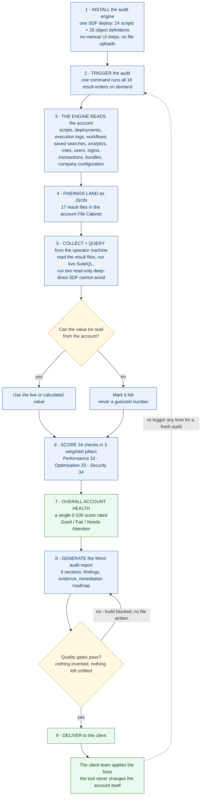

# AI NetSuite Auditing Tool — High-Level Process Flow

**In one sentence:** the tool deploys its own read-only audit engine into a NetSuite account
through SDF, triggers it, collects the findings from the account's File Cabinet, scores the
account's health out of 100 on the operator's machine, and produces a Word audit report with a
remediation roadmap — without ever changing anything the framework did not create itself.

---

### The 3 scored pillars and their 34 checks

| Pillar | Weight | Checks | What they measure |
|---|---|---|---|
| **Performance** | 33% | 12 | Page load and UI responsiveness, client-script density, API latency and failed executions, script timeout rate, error-log volume, governance-limit usage, workflow logging in production, workflow scheduled frequency, workbook data-source design, analytics asset load health, custom-form sprawl, custom-form maintainability |
| **Optimization** | 33% | 13 | Saved-search efficiency, orphaned scripts, TESTING-status deployments, test-named scripts, bundle currency, stale transactions and open POs, inactive records, workflow lifecycle hygiene, workflow hardcoded action values, dataset–workbook linkage, dataset complexity, custom-form lifecycle hygiene, custom-form export coverage |
| **Security** | 34% | 9 | Operator / admin accounts, batch-created accounts, segregation of duties, 2FA enforcement, password policy, IP address restrictions, login security, integration role hygiene, workflow run-as-Administrator |

Each pillar is the **plain mean of only its available checks** — a check with no live data is `NA`
and drops out of the mean entirely. The overall score is the weighted mean of the available
pillars, with the weights re-normalised so an unmeasurable pillar can never drag the result up
or down.

**Score bands:** 80–100 = Good · 65–79 = Fair · below 65 = Needs Attention.

### The 9 report sections

| # | Section | # | Section |
|---|---|---|---|
| 1 | Executive Dashboard | 6 | Features and Customization Summary |
| 2 | Scope & Methodology | 7 | Comprehensive Account Inventory |
| 3 | Performance Audit (3.1–3.6, incl. Workflows) | 8 | Remediation Roadmap |
| 4 | Optimization Audit (4.1–4.5, incl. Analytics + Custom Forms) | 9 | Appendices (Scoring, Glossary, Sign-off) |
| 5 | Security Audit (5.1–5.3) | | |

### Three things that make this audit trustworthy

- **It does not change the client's account.** The audit engine only reads — SuiteQL has no
  `INSERT`, `UPDATE` or `DELETE`, and the only things the framework ever writes are its own
  audit result files and its own reporting saved searches. Every finding is reported with
  remediation steps for the client's team to apply; the tool never applies a fix itself.
- **Nothing is invented.** Every number in the report comes from the account or is calculated
  from it. Anything that cannot be read is the literal `NA` — and three separate gates
  (a template lint, a build gate and a render guard) **abort the build with no file written**
  if a static, demo or leftover value would ship.
- **It's repeatable and account-agnostic.** Nothing is hardcoded but one gitignored credentials
  file: account IDs, folder IDs, saved-search IDs and script IDs are all resolved at runtime,
  and a value that a least-privilege role cannot see degrades to `NA` instead of crashing.

---

*High-level view — for a detailed technical breakdown see
[AI_NetSuite_Auditing_Tool_Consolidated_Flowchart_v1.0.md](AI_NetSuite_Auditing_Tool_Consolidated_Flowchart_v1.0.md)
(full single chart) or [AI_NetSuite_Auditing_Tool_Process_Flowchart_v1.0.md](AI_NetSuite_Auditing_Tool_Process_Flowchart_v1.0.md)
(phase-by-phase, with file-and-line traceability).*
