# AI NetSuite Auditing Tool — Complete Process Flowchart (v1.0)

> **What this is.** The end-to-end process of this project, from an empty machine to a delivered
> DOCX audit report, drawn as flowcharts. It covers **every** stage: setup, the read-only discipline,
> the SDF deploy, the in-account capture, the two read-only deep-dives that SuiteScript cannot
> replace, the value generation, the scoring model, the DOCX render, the verification gates, and the
> governance (save / archive) loop.
>
> **Accuracy basis.** Every node below was traced from the **source files on disk** (not from the
> README or the CHANGELOG) on **2026-08-03**. Each node maps to a real file and line range — see
> [§12 Traceability](#12-traceability--node--source). Where a component exists on disk but is **not
> part of the working flow** (deprecated, superseded or dormant), it is drawn dashed and listed in
> [§13](#13-on-disk-but-not-in-the-flow).
>
> **How to read.** Diagrams are Mermaid — they render in VS Code (Markdown Preview, Mermaid
> extension), GitHub, Obsidian, and most Markdown viewers. Shape legend:
>
> | Shape | Meaning |
> |---|---|
> | Rectangle | A script / process step that runs |
> | Rounded | A file or data artifact produced or consumed |
> | Diamond | A decision or enforcement gate |
> | Dashed | Exists on disk but **not** wired into the working flow |

---

## Contents

1. [Master flow — the whole project in one view](#1-master-flow--the-whole-project-in-one-view)
2. [Phase 0 — One-time setup & preflight](#2-phase-0--one-time-setup--preflight)
3. [Phase 1 — Read-only discipline (the four layers)](#3-phase-1--read-only-discipline-the-four-layers)
4. [Phase 2 — Deploy (the only way code enters the account)](#4-phase-2--deploy-the-only-way-code-enters-the-account)
5. [Phase 3 — Capture (the audit engine runs inside NetSuite)](#5-phase-3--capture-the-audit-engine-runs-inside-netsuite)
6. [Phase 3b — The two read-only deep-dives + operator inputs](#6-phase-3b--the-two-read-only-deep-dives--operator-inputs)
7. [Phase 4 — Generate the 401 values](#7-phase-4--generate-the-401-values)
8. [Phase 5 — Score (34 checks, 3 pillars)](#8-phase-5--score-34-checks-3-pillars)
9. [Phase 6 — Render (values JSON → DOCX)](#9-phase-6--render-values-json--docx)
10. [Phase 7 — Verify (the gates)](#10-phase-7--verify-the-gates)
11. [Cross-cutting — the live-or-NA decision tree](#11-cross-cutting--the-live-or-na-decision-tree)
12. [Traceability — node → source](#12-traceability--node--source)
13. [On disk but NOT in the flow](#13-on-disk-but-not-in-the-flow)
14. [Phase 8 — Governance: change, save, archive](#14-phase-8--governance-change-save-archive)
15. [The exact command sequence](#15-the-exact-command-sequence)

---

## 1. Master flow — the whole project in one view

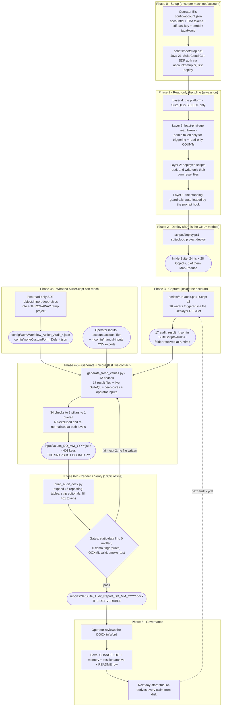

**The single most important property of this flow:** the tool **installs its own read-only engine**
and then reads. Live NetSuite contact spans Phases 2–4 and **ends when `values_<date>.json` is
written**; Phases 6–7 read that file from disk and make **zero** network calls, so a report can be
re-rendered any number of times without touching the account. (Re-*generating* the values does
require the account — the generator queries SuiteQL directly, there is no offline snapshot of the
raw account.)

---

## 2. Phase 0 — One-time setup & preflight

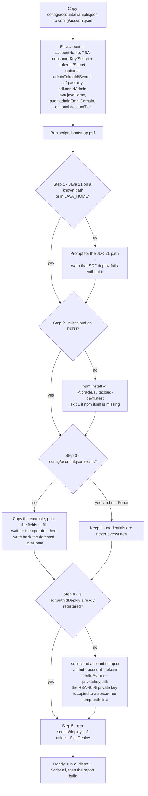

**Key guarantees established here.** `SUITECLOUD_CI=1` plus `SUITECLOUD_CI_PASSKEY` make every
later SDF call non-interactive, so a deploy never blocks on a prompt. The passkey and the private
key stay in `config/account.json` / `config/certs/` — the single source of truth — and are read
fresh on every invocation rather than being duplicated into any script. The certificate is mapped
to NetSuite's built-in **SuiteCloud Development Integration** application; a stale
`credentials_ci.p12` from a previous account must be removed before re-running against a new one.

---

## 3. Phase 1 — Read-only discipline (the four layers)

This project's read-only property is **not** enforced by an egress gate. It rests on four layers,
and it is worth being precise about which of them are structural and which are disciplinary.

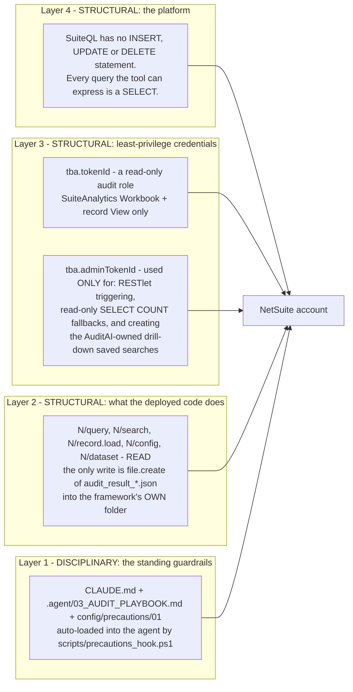

### 3.1 What a request actually does

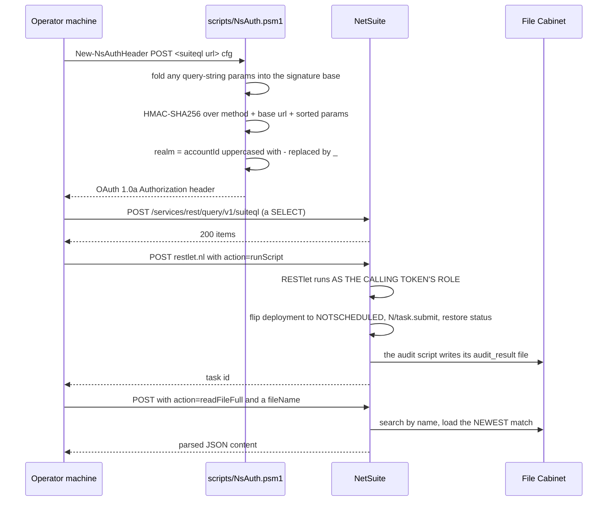

### 3.2 The Deployer RESTlet's action surface — and what the pipeline actually calls

| Action | Kind | Called by the pipeline? |
|---|---|---|
| `GET ?fileId=` | read | No — manual investigation only |
| `runScript` | trigger | **Yes** — `run-audit.ps1` |
| `readAllResults` | read | **Yes** — `run-audit.ps1 -ReadResult` |
| `readLogs` | read | **Yes** — `run-audit.ps1 -ReadResult` (single file) |
| `readFileFull` | read | **Yes** — `generate_fresh_values.py` (all 17 result files) |
| `runQuery` | read (SELECT-guarded) | **Yes** — the admin-token fallback for full-access-gated tables |
| `ensureDebugProdSearch` | creates an **AuditAI-owned** saved search, idempotent | **Yes** — the §3.3 drill-down hyperlink |
| `ensureDebugAllSearch` | creates an **AuditAI-owned** saved search, idempotent | **Yes** — the §3.3 total drill-down hyperlink |
| `lockFolder` | restricts the AuditAI folder | Only `secure_deploy.ps1` |
| `runSavedSearch`, `savedSearchList`, `loadSearch`, `setExecuteAs` | read / config | **No** |
| `createFile`, `createScript`, `createDeployment`, `deployFull` | **write — FORBIDDEN by Guardrail 2** | **No — nothing calls them** |

> **Stated plainly:** the four deployment actions exist in the RESTlet source and are explicitly
> forbidden by Guardrail 2. Verified by search, **no `.ps1` or `.py` in the project calls any of
> them**; the only invoked actions are the eight marked "Yes". A mutation is therefore prevented by
> platform limits, credential scope and enforced discipline — not by a component that could reject
> one at the wire. Removing those four actions from the RESTlet would make the guarantee
> structural; that is a deliberate open item, not an oversight in this document.

---

## 4. Phase 2 — Deploy (the only way code enters the account)

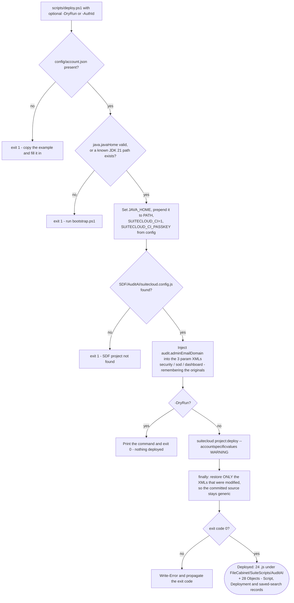

### 4.1 What SDF installs, and the three platform quirks baked into it

| Item | Detail |
|---|---|
| `src/manifest.xml` | `SERVERSIDESCRIPTING` must sit **inside** `<dependencies>`, not at top level |
| `src/deploy.xml` | Deploys `~/AccountConfiguration/*`, `~/FileCabinet/*`, `~/Objects/*` |
| Script `<name>` field | Hard limit of **40 characters** — every script name in `Objects/` respects it |
| `<starttime>` | Must land on a 30-minute increment (`03:30:00Z`, never `03:45`) |
| Changing `@NScriptType` | NetSuite binds a file to its original type: to convert Scheduled → Map/Reduce you must delete the **deployment, then the Script record, then the `.js` file** in the target account and redeploy. A brand-new account deploys cleanly. |

### 4.2 The secure-delivery variant

`scripts/secure_deploy.ps1` is the same single deploy command with an obfuscation wrapper: it backs
up all 24 sources, extracts each file's JSDoc header (SDF requires the `@NApiVersion` /
`@NScriptType` tags to stay readable), obfuscates only the body, deploys, then **restores the
readable sources locally** — so NetSuite holds minified code while the repo keeps the original.
On a failed deploy it restores the originals and exits 1. Step 3 then calls `lockFolder` to
restrict the AuditAI File Cabinet folder to Administrator.

---

## 5. Phase 3 — Capture (the audit engine runs inside NetSuite)

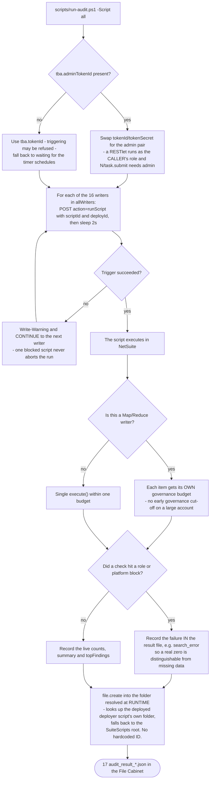

### 5.1 The 24 deployed scripts and what each contributes

| # | Script | Type | Writes / does |
|---|---|---|---|
| 1 | `ns_audit_deployer_rl.js` | RESTlet | **The entry point** — triggers scripts, returns result files, runs read-only COUNTs, ensures the two drill-down saved searches |
| 2 | `ns_audit_financial_anomaly_ss.js` | Scheduled | `audit_result_financial.json` — transaction anomalies |
| 3 | `ns_audit_security_ss.js` | Scheduled | `audit_result_security.json` — admin/operator accounts, 2FA, batch user creation, unused logins |
| 4 | `ns_audit_script_performance_ss.js` | Scheduled | `audit_result_perf.json` — script execution health |
| 5 | `ns_audit_system_config_ss.js` | **Map/Reduce** | `audit_result_sysconfig.json` — each config check in its own budget |
| 6 | `ns_audit_ui_performance_ss.js` | **Map/Reduce** | `audit_result_ui.json` — client scripts per record type |
| 7 | `ns_audit_sod_ss.js` | Scheduled | `audit_result_sod.json` — segregation-of-duties conflicts |
| 8 | `ns_audit_integration_perf_ss.js` | Scheduled | `audit_result_integration.json` — execution stats, ecosystem deployments, token age/rotation |
| 9 | `ns_audit_bundle_inventory_ss.js` | Scheduled | `audit_result_bundle.json` — bundles by name match (`script.bundleid` is absent on some accounts) |
| 10 | `ns_audit_phd_ss.js` | Scheduled | `audit_result_phd.json` — process-health diagnostics |
| 11 | `ns_audit_company_config_ss.js` | Scheduled | `audit_result_company_config.json` — password policy (preset **and** legacy models) + IP restrictions |
| 12 | `ns_audit_script_log_ss.js` | **Map/Reduce** | `audit_result_script_log.json` — a *filtered* `scriptexecutionlog` search runs for **any** role only inside a Map/Reduce |
| 13 | `ns_audit_saved_search_ss.js` | **Map/Reduce** | `audit_result_saved_search.json` — date-filter efficiency + join complexity for **every** search |
| 14 | `ns_audit_login_monitor_ss.js` | Scheduled | `audit_result_login_monitor.json` — failure rate, top failing users/IPs |
| 15 | `ns_audit_sched_freq_mr.js` | **Map/Reduce** | `audit_result_sched_freq.json` — real cadence from `scriptdeployment.recurringevent`; SuiteQL exposes no schedule field |
| 16 | `ns_audit_workflow_mr.js` | **Map/Reduce** | `audit_result_workflow.json` — per-workflow triggers, logging, run-as-admin, states and actions (powers §3.4) |
| 17 | `ns_audit_analytics_mr.js` | **Map/Reduce** | `audit_result_analytics.json` — `N/dataset` + `N/workbook` `.list()`/`.load()`; **the only path** (no SuiteQL table) (powers §4.4) |
| 18 | `ns_audit_pageperf_mr.js` | **Map/Reduce** | `audit_result_pageperf.json` — APM `EndToEndTime` + `SuiteScriptDetail`; read for the §3.1 availability note, **no score** |
| 19 | `ns_audit_trend_logger_ss.js` | Scheduled | Writes scores into the AuditAI score-history custom record (not report data) |
| 20 | `ns_audit_export_email_ss.js` | Scheduled | Emails the daily summary (not report data) |
| 21 | `ns_audit_log_reader_ss.js` | Scheduled | Execution-log reader helper |
| 22 | `ns_audit_health_dashboard_sl.js` | Suitelet | In-account dashboard page |
| 23 | `ns_audit_realtime_ue.js` | User Event | Real-time alerts on journal / vendor bill / employee saves |
| 24 | `ns_audit_deal_risk_rl.js` | RESTlet | On-request deal-risk scoring |

> **Counting note.** 17 of the 24 scripts write a result file the report reads (rows 2–18).
> `-Script all` triggers **16** of them — everything except `pageperf`.
> `trend` and `email` are excluded on purpose (not report data), and **`pageperf` is explicit-only**:
> the generator reads its result file, so on a fresh account trigger it by name
> (`-Script pageperf`) or wait for its daily run, otherwise the §3.1 note renders "not captured".
>
> **Naming note.** Four files keep an `_ss` suffix although their `@NScriptType` is
> `MapReduceScript` (`system_config`, `ui_performance`, `script_log`, `saved_search`) — a residue of
> the conversions. The `@NScriptType` tag, not the filename, is what NetSuite binds.

---

## 6. Phase 3b — The two read-only deep-dives + operator inputs

Two classes of data are unreachable by **any** deployed script, so they cannot be captured in
Phase 3 at all.

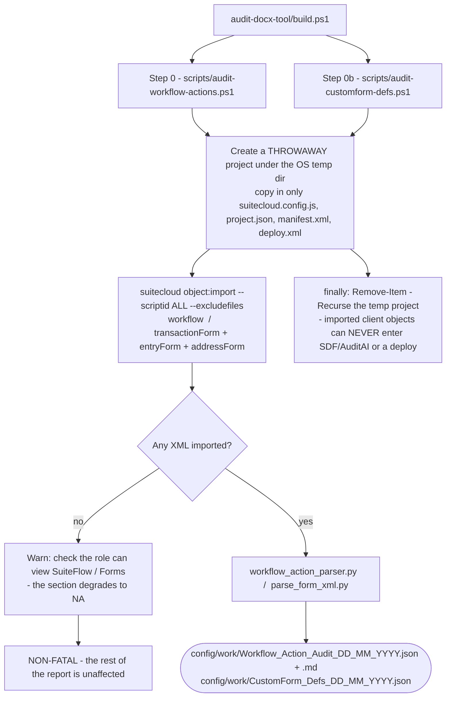

| Deep-dive | Why no script can do it | What it yields |
|---|---|---|
| **Workflow actions** (`audit-workflow-actions.ps1` → `workflow_action_parser.py`) | `N/search` / `N/record.load` return action **types** only; `workflowaction` and `workflowstate` are invalid search and record types. The per-action *values* — static literals, sourced fields, formulas — exist **only in the SDF workflow XML**. | The §3.4 value-source breakdown, the top workflows by hardcoded-value count, and the scored "hardcoded action values" maintainability check |
| **Custom-form definitions** (`audit-customform-defs.ps1` → `parse_form_xml.py`) | There is no `customform` / `transactionform` / `entryform` table, no `N/record` or `N/search` form type, and `N/ui/serverWidget` only *builds* forms. A deployed script would have nothing to read. | The §4.5 field-level definitions — shown/hidden fields, forced-mandatory overrides, sublists, attached scripts — fused with the live SuiteQL `transaction.customform` **usage** layer |

Both scripts use the identical safety pattern: a throwaway temp project (never `SDF/AuditAI`, whose
`deploy.xml` would otherwise sweep imported client objects into a deploy), `object:import` only,
and unconditional cleanup in a `finally` block.

> **One real-world caveat, handled in code.** `parse_form_xml.py` writes its confirmation to
> **stderr**, and Windows PowerShell under `$ErrorActionPreference='Stop'` turns native stderr into
> a terminating error *even on exit 0*. `audit-customform-defs.ps1` therefore drops to `Continue`
> around the Python call and gates on the real exit code, so only a genuine failure propagates.

### 6.1 Operator-provided inputs — the values no client can read

| Input | Where it goes | What it drives |
|---|---|---|
| Two billing/Setup screenshots | `config/account.json` → `accountTier` | SuiteCloud processors, storage allocated/used, **Full Licensed Users** (the "Active user licenses" score), integration concurrency limit |
| Installed Bundles export | `config/manual-inputs/InstalledBundles*.csv` | The bundle inventory |
| Bundle Audit Trail export | `config/manual-inputs/BundleAuditTrail*.csv` | **Bundle version currency** — installed vs latest |
| Manage Integrations export | `config/manual-inputs/Integrations*.csv` | The §7 integration-records inventory (the `integration` table is sealed at every API level) |
| UI Scripts list export | `config/manual-inputs/UIScripts*.txt` | The §7 per-type "Source / Notes" UI-vs-SuiteQL cross-verify |

Each missing input yields `NA` (or the base label) plus a printed reminder from the generator —
never an assumed default. `config/manual-inputs/README.md` is the canonical checklist.

---

## 7. Phase 4 — Generate the 401 values

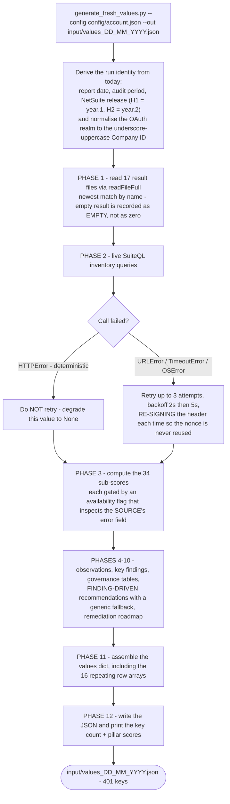

### 7.1 The accuracy rules enforced inside the generator

| Rule | Mechanism |
|---|---|
| A failed query must never become a `0` | `count_or_none()` returns `None` (→ `NA`). A successful SuiteQL `COUNT` always returns one row, so an empty result means *the query did not run* — the opposite of a genuine zero. Plain `count()` is reserved for values where a real zero is the only possibility. |
| A blocked source must never score `100` | The availability flag checks the source's own error field, not merely that the file exists — e.g. `avail_log = bool(summary) and not summary.get('search_error')`. A zero-error result from a *failed* search had previously inflated Performance to 85. |
| A full-access-gated table must degrade, not crash | `count_or_none_admin()` tries the least-privilege read token first, then falls back to a **`SELECT`-guarded** read-only `runQuery` through the RESTlet signed with the admin token, then `None`. |
| A recommendation must never assert an unmeasured finding | Recommendations are built from the live findings with a generic fallback; the render guard additionally blocks three known demo-era recommendation phrases on **every** account. |
| Nothing may be account-specific | Realm normalisation (`accountId.upper().replace('-','_')`) makes a sandbox work unchanged; folder IDs resolve at runtime; saved searches load by `scriptid`, never by numeric ID; the report's hyperlink subdomain is rewritten at build time. |
| A heavy account must not crash the build | `timeout=120` on every request, plus graceful degradation on `(URLError, TimeoutError, OSError)`. |

---

## 8. Phase 5 — Score (34 checks, 3 pillars)

Applied in one place only — the generator — so the report can never disagree with itself.

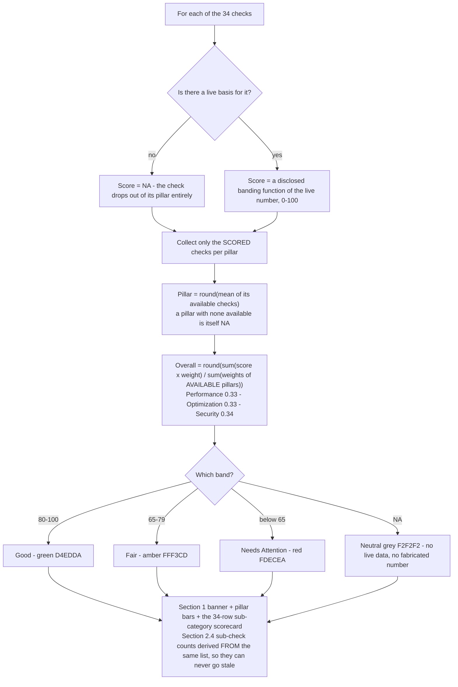

| Pillar | Weight | Checks | The live signals |
|---|---|---|---|
| **Performance** | 33% | 12 | Max scripts on one record type · total deployed scripts · integration failure rate · script timeout count · total error-log entries · governance-limit proxy · workflows always-logging in production · frequently-scheduled workflows · multi-source workbooks · analytics load errors · max custom forms per type · avg forced-mandatory fields + hidden-heavy form share |
| **Optimization** | 33% | 13 | % of saved searches without a date filter · orphaned scripts · TESTING-status deployments · test-named scripts · SuiteScript 1.0 bundle scripts · stale transactions / open POs · inactive records · workflows not RELEASED · hardcoded action values · orphaned datasets and unresolved workbook refs · wide datasets · dead + stale custom forms · forms in use with no SDF definition |
| **Security** | 34% | 9 | Operator/admin account count · batch-created accounts and their age · SoD HIGH/CRITICAL counts · roles without 2FA · password policy (preset or legacy model) · admin roles without IP restriction · login failure rate · integration token age and role hygiene · run-as-Administrator workflows |

**Worked example — the 23 July 2026 live run on the Meri Meri sandbox.** Performance **74**,
Optimization **64**, Security **71** → overall = round(74×0.33 + 64×0.33 + 71×0.34) = **70 · Fair**.
Because an `NA` check is removed *and* its pillar's denominator shrinks with it — and an `NA`
pillar is removed *and* the overall weights are re-normalised — an unmeasurable dimension can never
silently drag the overall score up or down.

---

## 9. Phase 6 — Render (values JSON → DOCX)

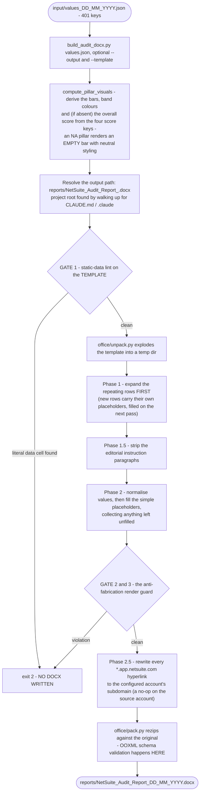

### 9.1 The 16 repeating tables the builder expands

| Purpose | Rows on the 23 Jul 2026 run |
|---|---|
| Extra remediation roadmap rows | 6 |
| **Sub-category scores** (the 34-check scorecard) | 34 |
| §3.3 governance-risk scripts | 20 |
| §3.3 DEBUG-in-production scripts | 60 |
| Deployment sprawl | 6 |
| Per-bundle detail | 4 |
| §3.4 workflow detail / best-practice flags | 44 / 5 |
| §3.4 action value-source breakdown / top hardcoded workflows | 4 / 8 |
| §4.4 custom datasets / custom workbooks / analytics flags | 9 / 11 / 5 |
| §4.5 in-use forms / dead forms / form flags | 21 / 31 / 4 |
| Editorial notes stripped | 13 paragraphs |

Each repeating table has an explicit row cap (10–200 depending on the table) so a pathological
account cannot produce an unbounded document.

### 9.2 Why the template is patched only by script

The placeholder template is **locked**: every change goes through an *idempotent* Python `zipfile`
maintenance script that takes a dated backup first (`audit-docx-tool/scripts/maintenance/patch_*.py`
→ `templates/*.bak_*.docx`). That is why all 21 past template changes in this project are
individually reversible, and why hand-editing it in Word is prohibited.

---

## 10. Phase 7 — Verify (the gates)

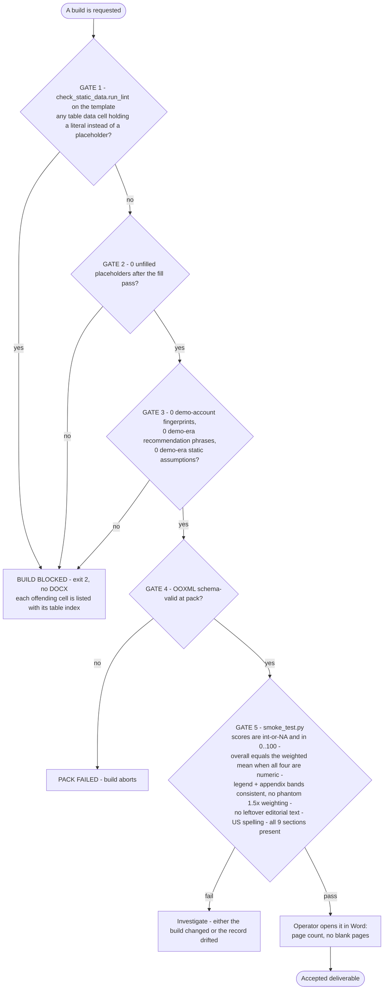

**What the lint allows as legitimately static** (everything else with a digit is a failure): row
numbers in the first column, the `Score (/100)` header, the fixed 33% / 34% pillar weights, the
"Equal weight across N sub-checks" phrasing, the score-band legend, platform constants (the 1,000
governance-unit ceiling, a storage-capacity figure, the `folder -15` fallback), advisory remediation
timeframes ("30 days"), and the term "2FA" — whose only digit is its own "2".

**Re-derive the counts, never quote them from memory:**

```bash
python -c "import zipfile,re;x=zipfile.ZipFile(P).read('word/document.xml').decode('utf8');print(len(re.findall(r'<w:tbl>.*?</w:tbl>',x,re.S)),len(re.findall(r'\{\{[A-Z0-9_]+\}\}',x)))"
```

> The debug-only escape hatch `AUDIT_ALLOW_UNVERIFIED=1` disables Gates 1–3. It exists for local
> template work and must **never** be set for a deliverable.

---

## 11. Cross-cutting — the live-or-NA decision tree

This is the rule that governs **every single value** in the report. It is the project's core
anti-fabrication contract.

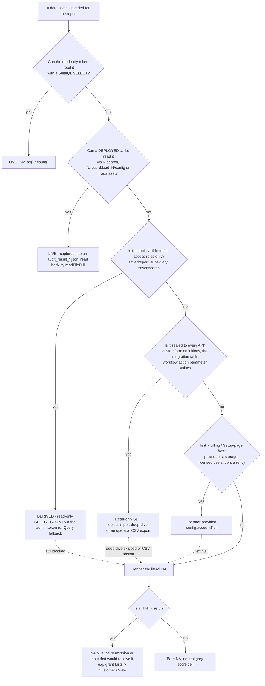

| Class | Examples | Where it comes from |
|---|---|---|
| **Live (SuiteQL)** | Scripts, deployments, transactions, employees, roles, login history, custom records/lists, file storage, PDF templates | `sql()` / `count()` / `count_or_none()` |
| **Live (in-account script)** | Execution-log errors, saved-search efficiency and joins, workflows, datasets and workbooks, password policy, IP restrictions, APM timing | The 17 `audit_result_*.json` files |
| **Derived** | The 34 check scores, the 3 pillars, the overall, observations, key findings, the remediation roadmap | Computed in `generate_fresh_values.py` |
| **Deep-dive (SDF XML)** | Workflow per-action parameter values; custom-form field-level definitions | The two read-only `object:import` deep-dives |
| **Operator-provided** | Account tier, bundle versions, integration records, the UI Scripts cross-check | `account.accountTier` + `config/manual-inputs/` |
| **`NA`** | Anything the role, the tier or the platform withholds | Rendered as the literal `NA`, with a hint where one helps |

**The role boundary is the single biggest scope lever.** Granting the audit role
`Lists → Customers / Vendors / Items → View` (and `Contacts`) converts the duplicate-detection,
incomplete-master-data and entity-inventory rows from `NA` to live, with **no code change**. Two
permissions are non-obvious prerequisites: **`SuiteAnalytics Workbook`** (under Reports) gates the
SuiteQL REST endpoint entirely, and **`Allow JS / HTML Uploads`** is required for the SDF file
deploy.

---

## 12. Traceability — node → source

Every diagram node above resolves to real code. Verified 2026-08-03.

| Flow node | File | Lines |
|---|---|---|
| Java 21 detection | [scripts/bootstrap.ps1](scripts/bootstrap.ps1) | 26–56 |
| SuiteCloud CLI install | [scripts/bootstrap.ps1](scripts/bootstrap.ps1) | 58–74 |
| account.json creation + javaHome write-back | [scripts/bootstrap.ps1](scripts/bootstrap.ps1) | 76–102 |
| SDF auth registration (`account:setup:ci`) | [scripts/bootstrap.ps1](scripts/bootstrap.ps1) | 106–143 |
| **The single OAuth 1.0a signer** | [scripts/NsAuth.psm1](scripts/NsAuth.psm1) `New-NsAuthHeader` | 17–65 |
| Query-string params folded into the signature base | [scripts/NsAuth.psm1](scripts/NsAuth.psm1) | 37–47 |
| Sandbox realm normalisation | [scripts/NsAuth.psm1](scripts/NsAuth.psm1) | 59–63 |
| Deploy env (JAVA_HOME, CI passkey) | [scripts/deploy.ps1](scripts/deploy.ps1) | 44–47 |
| Admin-domain injection + restore | [scripts/deploy.ps1](scripts/deploy.ps1) | 72–112 |
| **The only deploy command** | [scripts/deploy.ps1](scripts/deploy.ps1) | 66, 103 |
| Obfuscate → deploy → restore → lock | [scripts/secure_deploy.ps1](scripts/secure_deploy.ps1) | 18–133 |
| Admin-token swap for RESTlet triggering | [scripts/run-audit.ps1](scripts/run-audit.ps1) | 42–46 |
| Script → scriptId / deployId / result-file map | [scripts/run-audit.ps1](scripts/run-audit.ps1) | 62–82 |
| **The 16 writers `-Script all` triggers** | [scripts/run-audit.ps1](scripts/run-audit.ps1) | 87–89 |
| Trigger loop, warn-and-continue | [scripts/run-audit.ps1](scripts/run-audit.ps1) | 91–118 |
| SuiteQL runner + the WinPS 5.1 `-UseBasicParsing` requirement | [scripts/query.ps1](scripts/query.ps1) | 39–50 |
| Deployer RESTlet — `runScript` | [SDF/.../ns_audit_deployer_rl.js](SDF/AuditAI/src/FileCabinet/SuiteScripts/AuditAI/ns_audit_deployer_rl.js) | 128–198 |
| Deployer RESTlet — `readLogs` / `readAllResults`, newest-wins | same file | 199–268 |
| Deployer RESTlet — `readFileFull` (the generator's read path) | same file | 269–298 |
| Deployer RESTlet — `ensureDebugProdSearch` / `ensureDebugAllSearch` | same file | 337–399 |
| Deployer RESTlet — `runQuery` | same file | 400–411 |
| Deployer RESTlet — **the four FORBIDDEN write actions** | same file | 31–123 |
| Workflow deep-dive: throwaway project + import + cleanup | [scripts/audit-workflow-actions.ps1](scripts/audit-workflow-actions.ps1) | 40–82 |
| Form deep-dive: import loop + stderr handling + cleanup | [scripts/audit-customform-defs.ps1](scripts/audit-customform-defs.ps1) | 52–93 |
| build.ps1 Step 0 / Step 0b / Step 1 / Step 2 | [audit-docx-tool/build.ps1](audit-docx-tool/build.ps1) | 78–100 / 102–118 / 120–133 / 135–147 |
| Generator: config load, realm, output path | [generate_fresh_values.py](audit-docx-tool/scripts/generate_fresh_values.py) | 36–80 |
| Generator: OAuth signing (read + admin tokens) | same file | 85–116 |
| Generator: transient-only retry policy | same file | 117–144 |
| Generator: `sql()` / `count()` | same file | 149–158 |
| **Generator: `count_or_none()` — the no-fabricated-zero rule** | same file | 160–166 |
| Generator: admin-token read-only `runQuery` fallback | same file | 168–202 |
| Generator: `read_result()` | same file | 224–226 |
| Generator: score-band helpers + the strict data guardrail | same file | 235–360 |
| Generator: PHASE 1 — the 13 core result files | same file | 435–497 |
| Generator: the 4 further result reads (workflow, analytics, pageperf, sched_freq) | same file | 962, 1073, 1076, 2809 |
| Generator: availability flags (a blocked source scores `NA`, not 100) | same file | 841–856 |
| **Generator: pillar + overall assembly** | same file | 1238–1243 |
| **Generator: the 34 `SUBCAT_ROWS` checks** | same file | 1253–1288 |
| Generator: §2.4 sub-check counts derived from that list | same file | 1290–1301 |
| Generator: PHASE 12 write + summary print | same file | 3400–3412 |
| Builder: pillar bars / colours / overall | [build_audit_docx.py](audit-docx-tool/scripts/build_audit_docx.py) `compute_pillar_visuals` | 449–504 |
| **Builder: GATE 1 — static-data lint** | same file | 547–563 |
| Builder: the 16 repeating-table definitions | same file | 603–650 |
| Builder: strip editorial notes | same file | 653–656 |
| Builder: fill + collect unfilled | same file | 658–668 |
| **Builder: GATES 2 & 3 — the anti-fabrication render guard** | same file | 670–716 |
| Builder: account-agnostic hyperlink subdomain rewrite | same file | 721–737 |
| Builder: pack + OOXML validation | same file | 739–750 |
| Lint: allowlist of legitimately static cells | [check_static_data.py](audit-docx-tool/scripts/check_static_data.py) | 28–39 |
| Lint: the cell scan | same file | 41–56 |
| Smoke test: the six assertions | [smoke_test.py](audit-docx-tool/scripts/smoke_test.py) | 59–115 |
| Governance: prompt-trigger matching | [scripts/precautions_hook.ps1](scripts/precautions_hook.ps1) | 59–76 |
| Governance: auto-build Triggers A and B | [auto_build_hook.ps1](audit-docx-tool/scripts/auto_build_hook.ps1) | 33–50 |
| Both hooks registered | [.claude/settings.json](.claude/settings.json) | 1–25 |

---

## 13. On disk but NOT in the flow

Drawn here so the chart is **complete as well as correct** — these files exist but no arrow in the
working pipeline touches them.

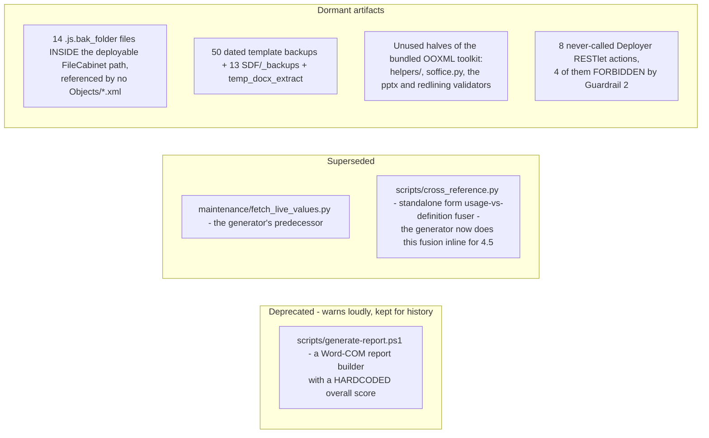

- **The deprecated builder is safe:** it prints a `Write-Warning` on every invocation stating that
  its score is hardcoded and that the `audit-docx-tool` pipeline is canonical.
- **The dormant artifacts are the reversibility trail** — one dated backup per past template patch
  is exactly why every change in this project can be undone. They are not clutter, but the 14
  `.js.bak_folder` files are the one group worth removing, since they sit in a path `deploy.xml`
  sweeps (`~/FileCabinet/*`).
- **The gates actually in force** are the five in §10. `check_static_data.py` and `smoke_test.py`
  are both live and wired — `check_static_data.run_lint` is imported directly by the builder as a
  hard gate.

### 13.1 Two portability defects found while tracing

Recorded here because this document is meant to be accurate, not flattering. Neither is fixed by
this document — it changed no code.

| Defect | Where | Why it matters |
|---|---|---|
| A hardcoded File Cabinet folder ID | [scripts/secure_deploy.ps1:117](scripts/secure_deploy.ps1#L117) — `folderId=763` | Every other path in the project resolves the AuditAI folder at runtime. `763` is one account's internal ID, so the Step-3 folder lock is a no-op or wrong on any other account. The script does print the manual UI fallback when the call fails. |
| Un-archived work | `reports/` + `audit-docx-tool/input/` | The newest report and values file are dated **23 July 2026** (Overall 70), while the newest `CHANGELOG.md` entry and session archive stop at **10 July 2026** (Overall 69). Nothing in the tooling detects this — only the day-start ritual does. |

---

## 14. Phase 8 — Governance: change, save, archive

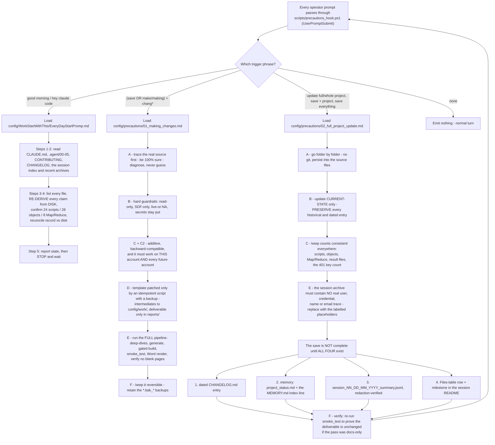

> **Known limitation of the automation.** The second hook,
> `audit-docx-tool/scripts/auto_build_hook.ps1`, fires on every `Write` and rebuilds the report when
> a `values_*.json` lands in `input/` (Trigger A) or an `Audit_Analysis_*.md` lands in `reports/`
> (Trigger B). Nothing, however, detects that a **completed run was never archived** — which is
> exactly the 23 July 2026 gap in §13.1. The day-start ritual, not any hook, is the source of truth.

---

## 15. The exact command sequence

A complete audit, from a configured machine to a delivered report. Steps 1–4 are the only ones that
contact NetSuite.

```powershell
# --- ONE TIME ---------------------------------------------------------------
Copy-Item config\account.example.json config\account.json   # then fill it in
.\scripts\bootstrap.ps1                                      # Java 21 + SDF CLI + auth + first deploy

# --- 1. Deploy / update the audit engine (THE ONLY deployment method) -------
.\scripts\deploy.ps1                                         # suitecloud project:deploy
# .\scripts\deploy.ps1 -DryRun                               # validate without deploying
# .\scripts\secure_deploy.ps1                                # obfuscated build for a client delivery

# --- 2. Trigger the audit inside the account -------------------------------
.\scripts\run-audit.ps1 -Script all                          # the 16 report result-writers
.\scripts\run-audit.ps1 -Script pageperf                     # explicit-only: powers the 3.1 APM note
# Map/Reduce writers take a few minutes; the report builds regardless
# (a missing or empty result renders NA, never a fabricated zero).

# --- 3. Optional: check anything ad hoc ------------------------------------
.\scripts\query.ps1 -SQL "SELECT COUNT(*) AS cnt FROM script WHERE isinactive = 'F'"

# --- 4. Deep-dives + generate + build, all in one -------------------------
.\scripts\run-report.ps1                                     # logged wrapper -> reports\logs\
#   which runs audit-docx-tool\build.ps1:
#     Step 0  scripts\audit-workflow-actions.ps1   -> config\work\Workflow_Action_Audit_<date>.json
#     Step 0b scripts\audit-customform-defs.ps1    -> config\work\CustomForm_Defs_<date>.json
#     Step 1  generate_fresh_values.py             -> input\values_<date>.json   (401 keys)
#     Step 2  build_audit_docx.py                  -> reports\NetSuite_Audit_Report_<date>.docx
# Reuse fresh deep-dive files and skip Step 0/0b:
#   cd audit-docx-tool ; .\build.ps1 -SkipWorkflowActions

# --- 5. Verify (offline) ---------------------------------------------------
python audit-docx-tool\scripts\check_static_data.py           # template lint, standalone
python audit-docx-tool\scripts\smoke_test.py                  # builds to a temp file and asserts
# Then open the DOCX in Word: page count, no blank pages.

# --- 6. reports\ keeps ONLY the deliverable + logs\ ------------------------
```

Re-rendering the report from values that already exist is **fully offline** — no NetSuite call:

```powershell
python audit-docx-tool\scripts\build_audit_docx.py audit-docx-tool\input\values_23_07_2026.json
```

---

*Document version 1.0 — authored 2026-08-03. Every node traced from the source files on disk; no
value in this document was taken on trust from another document. Read-only: producing this document
made no NetSuite call and changed no code.*
