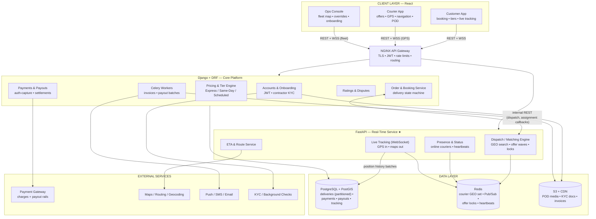
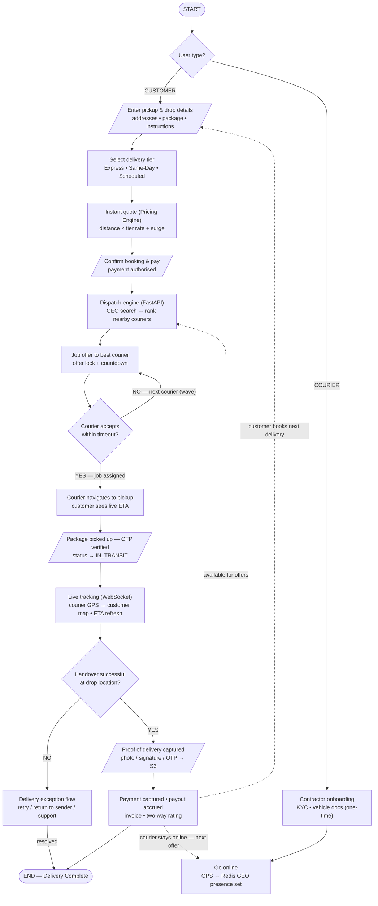

# Creative Delivery Web Application Platform — Detailed Technical Reference

**Highly scalable, real-time courier marketplace with multi-tiered delivery**
Client: A. Centauri Software • Version 1.0 • July 2026

---

## Contents

1. [System Architecture — Deep Dive](#1-system-architecture--deep-dive)
2. [Architecture Diagram (Mermaid)](#2-architecture-diagram-mermaid)
3. [Application Flow — Step-by-Step](#3-application-flow--step-by-step)
4. [Flow Chart (Mermaid)](#4-flow-chart-mermaid)
5. [Data Model (PostgreSQL)](#5-data-model-postgresql)
6. [Dispatch & Matching — How Assignment Works](#6-dispatch--matching--how-assignment-works)
7. [API & Event Surface](#7-api--event-surface)
8. [Delivery Lifecycle State Machine](#8-delivery-lifecycle-state-machine)
9. [Security, Scaling & Reliability Notes](#9-security-scaling--reliability-notes)

---

## 1. System Architecture — Deep Dive

### 1.1 Client Layer — React

**Customer App**
- Booking flow: pickup/drop entry (geocoded), package details, **tier selection** (Express / Same-Day / Scheduled), instant quote, payment authorisation.
- **Live tracking map** during active deliveries via WebSocket; order history, invoices, and courier ratings.

**Courier / Contractor App**
- One-time onboarding (KYC + vehicle documents) with approval status.
- **Go online/offline** toggle; while online the app streams GPS positions at a fixed cadence.
- **Job offers** with a countdown timer; accepted jobs show turn-by-turn navigation, OTP capture at pickup, and **proof-of-delivery** capture (photo/signature/OTP) at drop.
- Earnings dashboard and payout history.

**Ops / Admin Console**
- **Live fleet map** (every online courier + active delivery), manual dispatch overrides and reassignment.
- Contractor onboarding review, tier/pricing management, dispute and exception queues.

### 1.2 Application Layer — Python Hybrid Backend

**NGINX API Gateway** — TLS, JWT auth, rate limiting; routes `/api/*` to Django and `/rt/*` + `/ws/*` to FastAPI.

**Django + DRF — Core Platform Backend**

| Module | Responsibility |
|---|---|
| **Accounts & Onboarding** | JWT auth for customers/couriers/ops; contractor KYC + vehicle document workflow with approval gates. |
| **Order & Booking Service** | Owns the delivery lifecycle state machine (§8); validates transitions; emits state events. |
| **Pricing & Tier Engine** | Quote = f(distance from routing API, tier base + per-km rate, package size, surge factor); tier SLAs (Express: immediate dispatch; Same-Day: batched windows; Scheduled: future slot). |
| **Payments & Payouts** | Authorise at booking, **capture on delivery**; refunds on cancellation; batched contractor settlements with commission split; GST invoices. |
| **Ratings & Disputes** | Two-way post-delivery ratings; claims/exception resolution workflow. |
| **Celery Workers** | Invoice/receipt generation, payout batch runs, notification fan-out, scheduled-tier dispatch triggers. |

**FastAPI — Real-Time Dispatch & Tracking Service ★**

| Module | Responsibility |
|---|---|
| **Dispatch / Matching Engine** | On booking: `GEOSEARCH` the Redis online-courier set around pickup → rank candidates (distance, rating, acceptance rate, vehicle fit) → send **locked, time-limited offers** in waves (§6). |
| **Live Tracking (WebSocket)** | Courier GPS in (updates the GEO set + active-delivery channel); customer map and ops fleet view subscribe out; per-delivery channels. |
| **ETA & Route Service** | Calls the routing API, caches route polylines, refreshes ETAs as positions change. |
| **Presence & Status** | Online/offline state with heartbeat expiry; job-state event stream consumed by all three clients. |

Django ⇄ FastAPI: internal REST — Django asks FastAPI to dispatch and receives assignment callbacks; FastAPI reads order context from Django and writes nothing durable itself except via Django's APIs.

### 1.3 Data Layer

| Store | Role |
|---|---|
| **PostgreSQL + PostGIS** | `users`, `contractors`, `deliveries`, `tiers`, `payments`, `payouts`, `ratings`, `tracking_history`. Geo indexes on pickup/drop points; `deliveries` and `tracking_history` **partitioned by month**; read replicas for history/analytics dashboards. |
| **Redis** | `couriers:online` **GEO set** (live positions), Pub/Sub channels (`offers:{courierId}`, `track:{deliveryId}`), **offer locks** (`offer:{deliveryId}` with TTL = offer window), heartbeat keys, Celery broker, rate limits. |
| **S3 + CDN** | POD photos & signatures, KYC/vehicle documents, invoice PDFs. |

### 1.4 External Services

| Service | Purpose |
|---|---|
| **Payment gateway** | Customer charges (cards/UPI/wallets), auth+capture flow, contractor payout rails, signed webhooks. |
| **Maps / Routing / Geocoding** | Distance & ETA for quotes, turn-by-turn routes, address geocoding, map tiles. |
| **Push / SMS / Email** | Job offers, status updates, handover OTPs, delivery confirmations. |
| **KYC / Background checks** | Contractor identity and vehicle verification during onboarding. |

---

## 2. Architecture Diagram (Mermaid)



---

## 3. Application Flow — Step-by-Step

### Phase A — Entry & Role Branch

| # | Step | Detail |
|---|---|---|
| 1 | **User type decision** | Customers book deliveries; couriers earn by fulfilling them. |

### Phase B1 — Customer Path (demand)

| # | Step | Detail |
|---|---|---|
| 2 | **Enter pickup & drop** | Addresses geocoded; package size and handling instructions captured. |
| 3 | **Select tier** | Express (immediate), Same-Day (windowed), Scheduled (future slot). |
| 4 | **Instant quote** | Pricing Engine: routing-API distance × tier rate + size + surge. |
| 5 | **Confirm & pay** | Payment **authorised** (not captured); delivery enters `BOOKED`. |

### Phase B2 — Courier Path (supply)

| # | Step | Detail |
|---|---|---|
| 2′ | **Onboarding (one-time)** | KYC + vehicle docs → background check → approval. |
| 3′ | **Go online** | App streams GPS; positions land in the Redis `couriers:online` GEO set with heartbeat TTL. |

### Phase C — Dispatch (paths converge)

| # | Step | Detail |
|---|---|---|
| 6 | **Match** | Dispatch engine `GEOSEARCH`es around pickup, ranks candidates (distance, rating, acceptance rate, vehicle fit). |
| 7 | **Offer** | Best courier gets a push + in-app offer with a countdown; an **offer lock** ensures only one live offer per delivery. |
| 8 | **Accept?** — NO/timeout | Lock released; next-ranked courier offered (wave escalation, widening radius). Persistent failure → surge or ops escalation. |
| 8′ | **Accept?** — YES | Delivery `ASSIGNED`; customer notified with courier details and live ETA. |

### Phase D — Execution

| # | Step | Detail |
|---|---|---|
| 9 | **To pickup** | Courier navigates (routing API); customer watches live ETA. |
| 10 | **Pickup handover** | **OTP verification** at pickup; status → `IN_TRANSIT`, broadcast on the delivery channel. |
| 11 | **Live tracking** | Courier GPS → WebSocket → customer map + ops fleet view; ETA refreshed on movement. |
| 12 | **Drop handover?** — NO | **Exception flow**: retry attempt, return to sender, or support intervention; resolved exceptions close out to END. |
| 12′ | **Drop handover?** — YES | Proceed to POD. |

### Phase E — Completion & Loops

| # | Step | Detail |
|---|---|---|
| 13 | **Proof of delivery** | Photo / signature / OTP captured and uploaded to S3; status → `DELIVERED`. |
| 14 | **Settlement** | Payment **captured**; courier payout accrued (commission split); Celery issues invoice/receipts; two-way rating requested. |
| 15 | **Loops** | Customer books the next delivery; courier stays online for the next offer. |

---

## 4. Flow Chart (Mermaid)



---

## 5. Data Model (PostgreSQL)

### Identity & Supply
| Table | Key columns |
|---|---|
| `users` | id, phone (unique), email, role (`customer/courier/ops`), rating_avg |
| `contractors` | user_id (PK), kyc_status, vehicle_type, vehicle_doc_s3, background_check_status, approved_at, payout_account_ref |

### Deliveries (partitioned by month on `created_at`)
| Table | Key columns |
|---|---|
| `deliveries` | id, customer_id, courier_id?, tier_id, pickup_geom `GEOGRAPHY(Point)`, drop_geom, package_size, quote_amount, surge_multiplier, status (§8), otp_pickup, created_at |
| `delivery_events` | id, delivery_id, from_status, to_status, actor, at — append-only audit of every transition |
| `tracking_history` | delivery_id, courier_id, geom, recorded_at — batched inserts from the tracking stream; partitioned |
| `pod_records` | delivery_id (unique), kind (`photo/signature/otp`), s3_key, captured_at |

### Money
| Table | Key columns |
|---|---|
| `tiers` | id, name (`express/same_day/scheduled`), base_fare, per_km, sla_minutes |
| `payments` | id, delivery_id, intent_id (unique), amount, status (`authorised/captured/refunded`), webhook_payload |
| `payouts` | id, courier_id, period, gross, commission, net, status (`accrued/batched/paid`) |
| `payout_items` | payout_id, delivery_id, amount |
| `ratings` | delivery_id, direction (`c→k`/`k→c`), stars, comment |

---

## 6. Dispatch & Matching — How Assignment Works

1. **Presence:** online couriers `GEOADD` their position to `couriers:online` on every GPS tick; a heartbeat key with TTL removes silent couriers automatically.
2. **Candidate search:** on `BOOKED`, the engine runs `GEOSEARCH couriers:online FROMLONLAT <pickup> BYRADIUS r` starting at a tier-dependent radius.
3. **Ranking:** candidates scored on distance, rating, recent acceptance rate, and vehicle fit for the package size.
4. **Offer lock:** `SET offer:{deliveryId} {courierId} NX EX <window>` — the delivery can only be offered to one courier at a time; the courier also gets a personal lock so they see one offer at a time.
5. **Wave escalation:** timeout/decline releases the lock, the next candidate is offered; radius widens per wave; exhausted waves trigger surge pricing or ops escalation.
6. **Acceptance race safety:** acceptance is a compare-and-delete on the lock — a late accept after expiry simply fails, so two couriers can never both win.
7. **Durability:** the winning assignment is written to Django (`ASSIGNED` transition + `delivery_events` row) before the courier is told to head out — Redis never holds the only copy of a commercial fact.

---

## 7. API & Event Surface

### Django (`/api/*`)
| Method & Path | Purpose |
|---|---|
| `POST /api/auth/otp` · `/api/auth/verify` | phone OTP → JWT |
| `POST /api/contractors/apply` | onboarding with KYC/vehicle docs |
| `POST /api/quotes` | `{pickup, drop, size, tier}` → quote |
| `POST /api/deliveries` | book (authorises payment, triggers dispatch) |
| `POST /api/deliveries/{id}/cancel` | cancel per tier policy (refund/fee) |
| `GET /api/deliveries/{id}` · `GET /api/deliveries` | detail / history (replica-served) |
| `POST /api/payments/webhook` | gateway confirmation (idempotent) |
| `GET /api/payouts` | courier earnings & settlement history |

### FastAPI (`/rt/*`, `/ws/*`)
| Endpoint | Purpose |
|---|---|
| `POST /rt/presence/online` · `/offline` | courier availability |
| `POST /rt/gps` | GPS tick `{lat, lng, heading, speed}` (also over the socket) |
| `POST /rt/offers/{id}/accept` · `/decline` | offer response (lock-checked) |
| `WS /ws/courier` | offer push + job state events |
| `WS /ws/track/{delivery_id}` | customer live map channel |
| `WS /ws/fleet` | ops fleet view (all active couriers/deliveries) |

---

## 8. Delivery Lifecycle State Machine

```
BOOKED ──dispatch──▶ ASSIGNED ──arrive+OTP──▶ PICKED_UP ──▶ IN_TRANSIT ──handover──▶ DELIVERED
   │                    │                                        │
   │ no courier /       │ courier cancel                         │ failed handover
   ▼ customer cancel    ▼ (re-dispatch)                          ▼
CANCELLED ◀────────── REASSIGNING                            EXCEPTION ──▶ RETRY / RETURNED / RESOLVED
```

Rules: every transition is validated server-side and appended to `delivery_events`; payment capture is only legal from `DELIVERED`; refunds only from `CANCELLED`/`RETURNED`; `EXCEPTION` requires an ops-visible reason code.

---

## 9. Security, Scaling & Reliability Notes

- **Security:** JWT with role scoping (courier tokens can't read other deliveries); OTP handovers at pickup (and optionally drop) prevent misdelivery claims; POD media on pre-signed S3 URLs; payment webhooks signature-verified; contractor KYC + background checks gate supply.
- **Scalability:** the dispatch hot path touches only Redis (GEO + locks) — PostgreSQL is off the critical matching loop; FastAPI scales horizontally with Pub/Sub fan-out; tracking history is batched into partitioned tables; read replicas serve history/analytics; CDN serves all media.
- **Reliability:** offer locks + compare-and-delete acceptance eliminate double-assignment; assignments are durable in PostgreSQL before couriers move; heartbeat TTLs self-heal stale presence; idempotent payment webhooks; `delivery_events` gives a full audit trail for every dispute.
- **Observability:** dispatch funnel metrics (offer → accept rate per wave), live SLA dashboards per tier, GPS-gap alerts on active deliveries, and payout reconciliation reports.
