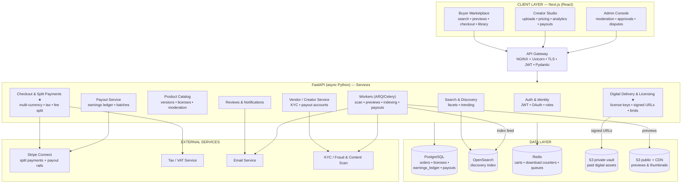
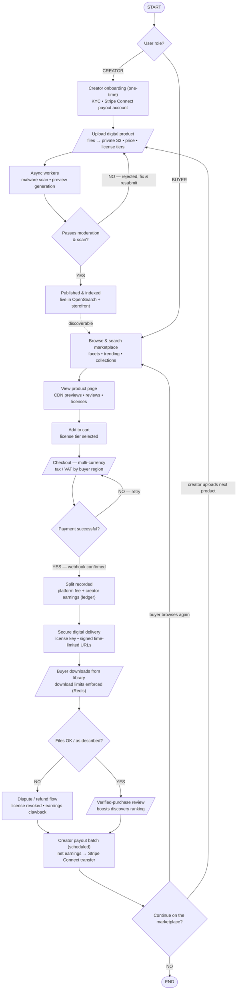

# Creative Marketplace E-commerce Platform v2.0 — Detailed Technical Reference

**Multi-vendor digital marketplace connecting independent creators with global buyers**
Client: A. Centauri Software • Version 2.0 • July 2026

---

## Contents

1. [System Architecture — Deep Dive](#1-system-architecture--deep-dive)
2. [Architecture Diagram (Mermaid)](#2-architecture-diagram-mermaid)
3. [Application Flow — Step-by-Step](#3-application-flow--step-by-step)
4. [Flow Chart (Mermaid)](#4-flow-chart-mermaid)
5. [Data Model (PostgreSQL)](#5-data-model-postgresql)
6. [Secure Digital Delivery — How Files Stay Protected](#6-secure-digital-delivery--how-files-stay-protected)
7. [Split Payments & the Earnings Ledger](#7-split-payments--the-earnings-ledger)
8. [API Surface](#8-api-surface)
9. [Security, Scaling & Reliability Notes](#9-security-scaling--reliability-notes)

---

## 1. System Architecture — Deep Dive

### 1.1 Client Layer — Next.js (React)

**Buyer Marketplace**
- SSR/ISR category, collection, and product pages for SEO — organic search drives marketplace demand.
- Faceted search UI (type, style, price, license, rating) backed by OpenSearch; trending and personalised rails.
- Product pages serve **CDN previews only** (watermarked images, low-res audio clips, limited-page PDFs) — never vault files.
- Multi-currency display, cart, checkout, and a **library** of purchased items with re-download access.

**Creator Studio**
- Product upload with multipart/resumable transfer straight to private S3 via pre-signed URLs; versioning for updates pushed to past buyers.
- Storefront branding, pricing and license-tier configuration (personal / commercial / extended).
- Sales analytics, earnings dashboard, payout history.

**Admin Console**
- Moderation queue (new + reported products), vendor approvals, commission-plan management, dispute resolution, fraud review (self-purchase rings, stolen content reports).

### 1.2 Application Layer — FastAPI (async Python)

**Gateway:** NGINX + Uvicorn workers; TLS, JWT middleware, per-route rate limits, Pydantic request validation. All traffic — buyer, creator, admin — enters here.

| Service | Responsibility |
|---|---|
| **Auth & Identity** | JWT sessions, OAuth social login, roles (buyer / creator / admin); a buyer can be upgraded to creator via onboarding. |
| **Vendor / Creator Service** | Onboarding workflow: profile → KYC → Stripe Connect payout account → approval; storefront profiles. |
| **Product Catalog** | Digital products with versions, file manifests, license tiers, categories/tags; moderation state machine (`draft → in_review → published / rejected`). |
| **Search & Discovery** | Query API over OpenSearch: full-text, facets, sort, trending (sales-velocity + review signals); indexing is worker-driven, near-real-time. |
| **Checkout & Split Payments ★** | Cart → order: multi-currency price resolution, tax/VAT via the tax service by buyer region, Stripe Connect **destination charges** carrying the platform-fee split; webhook-confirmed. |
| **Digital Delivery & Licensing ★** | On paid order: issue license keys per item/tier, create download grants, mint **signed time-limited URLs** against the private vault, enforce **download limits** via Redis counters. |
| **Payout Service** | Append-only `earnings_ledger`; scheduled batches aggregate net creator earnings → Stripe Connect transfers; clawback entries on refunds/disputes. |
| **Reviews & Notifications** | Verified-purchase-only reviews (must hold a license) feeding discovery ranking; sale alerts, payout notices, digest emails. |

**Background Workers (ARQ / Celery)**
- **Malware scan** on every uploaded file before it can be published.
- **Preview/thumbnail generation** (watermarking, transcodes) into public CDN storage.
- **Search indexing** on publish/update/review events.
- **Payout batch runs** and email fan-out.

### 1.3 Data Layer

| Store | Role |
|---|---|
| **PostgreSQL** | Commercial truth: `users`, `vendors`, `products`, `product_versions/files`, `orders` (partitioned by month), `licenses`, `download_grants`, `earnings_ledger`, `payouts`, `reviews`. Read replicas for analytics. |
| **OpenSearch** | Product discovery index (title, description, tags, facets, trending score). Rebuildable from PostgreSQL at any time — it is a projection, not truth. |
| **Redis** | Sessions & carts, hot product-page cache, **download-limit counters** (`dl:{licenseId}` with per-license caps), worker queues, rate limits. |
| **S3 + CDN** | Two zones: the **private vault** (paid deliverables, no public access, SSE encryption) and public preview storage served through CDN edge caching. |

### 1.4 External Services

| Service | Purpose |
|---|---|
| **Stripe Connect** | Global checkout, split (destination) charges, creator Express accounts, payout transfers, signed webhooks. |
| **Tax / VAT service** | Digital-goods tax by buyer region (EU VAT, GST, US sales tax), invoice compliance. |
| **Email service** | Receipts + license delivery, sale alerts, payout notices. |
| **KYC / Fraud & Content scan** | Creator identity verification; upload malware scanning; copyright/fraud signals for moderation. |

---

## 2. Architecture Diagram (Mermaid)



---

## 3. Application Flow — Step-by-Step

### Phase A — Role Branch

| # | Step | Detail |
|---|---|---|
| 1 | **Role decision** | Creators publish; buyers purchase. One identity can hold both roles. |

### Phase B1 — Creator Path (supply)

| # | Step | Detail |
|---|---|---|
| 2 | **Onboarding (one-time)** | Profile → KYC → Stripe Connect payout account → approval. |
| 3 | **Upload product** | Files go directly to the **private vault** via pre-signed multipart upload; price and license tiers set. |
| 4 | **Async processing** | Workers run the **malware scan** and generate watermarked previews/thumbnails into CDN storage. |
| 5 | **Moderation gate** | Scan + policy review. **Rejected** → feedback, fix & resubmit loop. **Approved** → published. |
| 6 | **Indexed** | Publish event indexes the product into OpenSearch; it appears in search and the creator's storefront. |

### Phase B2 — Buyer Path (demand)

| # | Step | Detail |
|---|---|---|
| 2′ | **Discover** | Faceted search / trending / collections (OpenSearch). |
| 3′ | **Evaluate** | Product page: CDN previews, license options, verified reviews. |
| 4′ | **Cart** | License tier chosen (personal / commercial / extended) — tier determines price and rights. |
| 5′ | **Checkout** | Multi-currency total; tax/VAT computed for the buyer's region; invoice data collected where required. |
| 6′ | **Payment** | Stripe destination charge with the platform fee attached. Failure → retry loop. Success is only trusted on the **signed webhook**. |

### Phase C — Post-Payment (the core)

| # | Step | Detail |
|---|---|---|
| 7 | **Split recorded** | One transaction: order → `paid`, `earnings_ledger` entries for gross, platform fee, and creator net (§7). |
| 8 | **Delivery** | License key(s) issued; download grants created; **signed time-limited URLs** minted; receipt + license emailed. |
| 9 | **Download** | Buyer downloads from their library; Redis counters enforce per-license download limits; links re-mint on demand while the license is valid. |

### Phase D — Quality & Settlement

| # | Step | Detail |
|---|---|---|
| 10 | **Files OK?** — YES | **Verified-purchase review** invited; ratings feed the trending/ranking signals. |
| 10′ | **Files OK?** — NO | **Dispute/refund flow**: refund via Stripe, license revoked, **earnings clawback** ledger entry; repeated disputes flag the vendor for review. |
| 11 | **Payout batch** | Scheduled runs aggregate each creator's net ledger balance → Stripe Connect transfer → payout notice. |
| 12 | **Loops** | Buyer browses again; creator uploads the next product. |

---

## 4. Flow Chart (Mermaid)



---

## 5. Data Model (PostgreSQL)

### Identity & Vendors
| Table | Key columns |
|---|---|
| `users` | id, email (unique), auth_provider, roles[] |
| `vendors` | user_id (PK), display_name, kyc_status, stripe_account_id, commission_plan_id, status (`pending/approved/suspended`) |

### Catalog
| Table | Key columns |
|---|---|
| `products` | id, vendor_id, title, description, category_id, tags[], status (`draft/in_review/published/rejected/delisted`), trending_score |
| `product_versions` | id, product_id, version, changelog, published_at |
| `product_files` | id, version_id, vault_s3_key, filename, size, checksum, scan_status |
| `license_tiers` | id, product_id, tier (`personal/commercial/extended`), price_base_ccy, rights_text, download_limit |

### Commerce (orders partitioned by month)
| Table | Key columns |
|---|---|
| `orders` | id, buyer_id, currency, fx_rate, subtotal, tax_amount, total, status (`pending_payment/paid/refunded`), stripe_intent_id (unique), created_at |
| `order_items` | order_id, product_id, license_tier_id, unit_price, vendor_id |
| `licenses` | id, order_item_id (unique), buyer_id, product_version_id, license_key (unique), status (`active/revoked`), issued_at |
| `download_grants` | license_id, file_id, downloads_used, max_downloads |

### Money
| Table | Key columns |
|---|---|
| `earnings_ledger` | id, vendor_id, delta, kind (`sale_net/platform_fee_info/refund_clawback/payout/adjustment`), ref_id, balance_after, created_at — **append-only** |
| `payouts` | id, vendor_id, period, amount, stripe_transfer_id, status (`scheduled/sent/failed`) |
| `reviews` | id, product_id, license_id (unique — verified purchase), stars, body |

---

## 6. Secure Digital Delivery — How Files Stay Protected

1. **Private vault:** deliverable files live in a non-public, SSE-encrypted S3 bucket; product pages only ever reference the public preview zone.
2. **License-gated URLs:** a download request must resolve `license → active` and `download_grant → downloads_used < max`. Only then is a **signed URL minted with a short TTL** (minutes) scoped to the exact object.
3. **Counted downloads:** `INCR dl:{licenseId}:{fileId}` in Redis enforces limits atomically; the durable count syncs to `download_grants`. Limits reset per version update at the creator's option.
4. **Revocation works retroactively:** refund/dispute flips the license to `revoked`; since URLs expire in minutes and every new mint re-checks the license, access ends immediately — no permanent links exist to leak.
5. **Version updates:** publishing a new version notifies license holders and grants access to the new files under the same license, encouraging creators to maintain products.

---

## 7. Split Payments & the Earnings Ledger

**At charge time (Stripe Connect destination charge):** the buyer pays the gross total; Stripe routes the creator's share toward their connected account with the **platform fee** retained — the split is a property of the payment itself, not a later reconciliation.

**At webhook time (one DB transaction):**

```sql
BEGIN;
  UPDATE orders SET status='paid' WHERE stripe_intent_id=:intent AND status='pending_payment';
  -- per order item:
  INSERT INTO earnings_ledger (vendor_id, delta, kind, ref_id, balance_after)
       VALUES (:vendor, +:net_amount, 'sale_net', :order_item_id, :new_balance);
COMMIT;
```

- **Idempotent:** the guarded `UPDATE ... AND status='pending_payment'` makes duplicate webhooks harmless.
- **Refunds are entries, not edits:** a clawback inserts `-:net_amount` with `kind='refund_clawback'`; history is never mutated.
- **Payout = ledger sum:** batches pay `SUM(delta)` since the last payout and append a `payout` entry, so every creator balance is reconstructible to the cent, and disputes reduce to reading the ledger.

---

## 8. API Surface

### Public / Buyer
| Method & Path | Purpose |
|---|---|
| `GET /search?q=&facets=` | OpenSearch-backed discovery |
| `GET /products/{id}` | product page data (previews, tiers, reviews) |
| `POST /cart` · `POST /orders` | cart; create order (computes currency + tax) |
| `POST /payments/webhook` | Stripe confirmation (idempotent) |
| `GET /library` | purchased items |
| `POST /library/{license_id}/download/{file_id}` | mint signed URL (limit-checked) |
| `POST /reviews` | verified-purchase review |

### Creator
| Method & Path | Purpose |
|---|---|
| `POST /vendors/apply` | onboarding (KYC + Stripe Connect link) |
| `POST /products` · `POST /products/{id}/versions` | create/update products |
| `POST /uploads/sign` | pre-signed vault upload |
| `POST /products/{id}/submit` | send to moderation |
| `GET /earnings` · `GET /payouts` | ledger view & settlement history |

### Admin
| Method & Path | Purpose |
|---|---|
| `GET /admin/moderation/queue` · `POST /admin/products/{id}/approve|reject` | moderation |
| `POST /admin/orders/{id}/refund` | refund + clawback |
| `POST /admin/vendors/{id}/suspend` | enforcement |

---

## 9. Security, Scaling & Reliability Notes

- **Security:** private vault + expiring signed URLs as the delivery boundary; KYC'd vendors and scanned uploads as the supply boundary; verified-purchase-only reviews; webhook signatures; JWT role scoping; rate limits tight on download-mint and search endpoints.
- **Scalability:** Next.js ISR + CDN absorb browse traffic; OpenSearch takes the read-heavy discovery load off PostgreSQL; async FastAPI suits the many-small-requests profile; partitioned orders and replicas keep analytics off the hot path; workers isolate CPU-heavy preview generation from request latency.
- **Reliability:** idempotent payment webhooks; append-only money; search index rebuildable from PostgreSQL (projection, not truth); scan-before-publish prevents malicious files from ever becoming deliverable; payout batches retry with `failed` state visibility.
- **Observability:** funnel metrics (search → view → purchase), download-abuse alerts (limit-hit spikes), dispute-rate per vendor feeding fraud review, payout reconciliation reports, and indexing-lag monitors.
