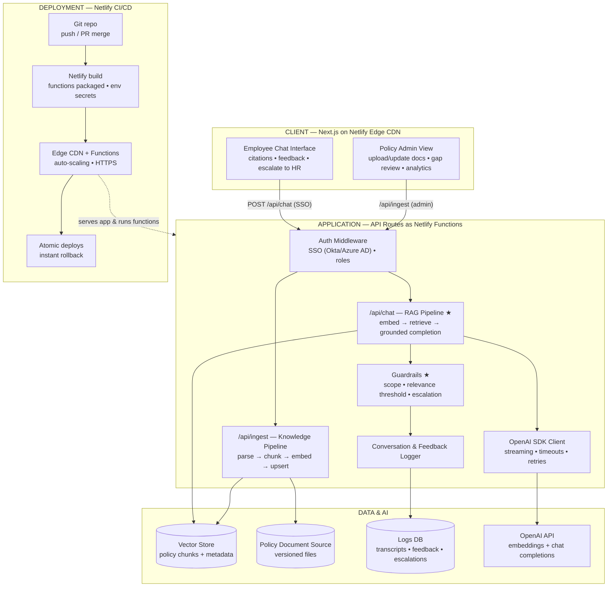

# Enterprise AI Policy Chatbot — Detailed Technical Reference

**A grounded conversational agent for internal policy inquiries**
Next.js • OpenAI SDK • Netlify • Version 1.0 • July 2026

---

## Contents

1. [System Architecture — Deep Dive](#1-system-architecture--deep-dive)
2. [Architecture Diagram (Mermaid)](#2-architecture-diagram-mermaid)
3. [Application Flow — Step-by-Step](#3-application-flow--step-by-step)
4. [Flow Chart (Mermaid)](#4-flow-chart-mermaid)
5. [The RAG Design — Retrieval, Grounding & Citations](#5-the-rag-design--retrieval-grounding--citations)
6. [API Contract](#6-api-contract)
7. [Netlify Deployment Model](#7-netlify-deployment-model)
8. [Security, Scaling & Reliability Notes](#8-security-scaling--reliability-notes)

---

## 1. System Architecture — Deep Dive

### 1.1 Client Layer — Next.js (React), served from Netlify Edge CDN

**Employee Chat Interface**
- Conversational thread with streamed answers (tokens render as they arrive), typing indicator, suggested starter questions ("leave policy", "expense limits", "WFH rules").
- Every answer shows **policy citations** — the policy name, section, and effective version the answer was drawn from, linking to the source document.
- **Feedback controls** (👍/👎) on each answer and an explicit **"escalate to HR"** action.
- Client-side conversation history sent with each request; the backend stays stateless.

**Policy Admin View** (admin role only)
- Upload or update policy documents (HR, IT, security, compliance) and trigger re-indexing.
- Review queues: unanswered questions (below-threshold retrievals) and 👎-flagged answers — the raw material for policy-gap fixes.
- Usage and feedback analytics.

### 1.2 Application Layer — Next.js API Routes as Netlify Serverless Functions

| Component | Responsibility |
|---|---|
| **Auth Middleware** | Validates the enterprise SSO session (Okta / Azure AD → JWT) on every API call; separates employee and admin roles; unauthenticated requests are redirected to SSO login. |
| **`/api/chat` — RAG Pipeline ★** | The core path: validate request → embed the question (OpenAI embeddings) → top-k similarity search over the vector store → relevance gate → grounded chat completion with the retrieved chunks in context → streamed response with citation metadata. |
| **`/api/ingest` — Knowledge Pipeline** | Admin-triggered: parse documents → chunk by policy section (heading-aware) → embed each chunk → upsert into the vector store with metadata `{policy, section, version, effective_date}`. Superseded versions are tombstoned so retrieval only ever surfaces current policy. |
| **OpenAI SDK Client** | One wrapper for embeddings and completions: streaming enabled, request timeouts, bounded retries on transient errors, token-usage capture per request. |
| **Guardrails ★** | System-prompt scope enforcement (answer only from provided policy context; no legal advice; no personal HR case judgments), a **relevance threshold** on retrieval (below it → honest "not covered" + escalation, never a guess), and answer-shape checks before returning. |
| **Conversation & Feedback Logger** | PII-minimised transcripts, per-answer feedback, retrieval scores, and escalation events — persisted for the admin queues and analytics. |

All functions are stateless — session identity comes from the JWT, conversation history from the client — so Netlify can scale them freely.

### 1.3 Data & AI Layer

| Store / Service | Role |
|---|---|
| **Vector store** | Chunked policy sections as embeddings + metadata; top-k cosine similarity search at query time; upserts/tombstones from the ingest pipeline. |
| **Policy document source** | The versioned source-of-truth files the admin uploads; retained so any answer's citation can be traced to an exact document version. |
| **Logs DB** | Transcripts, feedback, unanswered-question queue, escalation tickets. |
| **OpenAI API** | `text-embedding` model for indexing and queries; chat-completion model for grounded answers (streamed). |

### 1.4 Deployment Layer — Netlify

| Element | Role |
|---|---|
| **Git repository** | The single Next.js codebase; push/PR merge triggers a build; every PR gets a **deploy preview** URL. |
| **Netlify build** | Compiles the Next.js app; API routes are packaged automatically as serverless functions; environment secrets (`OPENAI_API_KEY`, SSO client config, vector-store credentials) injected at build/runtime — never in the repo. |
| **Edge CDN + Functions** | Static/SSR pages served globally from the edge; functions scale on demand and cost nothing idle. |
| **Atomic deploys** | Every deploy is immutable; rollback to any previous deploy is one click. |

---

## 2. Architecture Diagram (Mermaid)



---

## 3. Application Flow — Step-by-Step

### Phase 0 — Policy Ingestion (admin, on upload/update)

| # | Step | Detail |
|---|---|---|
| 0.1 | **Upload / update** | Admin submits policy documents through the admin view. |
| 0.2 | **Parse & chunk** | Heading-aware chunking by policy section; metadata attached: policy name, section, version, effective date. |
| 0.3 | **Embed** | Each chunk vectorised via the OpenAI embeddings endpoint. |
| 0.4 | **Upsert** | Vectors written to the store; chunks from superseded versions tombstoned so retrieval only surfaces current policy. |

### Phase 1 — Runtime Q&A Loop

| # | Step | Detail |
|---|---|---|
| 1 | **Open** | Employee loads the chatbot from the Netlify edge. |
| 2 | **SSO gate** | Valid session → proceed; otherwise redirect to Okta/Azure AD login, then back with a session JWT. |
| 3 | **Ask** | Natural-language policy question. |
| 4 | **`POST /api/chat`** | Function validates payload, session, and rate limit. |
| 5 | **Embed & retrieve** | Query embedded; top-k similarity search over the vector store with scores. |
| 6 | **Relevance gate** | Best score below threshold → **"not covered" response**: honest statement, HR escalation offered, question logged to the policy-gap queue. Above threshold → continue. |
| 7 | **Grounded completion** | System prompt + retrieved chunks + question → streamed OpenAI completion. |
| 8 | **Render with citations** | Answer streams into the thread with the policy/section/version citations of the chunks used. |
| 9 | **Feedback** | 👍 logs positive signal. 👎 → **escalation**: HR/helpdesk ticket created, transcript attached, answer flagged for admin review. |
| 10 | **Loop or end** | Next question returns to step 3; otherwise the session ends. |

### Failure & Edge Handling

- **OpenAI timeout/error:** bounded retries, then a graceful retryable error message — never a partial or fabricated answer.
- **Stale policy risk:** version tombstoning + effective-date metadata means retrieval can't mix old and new policy text; citations always name the version.
- **Prompt injection in questions:** user text is confined to the question slot; the system prompt instructs the model to ignore instructions inside it and answer only from the provided policy context.
- **Cost control:** history trimmed to a sliding window; token usage logged per request; Netlify function timeout bounds worst-case spend.

---

## 4. Flow Chart (Mermaid)

```mermaid
flowchart TD
    subgraph INGEST["Policy ingestion (admin — on upload/update)"]
        UP["Admin uploads / updates<br/>policy documents"] --> CHUNK["Parse & chunk by section<br/>+ version metadata"]
        CHUNK --> EMB["OpenAI embeddings"]
        EMB --> VEC["Vector store upserted"]
    end

    VEC -. "knowledge base serves the chat loop" .-> ASK

    START([START]) --> OPEN["Employee opens the chatbot<br/>(Netlify Edge CDN)"]
    OPEN --> SSOQ{Valid SSO session?}
    SSOQ -- NO --> LOGIN["Redirect to SSO login<br/>Okta / Azure AD → JWT"]
    LOGIN --> ASK
    SSOQ -- YES --> ASK[/"Employee asks a policy question"/]
    ASK --> API["POST /api/chat (Netlify Function)<br/>validate • session • rate limit"]
    API --> RETR["Embed query → retrieve top-k<br/>policy chunks (vector store)"]
    RETR --> RELQ{Relevant policy content<br/>above threshold?}
    RELQ -- NO --> NC["'Not covered' response<br/>HR escalation offered • gap logged"]
    NC --> FB
    RELQ -- YES --> COMP["OpenAI chat completion (streamed)<br/>system prompt + chunks + question"]
    COMP --> CITE[/"Answer rendered with policy citations<br/>+ feedback buttons"/]
    CITE --> FB{Answer helpful?<br/>(👍 / 👎)}
    FB -- "👎 — escalate" --> ESC["HR / helpdesk ticket<br/>feedback logged for review"]
    ESC --> MORE
    FB -- "👍 — logged" --> MORE{Another policy question?}
    MORE -- YES --> ASK
    MORE -- NO --> FIN([END])
```

---

## 5. The RAG Design — Retrieval, Grounding & Citations

1. **Chunking that mirrors policy structure.** Documents are split on section headings, not fixed character counts, so a retrieved chunk is a coherent rule (e.g., *"Remote Work Policy → §3 Eligibility"*) — which is exactly what a citation should point to.
2. **Metadata is first-class.** Every chunk carries `{policy, section, version, effective_date}`. Retrieval filters to current versions; citations render from the same metadata; audits can reconstruct which policy version produced any past answer.
3. **The relevance threshold is the honesty mechanism.** Below-threshold retrievals short-circuit *before* the completion call — the model is never asked to answer from thin context, which is where hallucinations come from. The employee gets a truthful "not covered" plus escalation, and the question lands in the gap queue.
4. **Grounded completion.** The system prompt (in substance): *You answer employee questions using ONLY the policy excerpts provided. Quote or paraphrase faithfully; cite the policy and section for every claim. If the excerpts don't answer the question, say so and suggest contacting HR. Do not give legal advice or judgments on individual cases.*
5. **Streaming for feel, citations for trust.** Tokens stream so the bot feels instant; citations render with the answer so employees can verify — which is what makes an *enterprise policy* bot usable in practice.
6. **The feedback loop closes the system.** 👎 answers and unanswered questions are reviewed by admins; fixes are either policy edits (re-ingested) or chunking/threshold tuning — the knowledge base improves without touching application code.

---

## 6. API Contract

### `POST /api/chat` (employee, SSO required)

**Request**
```json
{
  "message": "How many WFH days am I allowed per week?",
  "history": [ { "role": "user", "content": "..." }, { "role": "assistant", "content": "..." } ]
}
```

**Response — 200 (streamed, final shape)**
```json
{
  "reply": "Per the Remote Work Policy §3, full-time employees may work remotely up to 3 days per week ...",
  "citations": [
    { "policy": "Remote Work Policy", "section": "3. Eligibility", "version": "v4", "effective_date": "2026-01-01" }
  ],
  "grounded": true
}
```

**"Not covered" — 200**
```json
{ "reply": "I couldn't find this in our current policies. You can reach HR at ...", "citations": [], "grounded": false, "escalation": true }
```

**Errors:** 401 (no/expired SSO session → login redirect), 400 (validation), 429 (rate limit), 502/504 (OpenAI failure after retries → retryable UI message).

### `POST /api/ingest` (admin role)
Multipart upload or source-location reference → `{ indexed_chunks, policy, version }`.

### `POST /api/feedback`
`{ message_id, rating: "up" | "down", comment? }` — 👎 also opens an escalation ticket.

---

## 7. Netlify Deployment Model

- **Build:** Git push / PR merge → Netlify builds the Next.js app; API routes under `/api/*` are packaged as serverless functions automatically — no separate backend deployment.
- **Secrets:** `OPENAI_API_KEY`, SSO client credentials, and vector-store credentials live in Netlify environment variables (scoped per deploy context: production / preview / branch). Nothing sensitive in the repository.
- **Previews:** every PR gets an isolated **deploy preview** URL — policy admins can review chatbot behaviour changes before they reach employees.
- **Runtime:** static and SSR assets on the global edge CDN; functions scale from zero with demand; HTTPS everywhere by default.
- **Release safety:** deploys are atomic and immutable; rolling back is selecting a previous deploy — one click, instant.

---

## 8. Security, Scaling & Reliability Notes

- **Security:** SSO-gated access (no anonymous use of an internal tool); role-scoped admin endpoints; API key and SSO secrets only in platform env vars; PII-minimised transcript logging with retention limits; CORS locked to the app's own origin; rate limiting per user on `/api/chat`.
- **Prompt-injection posture:** user text confined to the question slot beneath a system prompt that forbids out-of-context answering; retrieved chunks are trusted content (they come from the admin-controlled ingest pipeline, not from users).
- **Scaling:** edge-served UI + auto-scaling functions handle company-wide rollout without capacity planning; the vector store is the only stateful dependency on the hot path.
- **Reliability:** relevance gate prevents low-context hallucination; bounded OpenAI retries with graceful degradation; atomic deploys + instant rollback; version tombstoning guarantees answers reflect current policy only.
- **Observability:** per-request token usage and latency, answered/not-covered/escalated outcome rates, retrieval-score distributions (threshold tuning), and the policy-gap queue as a product metric.
