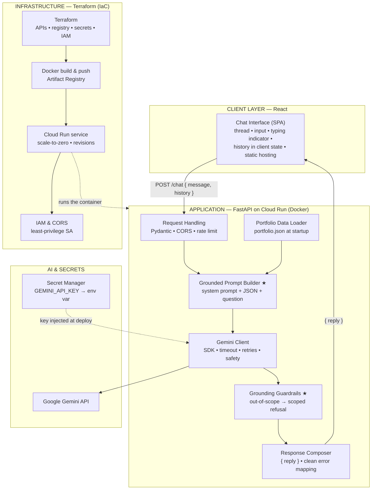
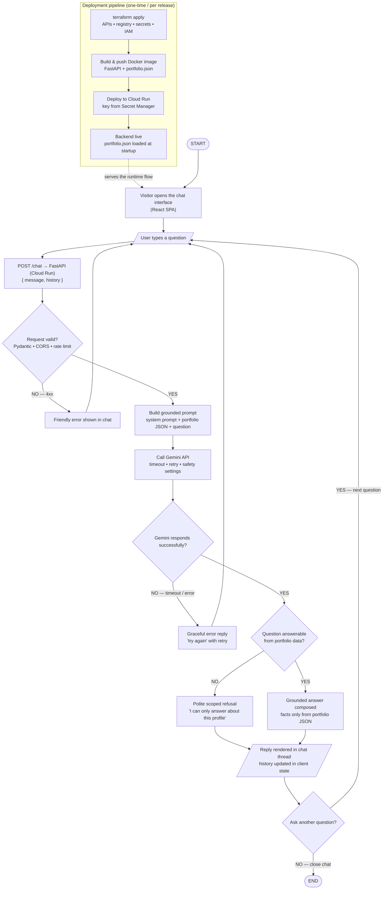

# LinkedIn Profile Assistance Bot — Detailed Technical Reference

**A grounded AI chat assistant for one professional profile**
React • FastAPI • Gemini • Terraform → Docker → Google Cloud Run • Version 1.0 • July 2026

---

## Contents

1. [System Architecture — Deep Dive](#1-system-architecture--deep-dive)
2. [Architecture Diagram (Mermaid)](#2-architecture-diagram-mermaid)
3. [Application Flow — Step-by-Step](#3-application-flow--step-by-step)
4. [Flow Chart (Mermaid)](#4-flow-chart-mermaid)
5. [The Grounding Design — How Hallucination Is Prevented](#5-the-grounding-design--how-hallucination-is-prevented)
6. [API Contract](#6-api-contract)
7. [Infrastructure as Code — Terraform Pipeline](#7-infrastructure-as-code--terraform-pipeline)
8. [Security, Scaling & Reliability Notes](#8-security-scaling--reliability-notes)

---

## 1. System Architecture — Deep Dive

### 1.1 Client Layer — React

- **Chat SPA:** message thread, input box, send-on-Enter, typing/loading indicator while `/chat` is in flight, error banner with retry.
- **Client-side history:** the conversation lives in React state and is sent along with each message (`{ message, history }`), keeping the backend stateless — no session store required.
- **Delivery:** built to static assets and served from static hosting/CDN; the only network dependency is the Cloud Run `/chat` URL, configured at build time.

### 1.2 Application Layer — FastAPI on Google Cloud Run

One Docker container, one endpoint, six components:

| Component | Responsibility |
|---|---|
| **Request Handling** | Pydantic schema for `{ message, history }` (length caps, type checks); CORS locked to the frontend origin; lightweight per-IP rate limiting; structured request logging. |
| **Portfolio Data Loader** | Reads `portfolio.json` (bundled into the image) **once at startup** into an in-memory structure: profile, experience, projects, skills, education. If the file is missing/invalid the container fails fast at boot — a bad build never serves traffic. |
| **Grounded Prompt Builder ★** | Composes each Gemini request as: strict system prompt (see §5) + the full portfolio JSON + recent history + the user's question. |
| **Gemini Client** | `google-generativeai` SDK; request timeout, bounded retries with backoff on transient errors, safety settings; the API key read from the environment (injected by Cloud Run from Secret Manager). |
| **Grounding Guardrails ★** | Belt-and-braces scope enforcement: the system prompt instructs refusal for out-of-portfolio questions, and the composer verifies refusal formatting so off-topic answers can't leak through with invented facts. |
| **Response Composer** | Wraps the model output as `{ "reply": "..." }`; maps SDK/timeout failures to friendly HTTP errors the UI renders as retryable messages. |

**Runtime characteristics:** stateless (all state is the request payload), so Cloud Run can scale it horizontally or to zero; cold starts are cheap because the only startup work is parsing one JSON file.

### 1.3 AI & Secrets

| Element | Role |
|---|---|
| **Google Gemini API** | Generation, constrained by the strict system prompt; the model never has tools, browsing, or memory — its entire world is the supplied JSON. |
| **GCP Secret Manager** | Holds `GEMINI_API_KEY`; Terraform wires it into the Cloud Run service as an environment variable. The key never appears in source, the image, or Terraform state output. |

### 1.4 Infrastructure & Deployment — Terraform

| Resource | Purpose |
|---|---|
| **API enablement** | Cloud Run, Artifact Registry, Secret Manager APIs turned on declaratively. |
| **Artifact Registry** | Docker repository; the backend image (FastAPI app + `portfolio.json`) is built and pushed per release, tagged by version/commit. |
| **Cloud Run service** | Deploys the image: HTTPS endpoint, **scale-to-zero** autoscaling with a max-instance cap, secret env wiring, health probe, revision history for instant rollback. |
| **IAM** | Least-privilege runtime service account (Secret Manager accessor only); public unauthenticated invoker on the service (it's a public chat) with CORS + rate limiting as the abuse controls. |

---

## 2. Architecture Diagram (Mermaid)



---

## 3. Application Flow — Step-by-Step

### Phase 0 — Deployment Pipeline (one-time / per release)

| # | Step | Detail |
|---|---|---|
| 0.1 | **`terraform apply`** | Enables GCP APIs; provisions Artifact Registry, Secret Manager (with the Gemini key), IAM service account, and the Cloud Run service definition. |
| 0.2 | **Build & push image** | Docker image containing the FastAPI app **and** `portfolio.json`; pushed to Artifact Registry with a version tag. |
| 0.3 | **Deploy to Cloud Run** | New revision rolls out; `GEMINI_API_KEY` mounted from Secret Manager; HTTPS URL issued. |
| 0.4 | **Startup** | Container boots, the loader parses `portfolio.json`; invalid data fails the health probe so bad builds never receive traffic. |

### Phase 1 — Runtime Chat Loop

| # | Step | Detail |
|---|---|---|
| 1 | **Open chat** | Visitor loads the React SPA; greeting message shown. |
| 2 | **Ask** | User types a question (e.g. "What projects has he worked on?"). |
| 3 | **`POST /chat`** | `{ message, history }` sent; loading indicator shown. |
| 4 | **Validate** | Pydantic + CORS + rate limit. Invalid → clean 4xx with a friendly message rendered in the thread; user can rephrase. |
| 5 | **Build grounded prompt** | System prompt + portfolio JSON + trimmed history + question. |
| 6 | **Call Gemini** | Timeout + bounded retries. Persistent failure → graceful "please try again" reply with a retry affordance (the loop continues; nothing crashes). |
| 7 | **Grounding decision** | Answerable from the portfolio → **grounded answer**, facts only from the JSON. Out of scope → **polite scoped refusal** ("I can only answer questions about this profile"). |
| 8 | **Render** | `{ reply }` appended to the thread; history updated client-side. |
| 9 | **Loop or end** | Next question returns to step 2; closing the chat ends the session (nothing persists server-side). |

---

## 4. Flow Chart (Mermaid)



---

## 5. The Grounding Design — How Hallucination Is Prevented

The bot's defining requirement is that it never invents profile facts. Three reinforcing layers:

1. **Closed-world knowledge.** The model is given exactly one knowledge source — the portfolio JSON — embedded in the prompt itself. No tools, no browsing, no memory, no other documents. There is nothing else to "know."

2. **Strict system prompt.** In substance:
   - *You are an assistant that answers questions about [Name]'s professional profile.*
   - *Answer ONLY using the JSON data provided below. Never add, infer, or embellish facts that are not present in it.*
   - *If the answer is not in the data, or the question is not about this profile, reply exactly with a brief polite refusal such as: "I can only answer questions about [Name]'s professional profile."*
   - *Keep answers concise, professional, and in the third person.*

3. **Output guardrails.** The composer checks the shape of the response (refusals match the template; answers stay conversational-length) and the API layer never mixes model errors with model answers — failures become explicit retryable error replies, not degraded generations.

Consequences worth noting: updating the profile is a **data change, not a code change** — edit `portfolio.json`, rebuild, redeploy (a new Cloud Run revision); and evaluation is easy — a small test set of in-scope and out-of-scope questions can be replayed against `/chat` after every profile update.

---

## 6. API Contract

### `POST /chat`

**Request**
```json
{
  "message": "What projects has he worked on?",
  "history": [
    { "role": "user", "content": "Hi" },
    { "role": "assistant", "content": "Hello! Ask me anything about ..." }
  ]
}
```

**Response — 200**
```json
{ "reply": "He has built ... (drawn only from portfolio.json)" }
```

**Errors**
| Status | Meaning | UI behaviour |
|---|---|---|
| 400 | validation failure (empty/oversized message, bad history shape) | friendly inline message |
| 429 | rate limit exceeded | "slow down" message |
| 502/504 | Gemini failure after retries | "please try again" with retry button |

**Portfolio JSON shape (illustrative)**
```json
{
  "profile":   { "name": "...", "headline": "...", "location": "...", "summary": "..." },
  "experience": [ { "company": "...", "role": "...", "period": "...", "highlights": ["..."] } ],
  "projects":   [ { "name": "...", "description": "...", "tech": ["..."], "link": "..." } ],
  "skills":     ["...", "..."],
  "education":  [ { "institution": "...", "degree": "...", "year": "..." } ]
}
```

---

## 7. Infrastructure as Code — Terraform Pipeline

Resources managed (illustrative of the module layout):

```
google_project_service        # enable run, artifactregistry, secretmanager APIs
google_artifact_registry_repository   # docker repo
google_secret_manager_secret + version # GEMINI_API_KEY
google_service_account        # least-privilege runtime SA
google_secret_manager_secret_iam_member # SA → secretAccessor
google_cloud_run_v2_service   # container image, env (secret ref), scaling {min=0, max=N}
google_cloud_run_v2_service_iam_member  # allUsers → run.invoker (public chat)
```

Release procedure: build & push the image (locally or via Terraform's build step) → `terraform apply` rolls a new Cloud Run **revision** → traffic shifts; a bad release is one `gcloud run services update-traffic` (or Terraform revert) away from rollback. State is versioned; the whole environment is reproducible from an empty GCP project plus one secret value.

---

## 8. Security, Scaling & Reliability Notes

- **Security:** API key only in Secret Manager → env var; CORS pinned to the frontend origin; per-IP rate limiting on the single public endpoint; Pydantic caps message/history sizes (prompt-stuffing and cost control); least-privilege service account; no PII stored server-side — the service is stateless and keeps no logs of conversation content beyond operational metadata.
- **Prompt-injection posture:** user text is confined to the "question" slot beneath an instruction hierarchy whose system prompt explicitly forbids leaving the portfolio scope; the refusal template gives injected instructions nowhere to land.
- **Scaling:** stateless container + scale-to-zero — idle cost ≈ 0, and Cloud Run adds instances automatically under load; a max-instance cap bounds worst-case Gemini spend.
- **Reliability:** fail-fast startup on invalid portfolio data; bounded retries with graceful degradation on Gemini outages; Cloud Run revisions for instant rollback; health probes gate traffic.
- **Observability:** request logs with latency and outcome (answered / refused / error), Gemini token usage per request for cost tracking, and an error-rate alert on the `/chat` route.
