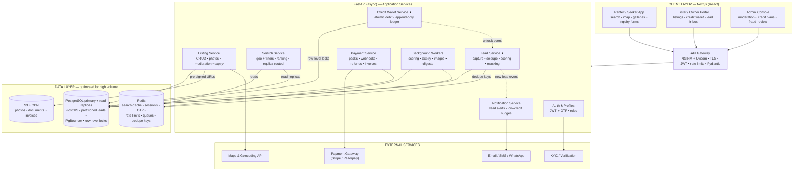
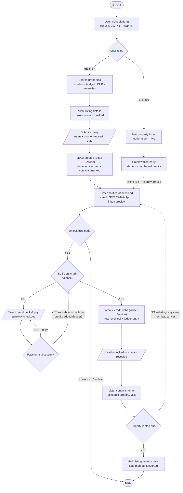

# Rent Property Listing Web Application — Detailed Technical Reference

**High-volume property rental marketplace with a credit-based lead model**
Client: A. Centauri Software • Version 1.0 • July 2026

---

## Contents

1. [System Architecture — Deep Dive](#1-system-architecture--deep-dive)
2. [Architecture Diagram (Mermaid)](#2-architecture-diagram-mermaid)
3. [Application Flow — Step-by-Step](#3-application-flow--step-by-step)
4. [Flow Chart (Mermaid)](#4-flow-chart-mermaid)
5. [Data Model (PostgreSQL)](#5-data-model-postgresql)
6. [Database Optimization Strategy](#6-database-optimization-strategy)
7. [API Surface](#7-api-surface)
8. [Credit & Lead Integrity — The Unlock Transaction](#8-credit--lead-integrity--the-unlock-transaction)
9. [Security, Scaling & Reliability Notes](#9-security-scaling--reliability-notes)

---

## 1. System Architecture — Deep Dive

### 1.1 Client Layer — Next.js (React)

**Renter / Seeker App**
- Search with geo + filters (location, budget, BHK, furnishing, amenities), map view, photo galleries served from CDN.
- Listing detail pages show everything **except** the owner's contact, which stays masked; the call-to-action is the **inquiry / contact-owner form** — the lead-capture point.
- SSR/ISR on catalog and locality pages for SEO — organic search is a primary acquisition channel for marketplaces.

**Lister / Owner Portal**
- Post and manage listings (details, photos, rent/deposit, availability), with moderation status visibility.
- **Credit wallet:** balance, pack purchase, transaction ledger.
- **Lead inbox:** previews of incoming leads (score, move-in date, partial message) with contacts hidden until unlocked.

**Admin Console**
- Listing moderation queue, credit plan & pricing management, lead-quality dashboards, refund handling, and fraud review (fake listings, self-inquiry credit farming).

### 1.2 Application Layer — FastAPI (async Python)

**Gateway (NGINX + Uvicorn workers)**
- TLS termination, per-route rate limits (search vs lead-submission vs unlock get different budgets), JWT auth middleware, request validation via Pydantic models.
- Sized for high-volume traffic: multiple Uvicorn workers per node, async I/O throughout.

| Service | Responsibility |
|---|---|
| **Auth & Profiles** | JWT sessions with OTP (phone-first) login; roles: renter, lister, agent, admin. |
| **Listing Service** | Listing CRUD, photo upload orchestration (pre-signed S3), amenity taxonomies, moderation workflow, expiry/renewal lifecycle. |
| **Search Service** | Geo + filter queries with ranking (freshness, completeness, lister responsiveness). Routed to **read replicas**; hot queries served from Redis. |
| **Lead Service** ★ | Inquiry capture → validation → **dedupe** (same renter × listing within a window) → **scoring** (completeness, phone verification, intent signals) → persistence with **masked contacts** → delivery to the lister's inbox. |
| **Credit Wallet Service** ★ | Wallet balances, credit packs/plans, **atomic debit on unlock** under row-level locking, append-only `credit_ledger`, expiry of promotional credits. |
| **Payment Service** | Credit-pack checkout via Stripe/Razorpay, **idempotent webhook** confirmation, refunds, GST invoice generation. |
| **Notification Service** | New-lead alerts (email/SMS/WhatsApp), low-credit nudges, listing-expiry reminders, OTP delivery. |
| **Background Workers (Celery/ARQ)** | Lead scoring enrichment, listing expiry sweeps, image processing (thumbnails, EXIF strip), digest emails, ledger reconciliation. |

★ = the two services implementing the credit-based lead model.

### 1.3 Data Layer

| Store | Role |
|---|---|
| **PostgreSQL (primary + read replicas)** | Source of truth: `users`, `listings`, `leads`, `wallets`, `credit_ledger`, `payments`. Optimised per §6. |
| **Redis** | Hot search-result and listing-detail cache, session/OTP store, rate-limit counters, worker queue backend, lead-dedupe keys (`lead:{renterId}:{listingId}`). |
| **S3 + CDN** | Property photos (originals + generated thumbnails), documents, invoice PDFs. |

### 1.4 External Services

| Service | Purpose |
|---|---|
| **Payment gateway (Stripe/Razorpay)** | Credit-pack purchases: UPI, cards, saved methods; webhooks; refunds. |
| **Maps & geocoding** | Address → coordinates on listing creation, map tiles, locality suggestions. |
| **Email / SMS / WhatsApp** | Lead alerts, OTPs, reminders. |
| **KYC / verification** | Owner identity and listing authenticity checks (feeds lead-quality trust). |

---

## 2. Architecture Diagram (Mermaid)



---

## 3. Application Flow — Step-by-Step

### Phase A — Entry & Role Branch

| # | Step | Detail |
|---|---|---|
| 1 | **Visit & sign-in** | Next.js app; JWT/OTP login identifies the user as renter or lister. |
| 2 | **Role decision** | Renters go to search; listers go to listing management. |

### Phase B1 — Renter Path (lead generation)

| # | Step | Detail |
|---|---|---|
| 3 | **Search** | Geo + filter query → Search Service → Redis cache or read replica. |
| 4 | **View listing** | Full detail with photos and map; **owner contact masked**. |
| 5 | **Submit inquiry** | Name, phone (OTP-verified), move-in date, message. |
| 6 | **Lead created** | Lead Service validates, **dedupes** (renter × listing window), **scores**, persists with masked contacts, and emits a new-lead event. |

### Phase B2 — Lister Path (supply + wallet)

| # | Step | Detail |
|---|---|---|
| 3′ | **Post listing** | Details + photos → moderation → live. Geocoded on save. |
| 4′ | **Wallet ready** | Free starter credits on signup or purchased packs; balance visible in the portal. |
| 5′ | **Wait state** | Listing live; inquiries arrive asynchronously (dashed edge in the chart). |

### Phase C — The Credit Gate (paths converge)

| # | Step | Detail |
|---|---|---|
| 7 | **Lister notified** | Email/SMS/WhatsApp + lead-inbox preview (score, move-in date; contacts hidden). |
| 8 | **Unlock decision** | Lister may skip/archive low-quality leads (no charge) — NO path exits. |
| 9 | **Balance check** | Sufficient credits? |
| 9a | **YES → atomic debit** | Wallet Service debits under a row-level lock, writes a `credit_ledger` entry, and the Lead Service reveals the renter's contact — one transaction (see §8). |
| 9b | **NO → buy credits** | Pack selection → gateway checkout → **payment retry loop** on failure → webhook confirms → credits added (ledger `purchase` entry) → back to the balance check. |

### Phase D — Outcome & Loop

| # | Step | Detail |
|---|---|---|
| 10 | **Contact & visit** | Lister calls/messages the renter, schedules a property visit. |
| 11 | **Rented?** — YES | Listing marked rented/delisted; lead marked **converted** (feeds quality scoring). END. |
| 11′ | **Rented?** — NO | Listing stays live; the next lead re-enters at the notification step (dashed loop). |

### Failure & Edge Handling

- **Duplicate inquiries:** Redis dedupe key (TTL) collapses repeat submissions into the original lead — listers never pay twice for the same renter.
- **Payment webhook races:** credits are added only on the webhook, idempotent by `payment_intent_id`; client-side "success" alone never mints credits.
- **Unlock crash-safety:** debit + reveal share one DB transaction — a failure rolls back both; a ledger sweep reconciles any orphaned rows.
- **Credit farming / fraud:** self-inquiry detection (device/phone graph), admin review queue, and refund-as-credit for verified bad leads.

---

## 4. Flow Chart (Mermaid)



---

## 5. Data Model (PostgreSQL)

### Identity
| Table | Key columns |
|---|---|
| `users` | id, phone (unique, OTP-verified), email, password_hash?, role (`renter/lister/agent/admin`), kyc_status |

### Listings
| Table | Key columns |
|---|---|
| `listings` | id, lister_id, title, property_type, bhk, rent, deposit, furnishing, geom `GEOGRAPHY(Point)`, locality_id, status (`draft/in_review/live/rented/expired/removed`), expires_at |
| `listing_photos` | id, listing_id, s3_key, thumb_key, position |
| `amenities` / `listing_amenities` | taxonomy + join table |

### Leads (the product)
| Table | Key columns |
|---|---|
| `leads` | id, listing_id, renter_id, lister_id, message, move_in_date, score, contact_masked BOOLEAN, status (`new/unlocked/skipped/converted/refunded`), created_at — **partitioned by month on `created_at`** |
| `lead_unlocks` | id, lead_id (unique), lister_id, ledger_entry_id, unlocked_at |

### Credits & Payments
| Table | Key columns |
|---|---|
| `wallets` | lister_id (PK), balance, updated_at — debits under `SELECT ... FOR UPDATE` |
| `credit_ledger` | id, wallet_id, delta (+/-), reason (`purchase/unlock/refund/promo/expiry`), ref_id, balance_after, created_at — **append-only** |
| `credit_packs` | id, name, credits, price, validity_days |
| `payments` | id, wallet_id, pack_id, gateway, payment_intent_id (unique), amount, status, webhook_payload JSONB |

---

## 6. Database Optimization Strategy

The "Database Optimization" line item, concretely:

1. **Geo search:** PostGIS `GEOGRAPHY(Point)` + GiST index on `listings.geom`; radius and bounding-box queries stay index-driven at scale.
2. **Filter-heavy queries:** composite indexes matching the dominant search patterns (e.g., `(locality_id, rent, bhk) WHERE status='live'`) and **partial indexes** scoped to `status='live'` so index size tracks active inventory, not history.
3. **Leads partitioning:** `leads` is **range-partitioned by month** — the inbox only touches recent partitions, and old partitions archive/drop cheaply.
4. **Read/write split:** search and listing-detail reads route to **read replicas**; writes (listings, leads, wallet) hit the primary. Replica lag is acceptable for search, never used for wallet reads.
5. **Connection pooling:** **PgBouncer** in transaction mode in front of the primary — essential with many async FastAPI workers.
6. **Hot-path caching:** Redis caches ranked search results (short TTL) and listing-detail payloads (invalidated on update), cutting replica load on popular localities.
7. **Contention control:** wallet debits use **row-level locking** (`FOR UPDATE`) on a single `wallets` row per lister — serialized where it matters, parallel everywhere else; `credit_ledger` is insert-only so it never blocks.
8. **Housekeeping:** autovacuum tuning on high-churn tables, `EXPLAIN ANALYZE` regression checks in CI for the top search queries, and pg_stat_statements-driven index reviews.

---

## 7. API Surface

### Public / Renter
| Method & Path | Purpose |
|---|---|
| `POST /auth/otp/send` · `POST /auth/otp/verify` | phone OTP login → JWT |
| `GET /listings/search?lat=&lng=&radius=&rent_max=&bhk=` | geo + filter search (cached/replica) |
| `GET /listings/{id}` | listing detail (contact masked) |
| `POST /leads` | submit inquiry `{listing_id, message, move_in_date}` |

### Lister
| Method & Path | Purpose |
|---|---|
| `POST /listings` · `PATCH /listings/{id}` | create/update listing (moderation workflow) |
| `GET /leads/inbox` | lead previews (masked) |
| `POST /leads/{id}/unlock` | **atomic debit + reveal** (409 on insufficient balance) |
| `POST /leads/{id}/skip` | archive without charge |
| `GET /wallet` · `GET /wallet/ledger` | balance and history |
| `POST /wallet/packs/{id}/checkout` | start gateway payment |

### System
| Method & Path | Purpose |
|---|---|
| `POST /payments/webhook` | gateway confirmation (idempotent) — the only path that credits wallets |
| `GET /admin/moderation/queue` · `POST /admin/leads/{id}/refund` | admin operations |

---

## 8. Credit & Lead Integrity — The Unlock Transaction

The unlock is the revenue event, so it is one ACID transaction:

```sql
BEGIN;
  SELECT balance FROM wallets WHERE lister_id = :lister FOR UPDATE;   -- serialize per lister
  -- fail fast with 409 if balance < cost
  UPDATE wallets SET balance = balance - :cost WHERE lister_id = :lister;
  INSERT INTO credit_ledger (wallet_id, delta, reason, ref_id, balance_after)
       VALUES (:wallet, -:cost, 'unlock', :lead_id, :new_balance);
  UPDATE leads SET contact_masked = FALSE, status = 'unlocked' WHERE id = :lead_id AND status = 'new';
  INSERT INTO lead_unlocks (lead_id, lister_id, ledger_entry_id) VALUES (...);
COMMIT;
```

Guarantees:
- **No free reveals / no phantom charges:** debit and reveal commit or roll back together.
- **Idempotency:** `lead_unlocks.lead_id` is unique — repeating the request returns the already-unlocked lead without a second debit.
- **Auditability:** `credit_ledger` is append-only with `balance_after`, so any balance can be reconstructed and disputes resolved.
- **Refund path:** verified bad leads get a compensating `+delta` ledger entry (`reason='refund'`), never a mutation of history.

---

## 9. Security, Scaling & Reliability Notes

- **Security:** OTP-verified phone identities; JWT with short expiry; contact data encrypted at rest and only exposed through the unlock transaction; per-route rate limits (tight on `POST /leads` to deter spam); gateway webhooks signature-verified; KYC on listers reduces fraudulent supply.
- **Scaling:** stateless FastAPI nodes horizontally scaled behind NGINX; replicas + Redis for the read-dominated search path; monthly lead partitions keep working sets small; CDN offloads all media traffic.
- **Reliability:** idempotent unlocks and payment webhooks; ledger reconciliation sweep; dead-letter queues for failed notifications; listing-expiry sweeps keep inventory honest.
- **Observability:** pg_stat_statements + slow-query alerts on the search patterns; lead-funnel metrics (inquiry → unlock → converted) as the product's core KPI; per-lister unlock/refund ratios feeding fraud review.
