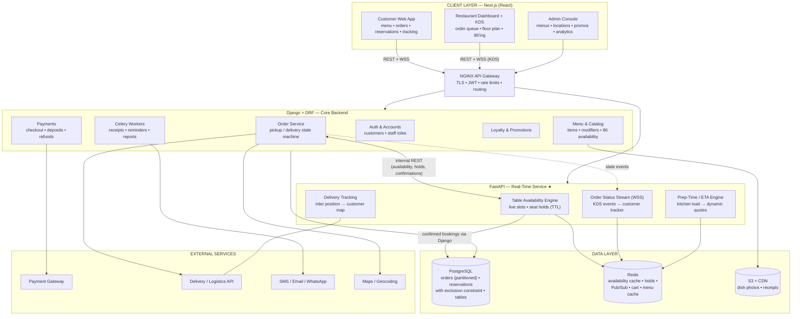
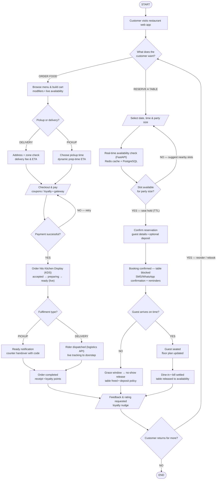

# Restaurant Online Web Application — Detailed Technical Reference

**Highly scalable restaurant platform unifying online ordering and real-time table reservations**
Client: A. Centauri Software • Version 1.0 • July 2026

---

## Contents

1. [System Architecture — Deep Dive](#1-system-architecture--deep-dive)
2. [Architecture Diagram (Mermaid)](#2-architecture-diagram-mermaid)
3. [Application Flow — Step-by-Step](#3-application-flow--step-by-step)
4. [Flow Chart (Mermaid)](#4-flow-chart-mermaid)
5. [Data Model (PostgreSQL)](#5-data-model-postgresql)
6. [Reservation Integrity — How Double-Booking Is Prevented](#6-reservation-integrity--how-double-booking-is-prevented)
7. [API & Event Surface](#7-api--event-surface)
8. [Order Lifecycle State Machine](#8-order-lifecycle-state-machine)
9. [Security, Scaling & Reliability Notes](#9-security-scaling--reliability-notes)

---

## 1. System Architecture — Deep Dive

### 1.1 Client Layer — Next.js (React)

**Customer Web App**
- SSR/ISR menu and location pages for SEO; menu hydrates live availability so 86'd (sold-out) items disappear immediately.
- Cart with item modifiers; pickup/delivery selection; checkout with coupons and loyalty redemption.
- **Reservation widget:** date/time/party-size picker fed by the live availability engine, with alternate-slot suggestions.
- **Order tracker:** WebSocket-driven status (accepted → preparing → ready → out for delivery) and rider map for delivery orders.

**Restaurant Dashboard + KDS**
- **Kitchen Display System:** live order queue with per-station tickets, prep timers, and one-tap status advancement — each tap streams to the customer's tracker.
- **Floor plan & table management:** visual table map; hosts seat walk-ins, mark occupied/cleared, and see upcoming reservations; walk-ins draw from the same availability engine as online bookings.
- Menu quick-controls: 86 an item, adjust wait-time buffer, pause online orders during rushes.

**Admin Console**
- Menus & pricing (with modifiers and daypart menus), multi-location management, staff roles, promotions/happy hours, and analytics (sales, covers, no-show rates, prep-time performance) from read replicas.

### 1.2 Application Layer — Python Hybrid Backend

**NGINX API Gateway** — TLS, JWT, rate limits; routes `/api/*` → Django, `/rt/*` + `/ws/*` → FastAPI.

**Django + DRF — Core Restaurant Backend**

| Module | Responsibility |
|---|---|
| **Auth & Accounts** | Customer JWT (with OTP option); staff accounts with roles (host, kitchen, manager, admin) scoping dashboard capabilities. |
| **Menu & Catalog** | Items, categories, modifiers/options, photos, daypart availability; 86'ing writes through to the Redis menu cache and pushes a live event. |
| **Order Service** | Owns the order state machine (§8) for both pickup and delivery; validates transitions; totals with taxes/fees. |
| **Payments** | Order checkout and **reservation deposits** for peak slots; authorise/capture; refunds per cancellation policy; signed webhook confirmation. |
| **Loyalty & Promotions** | Coupons, points earn/burn, happy-hour price rules applied at quote time. |
| **Celery Workers** | Receipts and invoices, reservation reminder schedule (T-24h, T-2h), no-show sweeps, daily reports. |

**FastAPI — Real-Time Service ★**

| Module | Responsibility |
|---|---|
| **Table Availability Engine** | Computes live slots from table inventory × turn-time rules × existing reservations/holds; places **seat holds with TTL** during checkout; releases holds and no-shows back to inventory. |
| **Order Status Stream** | WebSocket channels per order and per kitchen; KDS taps publish events consumed by customer trackers and ops. |
| **Prep-Time / ETA Engine** | Dynamic quotes from current KDS queue depth and item prep profiles; feeds pickup slots and delivery dispatch timing. |
| **Delivery Tracking** | Relays rider position from the logistics API webhook/stream to the customer's map channel. |

Django ⇄ FastAPI over internal REST: Django asks the engine for availability/holds and notifies it of confirmed bookings; FastAPI persists nothing commercial directly — confirmations write through Django into PostgreSQL.

### 1.3 Data Layer

| Store | Role |
|---|---|
| **PostgreSQL** | `menus/items/modifiers`, `orders` (+items, partitioned by month), `tables`, `reservations` (with a **range exclusion constraint** — §6), `payments`, `customers`, `loyalty`. Read replicas serve analytics. |
| **Redis** | Per-slot availability cache, seat holds (`hold:{tableId}:{slot}` TTL ≈ 7 min), Pub/Sub channels (`kds:{locationId}`, `order:{orderId}`, `track:{orderId}`), cart sessions, menu cache, Celery broker, rate limits. |
| **S3 + CDN** | Dish photography (originals + responsive sizes), receipts/invoices (PDF). |

### 1.4 External Services

| Service | Purpose |
|---|---|
| **Payment gateway** | Cards/UPI/wallets for orders; deposits for peak reservations; webhooks; refunds. |
| **Delivery / logistics API** | Rider assignment, delivery fees & ETAs, tracking webhooks. |
| **SMS / Email / WhatsApp** | Order confirmations, reservation confirmations & reminders, OTPs. |
| **Maps / Geocoding** | Delivery-zone validation, address checks, distance-based fees. |

---

## 2. Architecture Diagram (Mermaid)



---

## 3. Application Flow — Step-by-Step

### Phase A — Entry & Intent Branch

| # | Step | Detail |
|---|---|---|
| 1 | **Visit** | Customer lands on the Next.js app. |
| 2 | **Intent decision** | Order food, or reserve a table. |

### Phase B1 — Ordering Path

| # | Step | Detail |
|---|---|---|
| 3 | **Browse & cart** | Live menu (86'd items hidden), modifiers, cart in Redis session. |
| 4 | **Pickup or delivery?** | Delivery: address geocoded → zone check → fee + ETA. Pickup: prep-time slot from the ETA engine. |
| 5 | **Checkout & pay** | Coupons/loyalty applied; gateway payment with **retry loop** on failure. |
| 6 | **Kitchen (KDS)** | Order lands on the KDS: accepted → preparing → ready — each tap streamed live to the customer's tracker. |
| 7 | **Fulfilment** | Pickup: "ready" notification, counter handover with order code. Delivery: rider dispatched via the logistics API, live map tracking to the doorstep. |
| 8 | **Completed** | Receipt emailed, loyalty points credited. |

### Phase B2 — Reservation Path

| # | Step | Detail |
|---|---|---|
| 3′ | **Select slot** | Date, time, party size, optional seating preference. |
| 4′ | **Availability check** | FastAPI engine: Redis cache backed by PostgreSQL truth. |
| 5′ | **Full?** | Nearby alternate slots suggested; customer re-picks (loop). |
| 6′ | **Seat hold** | Available → TTL hold placed so the slot can't be taken during confirmation. |
| 7′ | **Confirm** | Guest details; optional **deposit** for peak slots; table blocked; SMS/WhatsApp confirmation + scheduled reminders. |
| 8′ | **Arrival check** | On time → seated (floor plan updated). Late → grace window, then **no-show release**: table freed, deposit policy applied. |
| 9′ | **Dine & settle** | Bill settled; table released back to the availability engine. |

### Phase C — Convergence & Loop

| # | Step | Detail |
|---|---|---|
| 10 | **Feedback** | Rating requested for the order or dining experience; loyalty nudge. |
| 11 | **Return?** | YES → reorder/rebook loop (identity and loyalty retained). NO → END. |

### Failure & Edge Handling

- **Hold expiry:** abandoned reservation checkouts release automatically via TTL; the slot returns to availability with no manual cleanup.
- **Rush control:** the dashboard can pause online ordering or extend prep buffers; pause state propagates instantly through the menu cache.
- **86 mid-order:** items sold out after add-to-cart are re-validated at checkout; the customer is prompted to substitute rather than failing post-payment.
- **Payment webhook races:** orders stay `PENDING_PAYMENT` until webhook confirmation; duplicates are idempotent by `payment_intent_id`.

---

## 4. Flow Chart (Mermaid)



---

## 5. Data Model (PostgreSQL)

### Catalog
| Table | Key columns |
|---|---|
| `menu_items` | id, location_id, name, price, category_id, is_86ed, daypart_mask, photo_s3 |
| `modifier_groups` / `modifiers` | option sets (size, add-ons) with price deltas |

### Orders (partitioned by month on `created_at`)
| Table | Key columns |
|---|---|
| `orders` | id, customer_id, location_id, mode (`pickup/delivery`), status (§8), subtotal, fees, discount, total, pickup_slot?, delivery_address?, created_at |
| `order_items` | order_id, item_id, qty, modifiers JSONB, line_total, prep_station |
| `order_events` | order_id, from_status, to_status, actor, at — append-only |

### Reservations & Tables
| Table | Key columns |
|---|---|
| `tables` | id, location_id, name, capacity, zone |
| `reservations` | id, table_id, customer_id, party_size, time_range `TSTZRANGE`, status (`held/confirmed/seated/completed/no_show/cancelled`), deposit_payment_id? — **exclusion constraint** on (table_id, time_range) |
| `waitlist` | location_id, customer_id, party_size, quoted_wait, created_at |

### Money & Identity
| Table | Key columns |
|---|---|
| `payments` | id, ref_kind (`order/deposit`), ref_id, intent_id (unique), amount, status, webhook_payload |
| `customers` | id, phone (unique), name, email |
| `loyalty_accounts` / `loyalty_events` | points balance + append-only earn/burn history |

---

## 6. Reservation Integrity — How Double-Booking Is Prevented

Two layers, fast and final:

**Fast path (Redis):** availability per slot is cached; starting checkout places `SET hold:{tableId}:{slotKey} {sessionId} NX EX 420`. `NX` means only one session can hold a given table-slot; TTL auto-releases abandonment.

**Final truth (PostgreSQL):** confirmation inserts into `reservations` protected by:

```sql
ALTER TABLE reservations
  ADD CONSTRAINT no_double_booking
  EXCLUDE USING gist (
    table_id WITH =,
    time_range WITH &&
  )
  WHERE (status IN ('held','confirmed','seated'));
```

Any insert whose time range **overlaps** an active reservation for the same table is rejected by the database itself — regardless of application bugs, race conditions, or concurrent hosts and web sessions. Walk-ins seated by the host go through the same insert, so online and offline bookings share one integrity boundary. No-show releases simply flip `status` to `no_show`, which removes the row from the constraint's scope and returns the table to availability.

---

## 7. API & Event Surface

### Django (`/api/*`)
| Method & Path | Purpose |
|---|---|
| `GET /api/menu?location=` | live menu (cache-backed) |
| `POST /api/cart` · `POST /api/orders` | cart ops; place order (validates 86 state, quotes ETA) |
| `POST /api/orders/{id}/cancel` | per-policy cancellation/refund |
| `POST /api/reservations` | confirm a held slot (optional deposit) |
| `POST /api/reservations/{id}/cancel` | cancel with deposit policy |
| `POST /api/payments/webhook` | gateway confirmation (idempotent) |
| `GET /api/loyalty` | points and history |

### FastAPI (`/rt/*`, `/ws/*`)
| Endpoint | Purpose |
|---|---|
| `GET /rt/availability?date=&party=&location=` | live slots |
| `POST /rt/holds` | seat hold `{table_id?, slot, party}` → hold token |
| `DELETE /rt/holds/{token}` | release |
| `GET /rt/eta?items=` | dynamic prep-time quote |
| `WS /ws/order/{order_id}` | customer status tracker |
| `WS /ws/kds/{location_id}` | kitchen display event channel |
| `WS /ws/track/{order_id}` | delivery rider map |

---

## 8. Order Lifecycle State Machine

```
PLACED ──payment──▶ CONFIRMED ──KDS accept──▶ PREPARING ──▶ READY ──┬─(pickup)──▶ PICKED_UP ──▶ COMPLETED
   │                    │                                           └─(delivery)─▶ OUT_FOR_DELIVERY ─▶ DELIVERED ─▶ COMPLETED
   ▼ payment fail       ▼ kitchen reject / customer cancel (policy window)
PENDING_PAYMENT      CANCELLED (refund per policy)
```

Every transition is validated server-side, appended to `order_events`, and published to the order's WebSocket channel; capture-side financial actions are only legal from terminal success states.

---

## 9. Security, Scaling & Reliability Notes

- **Security:** JWT role scoping (kitchen staff can't touch payments; hosts can't edit menus); deposit and order payments confirmed only by signed webhooks; customer PII minimised on KDS tickets; per-route rate limits.
- **Scalability:** Next.js ISR + CDN carry menu-browsing traffic; the availability engine answers from Redis with PostgreSQL as arbiter; order partitions and read replicas keep reporting off the hot path; FastAPI WebSocket fan-out scales horizontally over Redis Pub/Sub; multi-location by design (every entity carries `location_id`).
- **Reliability:** exclusion constraint as the un-bypassable booking guarantee; TTL holds self-clean; 86 re-validation at checkout prevents post-payment failures; idempotent webhooks; no-show sweeps run in Celery with audit rows.
- **Observability:** prep-time accuracy (quoted vs actual) per station, no-show and cover analytics, order funnel conversion, and KDS queue-depth alerts for rush detection.
