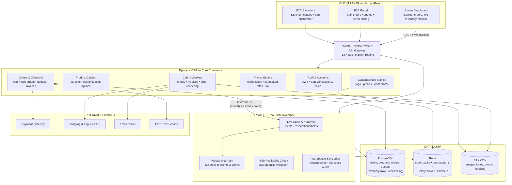
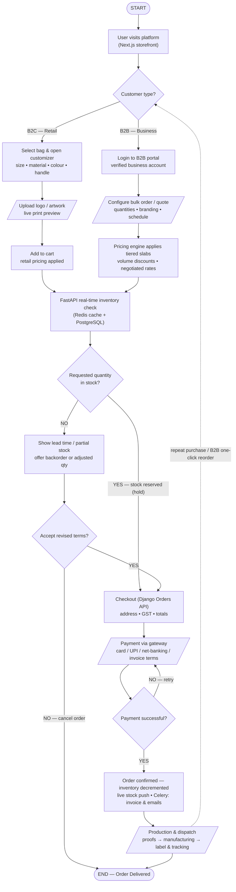

# Shopping Bags E-commerce Platform — Detailed Technical Reference

**Dedicated B2B & B2C platform for customizable shopping bags**
Version 1.0 • July 2026

---

## Contents

1. [System Architecture — Deep Dive](#1-system-architecture--deep-dive)
2. [Architecture Diagram (Mermaid)](#2-architecture-diagram-mermaid)
3. [Application Flow — Step-by-Step](#3-application-flow--step-by-step)
4. [Flow Chart (Mermaid)](#4-flow-chart-mermaid)
5. [Data Model (PostgreSQL)](#5-data-model-postgresql)
6. [API Surface](#6-api-surface)
7. [Inventory Integrity — How Overselling Is Prevented](#7-inventory-integrity--how-overselling-is-prevented)
8. [Security, Scaling & Reliability Notes](#8-security-scaling--reliability-notes)

---

## 1. System Architecture — Deep Dive

### 1.1 Client Layer — Next.js (React)

**B2C Storefront**
- **SSR/ISR** pages for the catalog: category and product pages are statically regenerated for SEO and speed; stock badges hydrate client-side from the FastAPI live-stock API.
- **Bag customizer:** interactive configuration of size, material, colour, and handle type; **logo/artwork upload** with a live print preview rendered client-side, with the final proof generated server-side.

**B2B Portal**
- Available only to **verified business accounts** (GST/registration verification, role-based users per company).
- Bulk-order builder with quantity ladders, per-SKU branding options, delivery scheduling, quote requests, and one-click reorder from order history.

**Admin Dashboard**
- Catalog & variant management, order pipeline, B2B account approvals and quote responses.
- **Live inventory monitor** fed by the FastAPI WebSocket channel — stock changes appear without refresh.

### 1.2 Application Layer

**NGINX Reverse Proxy / API Gateway**
- TLS termination, rate limiting, and **routing**: `/api/*` → Django, `/inventory/*` and `/ws/*` → FastAPI.
- Single secured entry point for storefront, portal, and admin traffic.

**Django + Django REST Framework — Core Commerce Backend**

| Module | Responsibility |
|---|---|
| **Auth & Accounts** | JWT auth; retail accounts vs verified business accounts; company roles (buyer, approver, admin); GST/registration verification workflow. |
| **Product Catalog** | Bags, variants (size × material × colour × handle), customization option matrices, media references. |
| **Orders & Checkout** | Cart, bulk orders, quotes (draft → sent → accepted/declined), invoices, order state machine (see §3). |
| **Pricing Engine** | Retail prices, **tiered B2B slabs** (quantity breakpoints), per-account negotiated rates, discounts, and tax hooks. |
| **Customization Service** | Stores uploaded artwork, validates print constraints (dimensions, DPI, colour profile), and queues **print-proof generation**. |
| **Celery Workers** | Async jobs: transactional email, invoice PDF generation, print-proof rendering, webhook fan-out. Broker: Redis. |

**FastAPI — Real-Time Inventory Microservice**

| Module | Responsibility |
|---|---|
| **Live Stock API (async)** | Current stock per SKU/variant; creates and releases **reservations (holds)** with TTL. Reads Redis hot cache; writes go through PostgreSQL with row-level locks. |
| **WebSocket Push** | Broadcasts stock deltas to storefront product pages and the admin monitor the moment they change. |
| **Bulk Availability Check** | Validates large B2B quantities across warehouses; returns full/partial availability with lead-time estimates. |
| **Warehouse Sync Jobs** | Ingests restock feeds, reconciles counts, and raises **low-stock alerts**. |

**Django ⇄ FastAPI contract:** internal REST. Django calls FastAPI for every availability question and for hold/commit/release operations; FastAPI emits inventory events onto the Redis Pub/Sub channel that both the WebSocket layer and Django subscribers consume.

### 1.3 Data Layer

| Store | Role | Details |
|---|---|---|
| **PostgreSQL** | Single source of truth | `users`, `companies`, `products`, `variants`, `orders`, `order_items`, `quotes`, `inventory`, `stock_holds`, `payments`. Stock rows are updated under `SELECT ... FOR UPDATE` (row-level locking). Django ORM on the commerce side; SQLAlchemy (async) on the FastAPI side. |
| **Redis** | Speed & coordination | Hot stock-level cache (`stock:{variantId}`), cart sessions, Celery broker, Pub/Sub channel `inventory.events`. |
| **Object Storage (S3) + CDN** | Files | Product images, customer logo uploads, generated print proofs and invoice PDFs; served through CDN edge caching. |

### 1.4 External / Third-Party Services

| Service | Purpose |
|---|---|
| **Payment Gateway (Stripe / Razorpay)** | Cards, UPI, net-banking; B2B invoice/credit-terms payments; webhook confirmation. |
| **Shipping & Logistics API** | Rate calculation, label generation, shipment tracking webhooks. |
| **Email / SMS Service** | Order confirmations, quote approvals, low-stock and dispatch alerts. |
| **GST / Tax Service** | Tax calculation and e-invoice compliance. |

---

## 2. Architecture Diagram (Mermaid)

---

## 3. Application Flow — Step-by-Step

### Phase A — Entry & Branching

| # | Step | Detail |
|---|---|---|
| 1 | **Visit platform** | Next.js storefront serves the SSR/ISR catalog. |
| 2 | **Customer-type decision** | Retail shoppers continue on the storefront; business customers enter the B2B portal (login required; account must be verified). |

### Phase B1 — B2C Path

| # | Step | Detail |
|---|---|---|
| 3 | **Select & customize** | Choose bag, then size, material, colour, handle type. |
| 4 | **Upload artwork** | Logo/artwork upload with live print preview; Customization Service validates dimensions/DPI. |
| 5 | **Add to cart** | Retail pricing applied; cart held in a Redis session. |

### Phase B2 — B2B Path

| # | Step | Detail |
|---|---|---|
| 3′ | **Portal login** | Verified business account (GST/registration checked; company roles enforced). |
| 4′ | **Configure bulk order / quote** | Quantities per SKU, branding options, delivery schedule; can be submitted as a quote request instead of a direct order. |
| 5′ | **Tiered pricing** | Pricing engine applies quantity-slab pricing, per-account negotiated rates, and volume discounts. |

### Phase C — Inventory Gate (paths converge)

| # | Step | Detail |
|---|---|---|
| 6 | **Real-time inventory check** | Django asks the FastAPI Live Stock API; FastAPI answers from the Redis hot cache, falling back to PostgreSQL. |
| 7 | **In stock?** — YES | A **stock hold** is placed (reservation row + cache decrement, TTL ~30 min) so the quantity can't be sold twice while the customer checks out. |
| 7′ | **In stock?** — NO | Customer sees lead time / partial availability and a backorder or adjusted-quantity offer. **Accept** → proceeds to checkout with revised terms; **decline** → order cancelled (END). |

### Phase D — Checkout, Payment & Confirmation

| # | Step | Detail |
|---|---|---|
| 8 | **Checkout (Django Orders API)** | Shipping address, GST details, totals (pricing engine + tax service). |
| 9 | **Payment** | Gateway handles cards/UPI/net-banking; B2B accounts may use invoice/credit terms. Failure loops back with retry. Confirmation arrives by **webhook**, not client redirect alone. |
| 10 | **Order confirmed** | Atomically: hold → committed decrement (row-level lock), order state → `confirmed`. FastAPI broadcasts the new stock level over WebSockets; Celery queues invoice PDF + confirmation email/SMS. |

### Phase E — Fulfilment & Loop

| # | Step | Detail |
|---|---|---|
| 11 | **Production & dispatch** | Print proofs generated → (B2B) proof approval where required → manufacturing → shipping label + tracking via logistics API → dispatch alert. |
| 12 | **END / reorder loop** | Order delivered. Dashed loop: repeat purchase or **one-click B2B reorder** re-enters at the customer-type branch with the saved configuration. |

### Failure & Edge Handling

- **Hold expiry:** unpaid holds auto-release on TTL; cache and DB reconcile via the sync job.
- **Payment webhook race:** order stays `pending_payment` until the gateway webhook confirms; duplicate webhooks are idempotent by `payment_intent_id`.
- **Partial stock (B2B):** split-shipment option — available quantity ships now, remainder backordered with its own hold on restock.

---

## 4. Flow Chart (Mermaid)

---

## 5. Data Model (PostgreSQL)

### Identity & Accounts
| Table | Key columns |
|---|---|
| `users` | id, email (unique), password_hash, kind (`retail`/`business_user`/`staff`), company_id (nullable) |
| `companies` | id, legal_name, gst_number, verification_status, credit_terms, negotiated_rate_card_id |

### Catalog & Customization
| Table | Key columns |
|---|---|
| `products` | id, name, description, base_price, is_active |
| `variants` | id, product_id, size, material, colour, handle_type, sku (unique) |
| `customizations` | id, order_item_id, artwork_s3_key, print_area, dpi, proof_s3_key, proof_status (`pending`/`approved`/`rejected`) |

### Pricing
| Table | Key columns |
|---|---|
| `price_tiers` | id, variant_id, min_qty, max_qty, unit_price |
| `rate_cards` | id, company_id, variant_id, negotiated_unit_price, valid_until |

### Orders & Quotes
| Table | Key columns |
|---|---|
| `orders` | id, user_id, company_id?, channel (`b2c`/`b2b`), status (`draft → pending_payment → confirmed → in_production → dispatched → delivered → cancelled`), totals, gst_details |
| `order_items` | id, order_id, variant_id, qty, unit_price, customization_id? |
| `quotes` | id, company_id, status (`draft/sent/accepted/declined/expired`), line_items JSONB, valid_until |
| `payments` | id, order_id, gateway, payment_intent_id (unique), amount, status, webhook_payload JSONB |

### Inventory
| Table | Key columns |
|---|---|
| `inventory` | variant_id (PK), warehouse_id, on_hand, reserved — updated only under `SELECT ... FOR UPDATE` |
| `stock_holds` | id, variant_id, qty, order_id, expires_at, status (`active/committed/released/expired`) |
| `stock_movements` | id, variant_id, delta, reason (`sale/restock/adjustment/release`), ref_id, created_at — append-only audit ledger |

---

## 6. API Surface

### Django (`/api/*`)
| Method & Path | Purpose |
|---|---|
| `POST /api/auth/login` · `POST /api/auth/register` | JWT auth; business registration starts verification |
| `GET /api/products` · `GET /api/products/:id` | catalog & variant matrices |
| `POST /api/customizations` | upload artwork metadata (S3 pre-signed upload first) |
| `POST /api/cart` · `POST /api/orders` | cart ops; create order (places inventory hold via FastAPI) |
| `POST /api/quotes` · `POST /api/quotes/:id/accept` | B2B quote lifecycle |
| `GET /api/pricing/quote?variant=&qty=` | tiered/negotiated price resolution |
| `POST /api/payments/webhook` | gateway confirmation (idempotent) |

### FastAPI (`/inventory/*`, `/ws/*`)
| Method & Path | Purpose |
|---|---|
| `GET /inventory/stock/{variant_id}` | live stock level |
| `POST /inventory/holds` | create reservation `{variant_id, qty, order_id, ttl}` |
| `POST /inventory/holds/{id}/commit` · `/release` | finalize or free a hold |
| `POST /inventory/bulk-check` | B2B multi-line availability + lead times |
| `WS /ws/stock` | subscribe to live stock deltas (used by storefront & admin) |

---

## 7. Inventory Integrity — How Overselling Is Prevented

1. **Single authority:** only the FastAPI service mutates stock; Django always asks, never assumes.
2. **Hold-then-commit:** adding to checkout creates a `stock_holds` row and decrements the Redis cache; `on_hand - reserved` is the sellable number everywhere.
3. **Row-level locking:** the commit path runs `SELECT ... FOR UPDATE` on the `inventory` row inside a transaction, so two simultaneous checkouts of the last units serialize — one succeeds, one is told stock ran out.
4. **TTL release:** abandoned checkouts expire; a sweeper releases holds and restores cache values, and `stock_movements` keeps an append-only audit trail for reconciliation.
5. **Live propagation:** every committed change publishes to `inventory.events` (Redis Pub/Sub); WebSocket clients — product pages and the admin monitor — update within milliseconds, so buyers rarely even attempt an out-of-stock purchase.

---

## 8. Security, Scaling & Reliability Notes

- **Security:** JWT with short-lived access tokens; B2B verification gates portal features; payment confirmation trusted only from signed gateway webhooks; artwork uploads validated (type/size/DPI) and stored via pre-signed S3 URLs; per-route rate limits at NGINX.
- **Scaling:** Next.js ISR pushes catalog reads to the CDN; FastAPI's async workers absorb high-frequency stock reads; Django app servers scale statelessly; Redis absorbs read pressure off PostgreSQL; Celery concurrency scales fulfilment-side work independently of checkout latency.
- **Reliability:** idempotent payment webhooks (`payment_intent_id` unique), hold TTL sweeper + `stock_movements` ledger for reconciliation, warehouse sync jobs with drift alerts, and dead-letter queues for failed Celery jobs.
- **Compliance:** GST/tax service integration for e-invoice generation; invoice PDFs archived to S3 with immutable keys.
