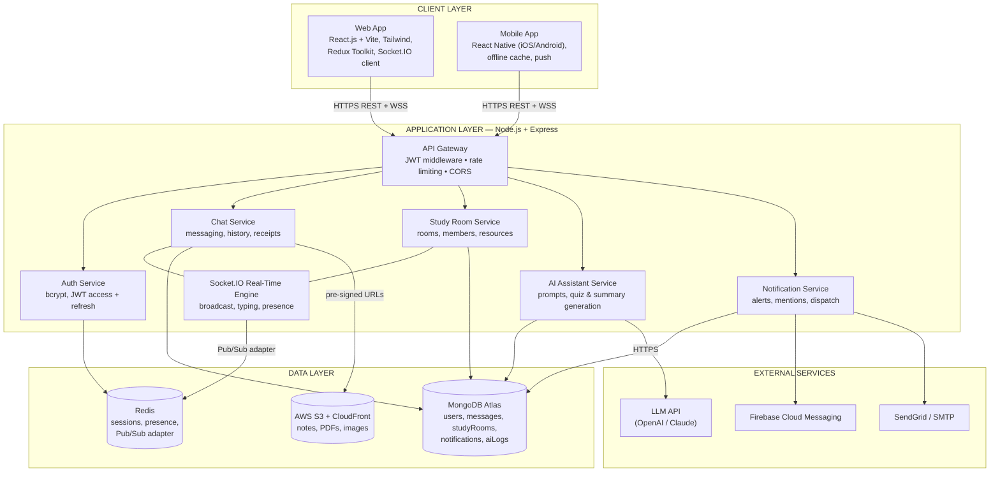
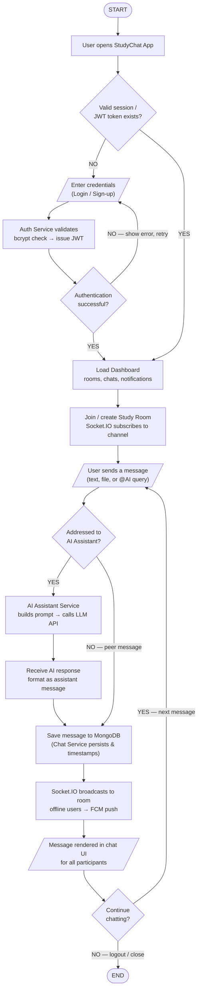

# StudyChat App — Detailed Technical Reference

**Real-time collaborative study & AI-assisted chat platform**
Version 1.0 • July 2026

---

## Contents

1. [System Architecture — Deep Dive](#1-system-architecture--deep-dive)
2. [Architecture Diagram (Mermaid)](#2-architecture-diagram-mermaid)
3. [Application Flow — Step-by-Step](#3-application-flow--step-by-step)
4. [Flow Chart (Mermaid)](#4-flow-chart-mermaid)
5. [Data Model](#5-data-model)
6. [API Surface](#6-api-surface)
7. [Socket.IO Event Contract](#7-socketio-event-contract)
8. [Security, Scaling & Reliability Notes](#8-security-scaling--reliability-notes)

---

## 1. System Architecture — Deep Dive

### 1.1 Client Layer

**Web Application (React.js)**
- Built with **React.js + Vite** for fast dev/build cycles; styled with **Tailwind CSS**.
- **Redux Toolkit** holds client state: auth session, active room, message lists, presence, and unread counters.
- **Socket.IO client** maintains a persistent WSS connection; REST (via `fetch`/axios) handles auth, history pagination, room CRUD, and file upload handshakes.
- Optimistic UI: messages render immediately with a `pending` state, reconciled when the server ack arrives.

**Mobile Application (React Native)**
- Single codebase for iOS and Android.
- **Offline cache** keeps recent rooms and messages readable without connectivity; queued outgoing messages flush on reconnect.
- **FCM push notifications** wake the app for mentions, replies, and room invites when the socket is disconnected.

### 1.2 Application Layer (Node.js + Express)

**API Gateway (entry point)**
- Terminates TLS; enforces **CORS**, **rate limiting** (per-IP and per-user buckets), and request validation.
- **JWT verification middleware** authenticates every REST call and the Socket.IO handshake (token passed in the connection auth payload).
- Routes to the five domain services below; rejects malformed or unauthenticated traffic before it reaches business logic.

**Auth Service**
- Registration and login; passwords hashed with **bcrypt** (cost factor ≥ 12).
- Issues short-lived **JWT access tokens** and long-lived **refresh tokens**; refresh tokens are rotated on use and stored server-side (Redis) so they can be revoked.
- Session invalidation on logout and password change.

**Chat Service**
- One-to-one and group messaging inside study rooms.
- Persists messages, maintains **read receipts** and per-user last-read cursors, and serves **paginated history** (cursor-based, newest-first).
- Handles edits/deletes with audit flags rather than hard deletion.

**Study Room Service**
- Room lifecycle: create, join (open or invite-code), leave, archive.
- Manages **membership and roles** (owner, moderator, member), **topics/tags**, and the room's shared **resource list** (links + S3 file references).

**AI Assistant Service**
- Triggered when a message is addressed to the assistant (`@AI ...`).
- Builds a prompt from: the question, a sliding window of recent room context, and the room topic.
- Calls the **LLM API** (OpenAI / Claude) over HTTPS with retries and a timeout budget; supports doubt-solving, summarisation of the room's recent discussion, and **quiz generation** from shared notes.
- Writes the reply back through the ordinary Chat Service pipeline (so AI messages have history, receipts, and notifications like any other message) and logs the exchange to `aiLogs` for audit/cost tracking.

**Notification Service**
- Fan-out for in-app alerts, mentions, and room invites.
- Dispatches **FCM push** for offline members and **email** (SendGrid/SMTP) for account verification, password reset, and weekly digests.

**Socket.IO Real-Time Engine**
- Rooms map 1:1 to Socket.IO rooms/channels.
- Emits message broadcasts, **typing indicators**, **online presence**, and room membership events.
- Uses the **Redis Pub/Sub adapter** so events propagate across all Node instances — the key to horizontal scaling.

### 1.3 Data Layer

| Store | Role | Details |
|---|---|---|
| **MongoDB Atlas** | Primary database | Collections: `users`, `messages`, `studyRooms`, `notifications`, `aiLogs`. Accessed via Mongoose ODM with schema validation and indexes (see §5). |
| **Redis** | Cache & coordination | Session/refresh-token store, presence sets (`room:{id}:online`), rate-limit counters, Socket.IO Pub/Sub adapter channel. |
| **AWS S3 + CloudFront** | File storage | Study notes, PDFs, images. Uploads use pre-signed URLs (client uploads directly to S3); downloads served via CDN. |

### 1.4 External Services

| Service | Purpose |
|---|---|
| **LLM API (OpenAI / Claude)** | Powers the AI Assistant Service: answers, explanations, quiz & summary generation. |
| **Firebase Cloud Messaging** | Mobile & web push: new messages, mentions, room invites. |
| **SendGrid / SMTP** | Account verification, password reset, weekly study digests. |

---

## 2. Architecture Diagram (Mermaid)

---

## 3. Application Flow — Step-by-Step

### Phase A — Entry & Authentication

| # | Step | Detail |
|---|---|---|
| 1 | **Open app** | Client boots and looks for a stored session. |
| 2 | **Session check** | Decision: *valid JWT exists?* Access token verified locally by expiry, then against the gateway. A valid refresh token silently mints a new access token. |
| 3 | **Login / Sign-up** (NO path) | User submits credentials. Auth Service verifies with bcrypt; on success issues JWT access + refresh tokens. |
| 4 | **Auth retry loop** | Failed authentication shows an error and returns the user to the credentials form. |

### Phase B — Dashboard & Room Entry

| # | Step | Detail |
|---|---|---|
| 5 | **Load dashboard** | Fetches the user's study rooms, recent chats, and unread notifications (REST). |
| 6 | **Join / create study room** | Room Service handles membership; the Socket.IO client subscribes to the room channel and receives the presence roster. |

### Phase C — The Message Loop

| # | Step | Detail |
|---|---|---|
| 7 | **Compose & send** | Message may be text, a file attachment (pre-signed S3 upload first, then message with the file reference), or an `@AI` query. |
| 8 | **Routing decision** | *Addressed to the AI assistant?* |
| 8a | **YES → AI path** | AI Assistant Service builds a prompt (question + recent room context), calls the LLM API, formats the reply as an assistant message. |
| 8b | **NO → peer path** | Message goes straight to persistence. |
| 9 | **Persist** | Chat Service saves the message to MongoDB with a server timestamp (both paths converge here — the AI reply is saved exactly like a peer message). |
| 10 | **Broadcast** | Socket.IO emits to every member of the room channel; the Redis adapter relays across server instances. **Offline members** receive an FCM push instead. |
| 11 | **Render** | All connected clients render the message in real time; read receipts update as members view it. |
| 12 | **Continue?** | YES loops to step 7; NO (logout / close) ends the session. |

### Failure & Edge Handling

- **Socket drop:** client auto-reconnects with backoff; missed messages are backfilled from REST history using the last-received message cursor.
- **LLM timeout/error:** the AI path posts a graceful failure message into the room and logs the error to `aiLogs`; the user can retry.
- **Duplicate sends:** client-generated message UUIDs make persistence idempotent.

---

## 4. Flow Chart (Mermaid)

---

## 5. Data Model

### `users`
| Field | Type | Notes |
|---|---|---|
| `_id` | ObjectId | |
| `email` | string | unique index |
| `passwordHash` | string | bcrypt |
| `displayName`, `avatarUrl` | string | |
| `fcmTokens` | string[] | device push tokens |
| `createdAt`, `lastSeenAt` | Date | |

### `studyRooms`
| Field | Type | Notes |
|---|---|---|
| `_id`, `name`, `topic` | | |
| `ownerId` | ObjectId → users | |
| `members` | [{ userId, role, joinedAt, lastReadMessageId }] | roles: owner / moderator / member |
| `inviteCode` | string | optional, for private rooms |
| `resources` | [{ title, url \| s3Key, addedBy, addedAt }] | |

### `messages`
| Field | Type | Notes |
|---|---|---|
| `_id`, `clientUuid` | | `clientUuid` unique — idempotent sends |
| `roomId` | ObjectId → studyRooms | compound index `(roomId, createdAt)` |
| `senderId` | ObjectId \| `"AI"` | |
| `type` | `text` \| `file` \| `ai_response` | |
| `body` | string | |
| `attachment` | { s3Key, fileName, mimeType, size } | optional |
| `readBy` | [{ userId, at }] | receipts |
| `createdAt`, `editedAt`, `deleted` | | soft delete |

### `notifications`
`{ userId, kind (mention|invite|reply|digest), refIds, read, createdAt }`

### `aiLogs`
`{ roomId, userId, promptTokens, completionTokens, model, latencyMs, status, createdAt }` — audit & cost tracking.

---

## 6. API Surface

| Method & Path | Service | Purpose |
|---|---|---|
| `POST /api/auth/register` | Auth | create account, send verification email |
| `POST /api/auth/login` | Auth | issue access + refresh tokens |
| `POST /api/auth/refresh` | Auth | rotate refresh, mint access token |
| `POST /api/auth/logout` | Auth | revoke refresh token |
| `GET /api/rooms` / `POST /api/rooms` | Room | list / create rooms |
| `POST /api/rooms/:id/join` | Room | join by id or invite code |
| `GET /api/rooms/:id/messages?before=<cursor>` | Chat | paginated history |
| `POST /api/uploads/sign` | Chat | pre-signed S3 upload URL |
| `POST /api/ai/ask` | AI | direct (non-room) AI query |
| `GET /api/notifications` | Notification | unread list |

---

## 7. Socket.IO Event Contract

| Direction | Event | Payload |
|---|---|---|
| client → server | `message:send` | `{ clientUuid, roomId, type, body, attachment? }` |
| server → client | `message:new` | full message document |
| server → client | `message:ack` | `{ clientUuid, messageId }` |
| client → server | `typing:start` / `typing:stop` | `{ roomId }` |
| server → client | `presence:update` | `{ roomId, online: userId[] }` |
| server → client | `room:member_joined` / `room:member_left` | `{ roomId, userId }` |
| server → client | `ai:thinking` | `{ roomId }` — shows the assistant typing indicator |

Handshake: JWT passed in `auth.token`; the gateway validates before the socket joins any room.

---

## 8. Security, Scaling & Reliability Notes

- **Security:** bcrypt-hashed credentials; short-lived access JWTs with rotating, revocable refresh tokens; all traffic over TLS; per-user and per-IP rate limits; S3 access only through pre-signed URLs; AI prompts strip PII before leaving the platform boundary.
- **Horizontal scaling:** stateless Express instances behind the gateway; the Redis Pub/Sub adapter keeps Socket.IO rooms consistent across instances; MongoDB Atlas handles replica-set failover.
- **Reliability:** idempotent message writes (`clientUuid`), reconnect-and-backfill on socket drops, LLM calls wrapped in timeout + retry with graceful in-room error messages, and dead-letter logging for failed notification dispatches.
- **Observability:** `aiLogs` for LLM cost/latency; structured request logs at the gateway; per-event Socket.IO metrics (connect rate, room fan-out sizes).
